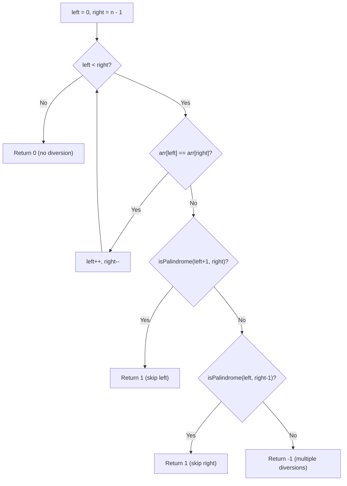

# Feature #6: Transmission Error

## The problem

In our protocol, a response packet is supposed to retrace the exact same route as its matching request packet, just in reverse. Occasionally a link error causes at most one router along the way to diverge from that expected mirror path. The full round trip — request path followed by the reversed response path — arrives as a single array of router IDs, with the same router at both ends.

We need to tell whether the round trip matches the "at most one diversion" rule. For example, given the path `{1, 2, 3, 5, 4, 3, 2, 1}` — reading inward from both ends, `1` matches `1`, `2` matches `2`, `3` matches `3`, but then `5` doesn't match `4`. Skip either the `5` or the `4` and the rest lines up perfectly, so this counts as exactly one diversion router.

## Solution

Walking inward from both ends of the array and comparing as we go is exactly how you'd check whether a sequence is a palindrome. So, ignoring the possibility of an error for a moment, a perfectly mirrored round trip is just a palindromic array.

Now bring the "at most one diversion" rule back in. We walk two pointers, `left` and `right`, inward from either end. As long as the elements they point to match, we keep closing in. The moment we hit a mismatch, we know the diversion — if there is a valid one — must be at exactly one of these two positions. So we try both: check if skipping the `left` element makes the remaining sub-array (`left + 1` to `right`) a palindrome, and check if skipping the `right` element makes the remaining sub-array (`left` to `right - 1`) a palindrome. If either check succeeds, there's exactly one diversion router. If neither works, more than one router must have diverged. And if we never hit a mismatch at all, the round trip is perfect — zero diversions.



## Code

```java
class TransmissionError {
    public static int transmissionError(int[] path) {
        int left = 0, right = path.length - 1;

        while (left < right) {
            if (path[left] == path[right]) {
                left++;
                right--;
            } else {
                if (isPalindrome(path, left + 1, right)) {
                    return 1;
                }
                if (isPalindrome(path, left, right - 1)) {
                    return 1;
                }
                return -1;
            }
        }
        return 0;
    }

    private static boolean isPalindrome(int[] path, int left, int right) {
        while (left < right) {
            if (path[left] != path[right]) {
                return false;
            }
            left++;
            right--;
        }
        return true;
    }

    public static void main(String[] args) {
        System.out.println(transmissionError(new int[]{1, 2, 3, 5, 4, 3, 2, 1}));
        // 1  (skipping the "5" restores the mirror)
        System.out.println(transmissionError(new int[]{1, 2, 3, 4, 3, 2, 1}));
        // 0  (already a perfect mirror)
        System.out.println(transmissionError(new int[]{1, 2, 3, 4, 5, 2, 1}));
        // -1 (more than one router diverged)
    }
}
```

## Complexity measures

Let **n** be the size of the path array.

### Time Complexity

`O(n)` — the two-pointer scan and each `isPalindrome` check together still only ever look at each array position a constant number of times.

### Space Complexity

`O(1)` — only the pointers are used; no auxiliary data structure grows with input size.
