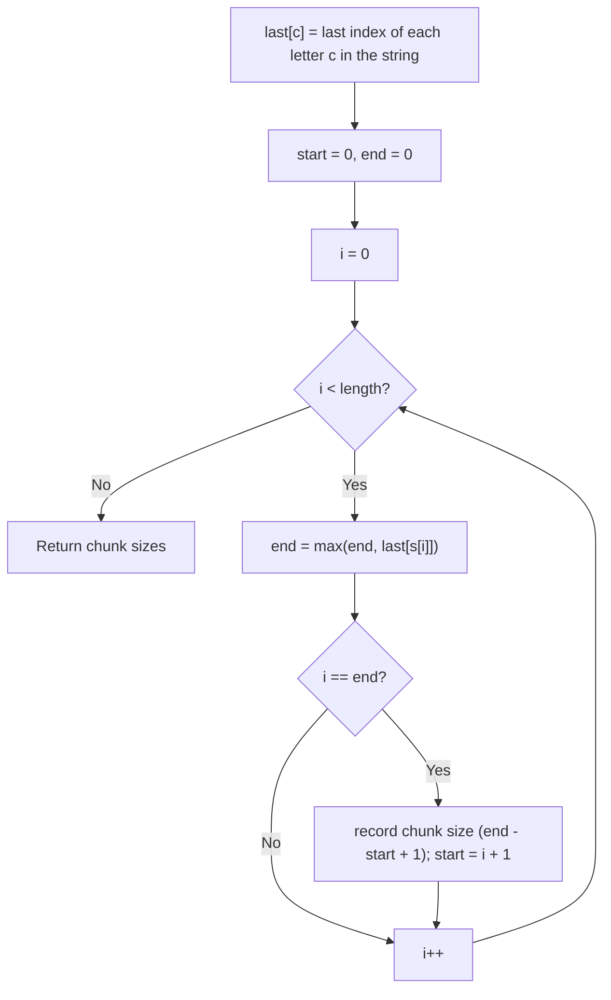

# Feature #7: Divide Files Over the Network

## The problem

We need to run operations on a huge number of files, given to us as a string where each character is a file (say, a lowercase letter) and its position tells us the processing order. If a file's letter shows up more than once, that file needs multiple operations performed on it, at different points in the sequence.

To speed this up, we've got a high-performance cluster, and we want to split the file string into contiguous chunks — one per worker node — so that each node handles a self-contained stretch of work. The catch: to avoid cross-node communication overhead, no file may appear in more than one chunk. We want to split the string into as many chunks as possible under that constraint.

For example, `"abacdc"` splits into `"aba"` and `"cdc"` — two worker nodes. Every `a` and `b` is contained inside the first chunk, and every `c` and `d` inside the second, so neither chunk depends on the other.

## Solution

Whenever a letter needs to appear in only one chunk, that chunk has to stretch all the way out to that letter's *last* occurrence in the string — cutting the chunk any earlier would strand a copy of that letter in the next chunk. And any other letter that falls between a letter's first and last occurrence drags the chunk boundary out further still, to *its* last occurrence, too, recursively.

So for each position in the string, we track the furthest "last occurrence" among every letter we've seen so far in the current chunk — call it `end`. We keep extending `end` as we scan forward. The moment our scan position catches up to `end`, that means every letter we've seen since the chunk started has already had its last appearance — so it's safe to close the chunk right there and start a new one.

Walking through `"abacdc"`: at index 0 (`a`), its last occurrence is index 2, so `end` becomes 2. At index 1 (`b`), its last occurrence is index 1, which doesn't push `end` any further. At index 2, our scan position finally reaches `end` — chunk closed, size 3. The next chunk starts fresh at index 3 and closes the same way at index 5.



## Code

```java
import java.util.*;

class DivideFiles {
    public static int divideFiles(String files) {
        int[] lastOccurrence = new int[26];
        for (int i = 0; i < files.length(); i++) {
            lastOccurrence[files.charAt(i) - 'a'] = i;
        }

        int start = 0, end = 0, workerNodes = 0;
        for (int i = 0; i < files.length(); i++) {
            end = Math.max(end, lastOccurrence[files.charAt(i) - 'a']);
            if (i == end) {
                workerNodes++;
                start = i + 1;
            }
        }
        return workerNodes;
    }

    public static void main(String[] args) {
        String files = "abacdc";
        System.out.println("The files \"" + files + "\" will be divided into "
                + divideFiles(files) + " worker nodes!");
        // The files "abacdc" will be divided into 2 worker nodes!
    }
}
```

## Complexity measures

Let **n** be the length of the file string.

### Time Complexity

`O(n)` — one pass to compute last occurrences, one more to scan and cut chunks.

### Space Complexity

`O(1)` — the `lastOccurrence` array is fixed at 26 entries (one per lowercase letter), regardless of the string's length.
