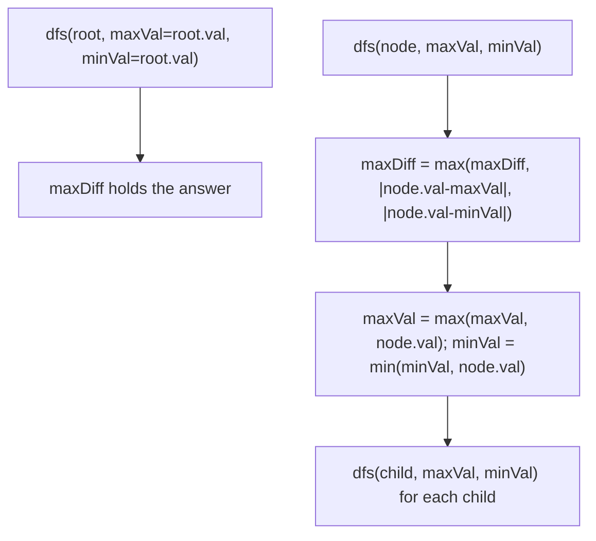

# Feature #8: Maximum Clock Skew

## The problem

Our network topology is a tree of routers, and messages get forwarded from ancestor nodes down to descendant nodes. Every router stores a clock-time value. We're tuning a distributed consensus algorithm that's parameterized by the *maximum clock skew* along any forwarding path — the largest time difference between any two routers where one is an ancestor of the other. We want to find that maximum skew across the whole tree.

For example, take this tree of clock values:

```
        8
      /   \
     3     10
    / \      \
   1   6      14
```

The largest ancestor-descendant difference here is `|1 - 8| = 7` — bigger than `|3 - 8| = 5`, `|10 - 8| = 2`, or `|14 - 10| = 4`. (Sibling pairs like `1` and `6`, or `1` and `14`, don't count — neither is an ancestor of the other.)

## Solution

Since we only care about ancestor-descendant pairs, we can settle this with a single top-down DFS. As we descend from the root, we carry along the maximum and minimum clock values seen among the current node's ancestors (including itself). At each node, the biggest possible skew *involving this node* is the larger of `|node.val - maxSoFar|` and `|node.val - minSoFar|` — because the most out-of-sync ancestor is always either the largest or the smallest value seen on the path so far.

We compute that difference at every node, keep a running maximum across the whole tree, then update `maxSoFar` and `minSoFar` with the current node's value before recursing into its children. By the time the DFS finishes, we've compared every node against the most extreme ancestor above it, which is exactly what we need — the true maximum skew has to be one of these comparisons.



## Code

```java
import java.util.*;

class MaximumClockSkew {
    static class TreeNode {
        int val;
        List<TreeNode> children = new ArrayList<>();
        TreeNode(int val) { this.val = val; }
    }

    private static int maxDiff = 0;

    public static int maxClockSkew(TreeNode root) {
        if (root == null) {
            return 0;
        }
        maxDiff = 0;
        dfs(root, root.val, root.val);
        return maxDiff;
    }

    private static void dfs(TreeNode node, int maxVal, int minVal) {
        if (node == null) {
            return;
        }
        maxDiff = Math.max(maxDiff, Math.max(Math.abs(node.val - maxVal), Math.abs(node.val - minVal)));
        maxVal = Math.max(maxVal, node.val);
        minVal = Math.min(minVal, node.val);
        for (TreeNode child : node.children) {
            dfs(child, maxVal, minVal);
        }
    }

    public static void main(String[] args) {
        TreeNode root = new TreeNode(8);
        TreeNode n3 = new TreeNode(3);
        TreeNode n10 = new TreeNode(10);
        TreeNode n1 = new TreeNode(1);
        TreeNode n6 = new TreeNode(6);
        TreeNode n14 = new TreeNode(14);
        root.children.addAll(List.of(n3, n10));
        n3.children.addAll(List.of(n1, n6));
        n10.children.add(n14);

        System.out.println(maxClockSkew(root));
        // 7
    }
}
```

## Complexity measures

Let **n** be the number of routers (nodes) in the tree.

### Time Complexity

`O(n)` — each node is visited by the DFS exactly once, doing constant work per visit.

### Space Complexity

`O(n)` — dominated by the recursion stack, which in the worst case (a tree that's really a linked list) holds all n nodes.
