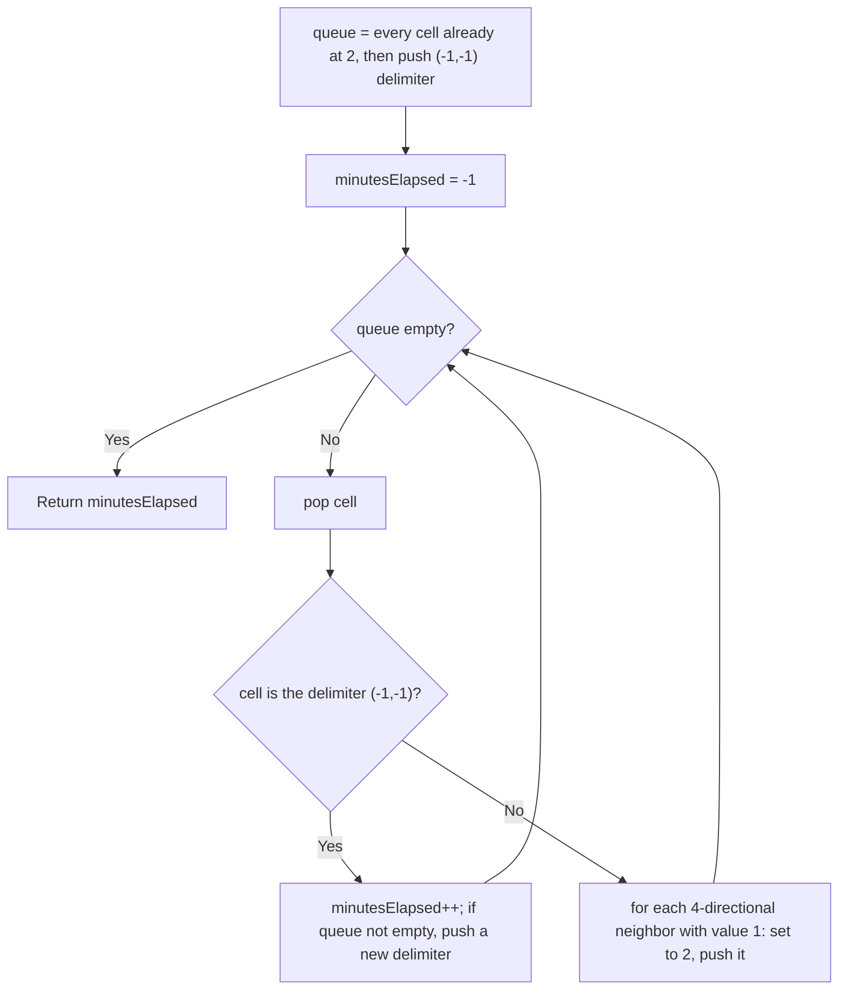

# Feature #9: Update Configuration

## The problem

Routers are interconnected in a rectangular grid. Whenever a configuration change happens, an updated router transmits a control message to its four directional neighbors, and those neighbors accept the change and pass it along, one minute at a time, until it's finished spreading.

We represent the grid as a matrix of integers: `0` means a router with VLAN ID 0 (not part of this update at all), `1` means a router that still needs the update, and `2` means a router that has already received it. We're told there are no isolated routers — every router that needs updating is reachable — and we need to find the minimum number of minutes before the configuration stops propagating.

For example:

```
2 1 1
1 1 0
0 1 1
```

Here it takes `4` minutes for the update to reach every router that needs it.

## Solution

Since every already-updated router transmits to its neighbors simultaneously, and those neighbors transmit onward the very next minute, this is a textbook multi-source breadth-first search — "multi-source" because we don't start from just one router, we start from *every* already-updated router at once, all at minute 0.

We load every `2`-valued router into a queue up front, then push a level-delimiter marker `(-1, -1)` behind them to mark "end of this minute's batch." We then process the queue: whenever we pop a real router, we look at its four neighbors, and any neighbor still holding `1` gets flipped to `2` and pushed onto the queue for the *next* minute. When we pop the delimiter instead, that means every router from the current minute is done, so the minute counter increments, and — as long as there's still work left in the queue — we push a fresh delimiter for the next round.



## Code

```java
import java.util.*;

class UpdateConfiguration {
    static class Cell {
        int row, col;
        Cell(int row, int col) { this.row = row; this.col = col; }
    }

    public static int updateConfiguration(int[][] grid) {
        Queue<Cell> queue = new ArrayDeque<>();
        int rows = grid.length, cols = grid[0].length;

        for (int r = 0; r < rows; r++) {
            for (int c = 0; c < cols; c++) {
                if (grid[r][c] == 2) {
                    queue.offer(new Cell(r, c));
                }
            }
        }
        queue.offer(new Cell(-1, -1)); // marks the end of minute 0's batch

        int minutesElapsed = -1;
        int[][] directions = {{-1, 0}, {0, 1}, {1, 0}, {0, -1}};

        while (!queue.isEmpty()) {
            Cell cell = queue.poll();
            if (cell.row == -1) {
                minutesElapsed++;
                if (!queue.isEmpty()) {
                    queue.offer(new Cell(-1, -1));
                }
                continue;
            }

            for (int[] d : directions) {
                int nr = cell.row + d[0], nc = cell.col + d[1];
                if (nr >= 0 && nr < rows && nc >= 0 && nc < cols && grid[nr][nc] == 1) {
                    grid[nr][nc] = 2;
                    queue.offer(new Cell(nr, nc));
                }
            }
        }
        return minutesElapsed == -1 ? 0 : minutesElapsed;
    }

    public static void main(String[] args) {
        int[][] grid = {
            {2, 1, 1},
            {1, 1, 0},
            {0, 1, 1}
        };
        System.out.println(updateConfiguration(grid));
        // 4
    }
}
```

## Complexity measures

Let **n** be the number of routers in the grid.

### Time Complexity

`O(n)` — building the initial queue takes `O(n)`, and BFS visits every router at most once more, another `O(n)`.

### Space Complexity

`O(n)` — the queue can hold up to every router in the grid across the traversal, plus the level delimiters.
