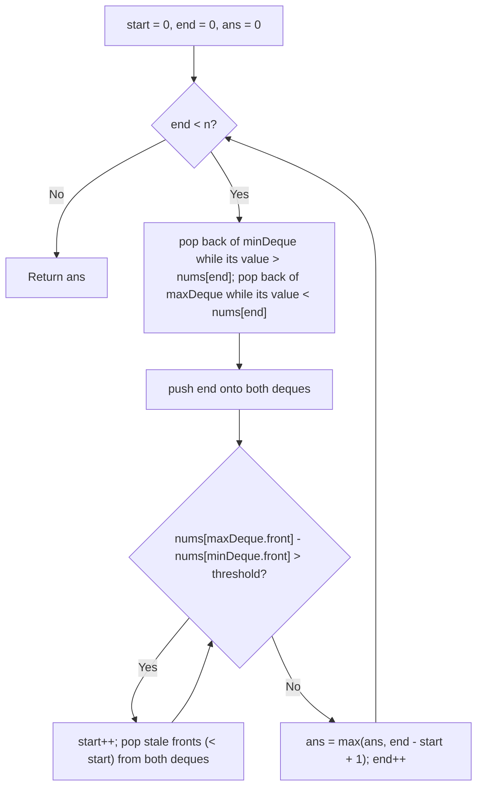

# Feature #10: Minimum Variation

## The problem

We've monitored a network for several days and recorded the daily traffic rate in an array. When billing customers, we want to offer a discount for stretches where the traffic stayed roughly constant — that is, where its *variation* stayed below some threshold. We define the variation of a sub-array as the difference between its maximum and minimum values. Given a threshold, we want the longest stretch of consecutive days whose variation stays within it.

For example, with daily traffic `{10, 1, 2, 4, 7, 2}` and a threshold of `5`: the sub-array `{2, 4, 7, 2}` (days 2 through 5) has variation `7 - 2 = 5`, right at the limit, and it's `4` days long — the longest such stretch in this array.

## Solution

We slide a window over the array with two pointers, `start` and `end`. As `end` advances, we're growing the window; whenever the window's variation exceeds the threshold, we advance `start` to shrink it back down. The window size at every valid moment is a candidate for the answer, so we track the maximum window size we ever see.

The one wrinkle: at every step we need to know the current window's max and min *quickly*, without rescanning the whole window each time. That's what a pair of monotonic deques buys us — one that always has the window's minimum at its front, one that always has the maximum. Before adding a new index to either deque, we pop off everything at the back that the new value would make irrelevant (anything smaller than the new value gets popped from the max-deque; anything larger gets popped from the min-deque), since those elements can never again be the window's extreme while the new element is still in range. Both deques only ever hold indices in increasing order, so once the value at the *front* of a deque falls outside `[start, end]`, we pop it off the front too.

Every time the window's variation (front of max-deque minus front of min-deque) exceeds the threshold, we shrink the window from the left, popping stale indices off the fronts of both deques as `start` moves past them.



## Code

```java
import java.util.*;

class MinimumVariation {
    public static int minimumVariationLength(int[] traffic, int threshold) {
        Deque<Integer> maxDeque = new ArrayDeque<>(); // front holds index of window max
        Deque<Integer> minDeque = new ArrayDeque<>(); // front holds index of window min
        int start = 0, end = 0, ans = 0;

        while (end < traffic.length) {
            while (!minDeque.isEmpty() && traffic[end] < traffic[minDeque.peekLast()]) {
                minDeque.pollLast();
            }
            while (!maxDeque.isEmpty() && traffic[end] > traffic[maxDeque.peekLast()]) {
                maxDeque.pollLast();
            }
            minDeque.addLast(end);
            maxDeque.addLast(end);

            while (traffic[maxDeque.peekFirst()] - traffic[minDeque.peekFirst()] > threshold) {
                start++;
                if (minDeque.peekFirst() < start) {
                    minDeque.pollFirst();
                }
                if (maxDeque.peekFirst() < start) {
                    maxDeque.pollFirst();
                }
            }

            ans = Math.max(ans, end - start + 1);
            end++;
        }
        return ans;
    }

    public static void main(String[] args) {
        int[] traffic = {10, 1, 2, 4, 7, 2};
        System.out.println(minimumVariationLength(traffic, 5));
        // 4
    }
}
```

## Complexity measures

Let **n** be the number of days recorded.

### Time Complexity

`O(n)` — `end` and `start` each advance across the array at most n times total, and every index enters and leaves each deque at most once, so all deque operations amortize to `O(1)` per step.

### Space Complexity

`O(n)` — in the worst case (a monotonically increasing or decreasing traffic array), one of the two deques holds close to n indices.
