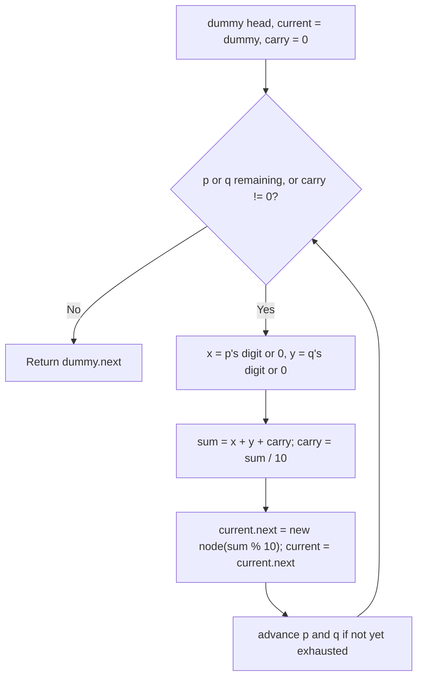

# Feature #11: Weighted Exponential Back-off

## The problem

On our shared communication channel, colliding devices back off before retransmitting: after a collision, a device draws a random digit `r` between 1 and 9 and waits that many time slots. If it collides again on the retry, it draws another random digit and waits `10 * r` time slots. After `i` successive collisions, it backs off for `10^i * r` slots, where `r` is freshly drawn each time.

We represent the sequence of random digits drawn across all the collisions as a linked list, with the head holding the least-significant digit (the units place), the next node the tens place, and so on. Given two such linked lists — say, for two devices, or two separate collision incidents — we want the total number of time slots spent backed off, which is just the two numbers added together.

For example, list `9 -> 9 -> 9` represents 999 slots, and list `9 -> 9` represents 99 slots. Added together, that's `1098`, represented least-significant-digit-first as `8 -> 9 -> 0 -> 1`.

## Solution

Since the head of each list holds the least-significant digit, adding the two numbers is exactly long addition on paper, done from right to left, except we walk both lists left to right (head to tail) since that already visits digits from least to most significant.

We walk both lists together with a carry, one digit position at a time. At each step, we take the current digit from each list (treating a list that's run out as contributing a 0), add them plus whatever carry rolled in from the previous position, and split the result into a new digit (`sum % 10`) and a new carry (`sum / 10`). We append the new digit to our result list and keep going until both lists are exhausted. If there's a carry left over after the last digit, that becomes one final extra digit — a dummy head at the start of the result list keeps the append logic uniform, with no special case needed for the very first digit.



## Code

```java
class WeightedExponentialBackOff {
    static class LinkedListNode {
        int val;
        LinkedListNode next;
        LinkedListNode(int val) { this.val = val; }
    }

    public static LinkedListNode idleTime(LinkedListNode list1, LinkedListNode list2) {
        LinkedListNode dummy = new LinkedListNode(0);
        LinkedListNode current = dummy;
        LinkedListNode p = list1, q = list2;
        int carry = 0;

        while (p != null || q != null || carry != 0) {
            int x = (p != null) ? p.val : 0;
            int y = (q != null) ? q.val : 0;
            int sum = x + y + carry;
            carry = sum / 10;
            current.next = new LinkedListNode(sum % 10);
            current = current.next;
            if (p != null) p = p.next;
            if (q != null) q = q.next;
        }
        return dummy.next;
    }

    public static void main(String[] args) {
        LinkedListNode list1 = new LinkedListNode(9);
        list1.next = new LinkedListNode(9);
        list1.next.next = new LinkedListNode(9);

        LinkedListNode list2 = new LinkedListNode(9);
        list2.next = new LinkedListNode(9);

        LinkedListNode result = idleTime(list1, list2);
        StringBuilder sb = new StringBuilder();
        while (result != null) {
            sb.append(result.val);
            if (result.next != null) sb.append(" -> ");
            result = result.next;
        }
        System.out.println(sb);
        // 8 -> 9 -> 0 -> 1   (999 + 99 = 1098, least-significant digit first)
    }
}
```

## Complexity measures

Let **m** and **n** be the lengths of `list1` and `list2`.

### Time Complexity

`O(max(m, n))` — we walk both lists in lockstep, stopping once both are exhausted and no carry remains.

### Space Complexity

`O(max(m, n))` — the result list has at most `max(m, n) + 1` nodes.
