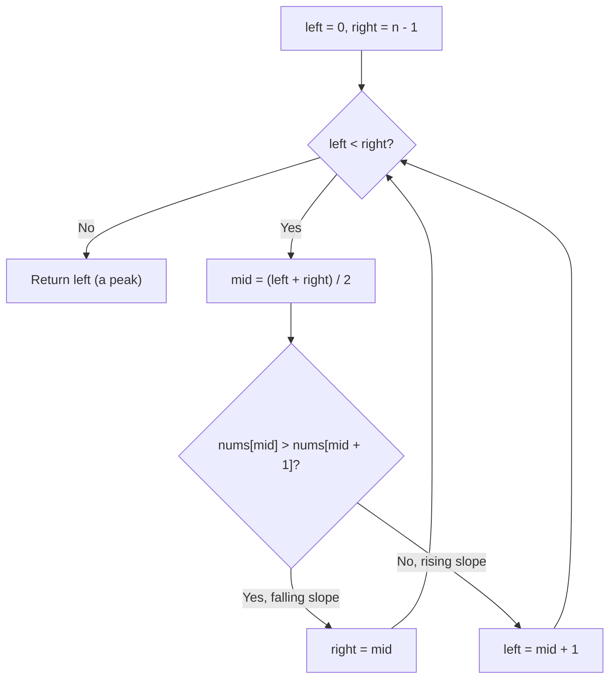

# Feature #12: Peak Signal Strength

## The problem

Along an expressway, an internet provider has deployed several wireless access points. An advertising company wants to place a smart billboard somewhere on the expressway where the signal is strong enough — specifically, at a position where the signal strength is a *local* peak, higher than both of its immediate neighbors (not necessarily the single strongest point overall, since the globally strongest spot might be too congested with existing users).

The signal readings are recorded in an array, one value per position along the expressway, and we can assume adjacent readings are never equal — the signal is always either rising or falling between consecutive positions. Given such an array, we need to return the index of any one local peak.

For example, with `nums = {1, 2, 4, 3, 6, 5, 10, 19, 8, 17}`, index `2` (value `4`) is a valid peak — since `2 < 4 > 3` — and so are several other positions; any one of them is an acceptable answer.

## Solution

Because the array is guaranteed to alternate between rising and falling stretches (with no equal neighbors), we can binary search for a peak instead of scanning linearly. Look at the middle element and compare it to its right neighbor: if `nums[mid] > nums[mid + 1]`, we're on a falling slope at `mid`, which guarantees a peak exists somewhere to the left of or at `mid` — so we shrink our search to `[left, mid]`. Otherwise, `nums[mid] < nums[mid + 1]` means we're on a rising slope, which guarantees a peak exists strictly to the right of `mid` — so we shrink to `[mid + 1, right]`.

Either way, the half we discard is guaranteed *not* to contain a peak that matters, because whichever direction is "uphill" from `mid` must eventually crest somewhere before the search space runs out. We keep halving until `left` and `right` converge on a single index — that index is a peak.



## Code

```java
class PeakSignalStrength {
    public static int peakSignalStrength(int[] nums) {
        int left = 0, right = nums.length - 1;

        while (left < right) {
            int mid = (left + right) / 2;
            if (nums[mid] > nums[mid + 1]) {
                right = mid;
            } else {
                left = mid + 1;
            }
        }
        return left;
    }

    public static void main(String[] args) {
        int[] decreasing = {5, 4, 3, 2, 1};
        System.out.println("Peak index: " + peakSignalStrength(decreasing));
        // Peak index: 0

        int[] increasing = {1, 2, 3, 4, 5};
        System.out.println("Peak index: " + peakSignalStrength(increasing));
        // Peak index: 4

        int[] unsorted = {2, 3, 4, 5, 1};
        System.out.println("Peak index: " + peakSignalStrength(unsorted));
        // Peak index: 3

        int[] multiplePeaks = {1, 2, 4, 3, 6, 5, 10, 19, 8, 17};
        System.out.println("Peak index: " + peakSignalStrength(multiplePeaks));
        // Peak index: 2 (one of several valid peaks)
    }
}
```

## Complexity measures

Let **n** be the size of the `nums` array.

### Time Complexity

`O(log n)` — the search space is halved at every step.

### Space Complexity

`O(1)` — only the two pointers and the midpoint are used.
