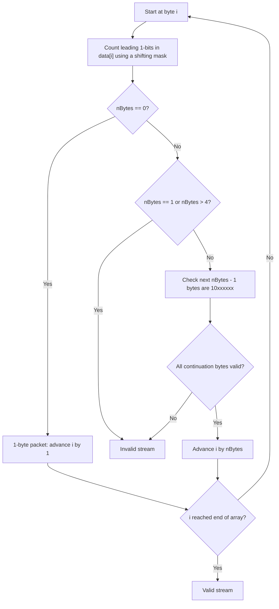

# Feature #1: Validate Packet Structure

## The problem

We use a network protocol that encrypts every packet with a proprietary scheme. The encryption scheme fixes the size of an individual packet at `1` to `4` bytes, and each packet follows a specific bit structure:

- For a **1-byte packet**, the first bit is `0`, followed by the rest of the packet's content.
- For an **n-byte packet**, the first `n` bits are all `1`, the `(n+1)`-th bit is `0`, and each of the remaining `n - 1` bytes has its two most significant bits set to `10`.

This is exactly the shape UTF-8 uses to self-describe how many bytes a character spans:

| Packet number range (hex) | Octet sequence (binary) |
|---|---|
| `0000 0000` – `0000 007F` | `0xxxxxxx` |
| `0000 0080` – `0000 07FF` | `110xxxxx 10xxxxxx` |
| `0000 0800` – `0000 FFFF` | `1110xxxx 10xxxxxx 10xxxxxx` |
| `0001 0000` – `0010 FFFF` | `11110xxx 10xxxxxx 10xxxxxx 10xxxxxx` |

We're given a sequence of packets as an array of integers, one integer per byte. We need to verify that the stream has not been tampered with — that it can be cleanly sliced into valid 1-to-4-byte packets end to end.

**Note:** the array holds plain `int`s, but only the 8 least significant bits of each integer matter — an entry like `876` still represents just one byte of data, so we always mask down to 8 bits before inspecting it.

For example, `[198, 150, 9, 8]` is valid: `198` (`11000110`) starts a 2-byte packet, `150` (`10010110`) is a valid continuation byte, and `9` and `8` are each valid 1-byte packets — the whole array is consumed cleanly. But `[255, 129, 129, 129, 129, 129, 129, 129]` is invalid: `255` is `11111111`, eight leading `1` bits, which is more than the `4` bits a packet header is allowed to declare.

## Solution

The tricky part of this problem is less about detecting a single bad byte and more about correctly bookkeeping across the whole stream: every byte belongs either to a fresh packet header or to a continuation of the packet started a few bytes back, and we have to keep track of which is which as we scan.

Whenever we're standing at the start of what should be a new packet, we count how many leading `1` bits its byte has. A mask of `1 << 7` (`10000000`) tells us if the top bit is set; shifting the mask right one place at a time and re-checking lets us count consecutive `1`s from the top:

```
mask = 1 << 7
while (mask & byte) != 0:
    nBytes += 1
    mask >>= 1
```

- If `nBytes` is `0`, the byte's top bit was `0` — it's a complete 1-byte packet on its own, and we move to the very next byte.
- If `nBytes` is `1` or greater than `4`, the header is malformed (a single leading `1` with no following `0` doesn't describe any valid packet length, and no packet spans more than 4 bytes) — the stream is invalid.
- Otherwise, `nBytes` tells us exactly how many bytes (including this one) the packet spans. We must have that many bytes left in the array, and each of the following `nBytes - 1` bytes must have its top two bits equal to `10` — checked with two more masks, `1 << 7` and `1 << 6`, requiring the first to be set and the second to be clear.

If every packet in the stream passes these checks and we land exactly on the end of the array, the stream is valid.



## Code

```java
class ValidatePacketStructure {
    // Verifies that the byte stream can be sliced end-to-end into valid 1-to-4-byte packets.
    public static boolean validatePacketStructure(int[] data) {
        int i = 0;
        int n = data.length;

        while (i < n) {
            int firstByte = data[i] & 0xFF;
            int numBytes = 0;
            int mask = 1 << 7;
            while ((firstByte & mask) != 0) {
                numBytes++;
                mask >>= 1;
            }

            if (numBytes == 0) {
                // 1-byte packet: leading bit is 0.
                i += 1;
                continue;
            }
            if (numBytes == 1 || numBytes > 4) {
                return false;
            }
            if (i + numBytes > n) {
                return false;
            }
            for (int j = i + 1; j < i + numBytes; j++) {
                int b = data[j] & 0xFF;
                boolean topBitSet = (b & (1 << 7)) != 0;
                boolean secondBitClear = (b & (1 << 6)) == 0;
                if (!topBitSet || !secondBitClear) {
                    return false;
                }
            }
            i += numBytes;
        }
        return true;
    }

    public static void main(String[] args) {
        int[] validStream = {198, 150, 9, 8};
        int[] invalidStream = {255, 129, 129, 129, 129, 129, 129, 129};

        System.out.println(validatePacketStructure(validStream));
        // true
        System.out.println(validatePacketStructure(invalidStream));
        // false
    }
}
```

## Complexity measures

Let **n** be the total number of bytes (array elements).

### Time Complexity

`O(n)` — every byte is visited exactly once, either as a header byte (whose header check costs at most `4` mask shifts) or as a continuation byte (a constant-time check).

### Space Complexity

`O(1)` — only a handful of integer counters are used regardless of stream length.
