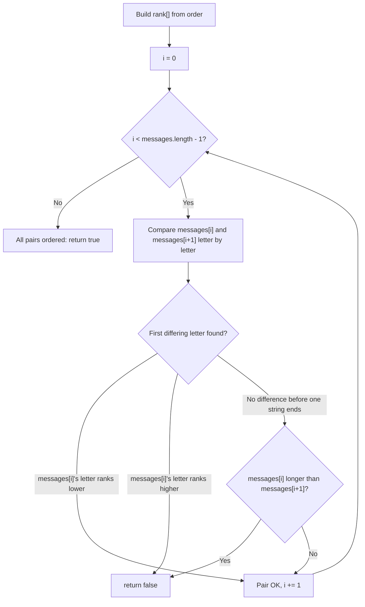

# Feature #2: Verify Message Integrity

## The problem

Our network protocol encrypts every application message with a proprietary scheme. The scheme has a distinctive property: within a single session, the sequence of encrypted messages always appears in sorted order according to a secret dictionary — a custom letter ordering the two communicating parties exchange during a handshake, before any real messages are sent. That dictionary consists of all the letters used in the messages, and it may put them in a completely different order than the regular English alphabet.

Given the sequence of messages received in a session and the dictionary, we need to verify that the messages haven't been tampered with. The key insight: any tampering — reordering, substitution, truncation — would break the sorted-order guarantee, so checking "are these messages still in order according to the dictionary?" is the same as checking "were these messages tampered with?"

**Note:** for simplicity, we assume the encrypted contents only ever use English lowercase letters.

For example, with `order = "hwabcdefgijklmnopqrstuvxyz"`, the session `["hello", "world"]` is untampered — `h` comes before `w` in the dictionary, so `"hello"` correctly precedes `"world"`. But with `order = "educatebfghijklmnopqrsvwxyz"`, the session `["educated", "educate"]` has been tampered with: `"educate"` is a prefix of `"educated"`, and a shorter word must always come before a word it's a prefix of — here it's the other way around, which is impossible under any valid dictionary.

## Solution

We don't need to compare every pair of messages against every other pair — we only need to check each pair of **adjacent** messages. If every adjacent pair is correctly ordered, the whole session is sorted; if we find one adjacent pair out of order, the session has been tampered with.

First, we turn the dictionary into something we can compare with in constant time: a lookup table mapping each letter to its rank (its index in `order`). Then, for each adjacent pair `messages[i]` and `messages[i + 1]`, we walk both strings letter by letter looking for the first position where they differ:

- If `messages[i]`'s letter ranks lower than `messages[i + 1]`'s letter at that position, the pair is correctly ordered — we can stop comparing this pair and move to the next one.
- If `messages[i]`'s letter ranks higher, the pair is out of order — the session has been tampered with, so we return `false` immediately.
- If we exhaust one message before finding any difference, we fall back to length: the shorter message must come first (a word is always "smaller" than any word it's a proper prefix of). If the first message is longer than the second in this situation, we return `false`.

If every adjacent pair passes, the whole sequence is verified intact.



## Code

```java
import java.util.*;

class VerifyMessageIntegrity {
    // Confirms that `messages` are in sorted order under the alien dictionary `order`.
    public static boolean verifyMessageIntegrity(String[] messages, String order) {
        int[] rank = new int[26];
        for (int i = 0; i < order.length(); i++) {
            rank[order.charAt(i) - 'a'] = i;
        }

        for (int i = 0; i < messages.length - 1; i++) {
            if (!inOrder(messages[i], messages[i + 1], rank)) {
                return false;
            }
        }
        return true;
    }

    private static boolean inOrder(String a, String b, int[] rank) {
        int minLen = Math.min(a.length(), b.length());
        for (int i = 0; i < minLen; i++) {
            char ca = a.charAt(i);
            char cb = b.charAt(i);
            if (ca != cb) {
                return rank[ca - 'a'] < rank[cb - 'a'];
            }
        }
        // No differing letter found within the shared prefix: shorter (or equal) must come first.
        return a.length() <= b.length();
    }

    public static void main(String[] args) {
        String[] session1 = {"hello", "world"};
        String order1 = "hwabcdefgijklmnopqrstuvxyz";
        System.out.println(verifyMessageIntegrity(session1, order1));
        // true

        String[] session2 = {"educated", "educate"};
        String order2 = "educatebfghijklmnopqrsvwxyz";
        System.out.println(verifyMessageIntegrity(session2, order2));
        // false
    }
}
```

## Complexity measures

Let **m** be the total number of letters across all messages, and **n** the (fixed) length of the dictionary.

### Time Complexity

`O(m)` — building the rank table takes `O(n)`, and comparing adjacent messages touches each letter at most once across the whole scan. Since `n` is fixed at 26 letters, this reduces to `O(m)`.

### Space Complexity

`O(1)` — the rank table always holds exactly 26 entries, independent of the input size.
