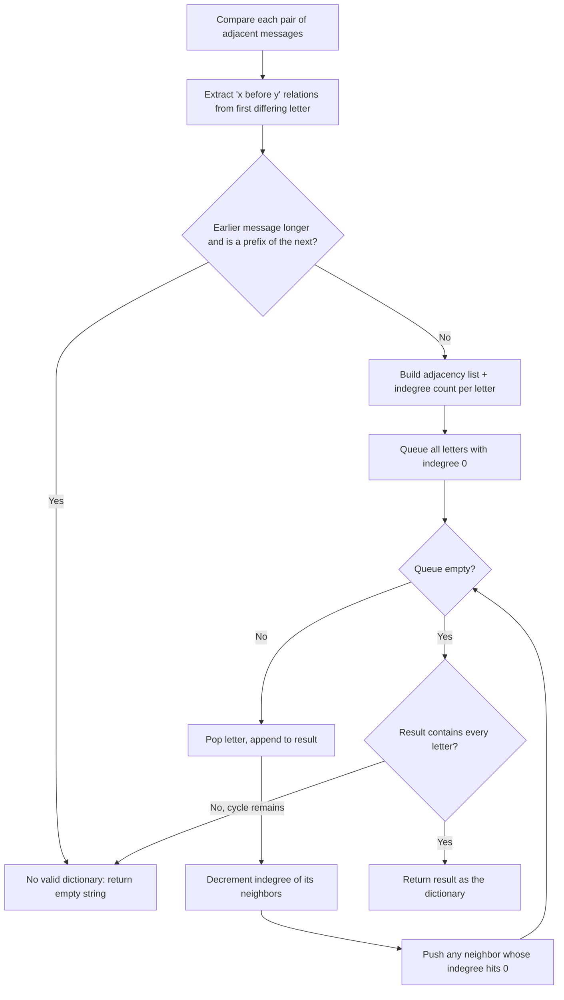

# Feature #3: Find Dictionary

## The problem

Our network protocol again encrypts every message with a scheme where the sequence of encrypted messages in a session appears sorted according to a secret dictionary — but this time, the dictionary itself is never transmitted, for security reasons.

Instead, before real communication starts, the sender transmits a batch of encrypted **training** messages to the receiver. The sender guarantees these training messages follow lexicographic order under the (still unknown) dictionary. The receiver's job is to reverse-engineer that dictionary from the training messages, so it can validate and decrypt everything the sender transmits afterward. If the training messages turn out not to be consistent with any valid dictionary, the receiver gives up, produces an empty dictionary, and asks the sender to retransmit.

**Note:** as before, we assume messages only use English lowercase letters.

For example, given the training messages `["xro", "xma", "per", "pert", "oxh", "olv"]`, one valid reconstructed dictionary is `"artevxhmplo"`. Given `["mdx", "mars", "avgd", "dkae"]`, no valid dictionary exists, so the answer is `""` — because `"mdx"` vs `"mars"` disagree at their second letter, implying `d` comes before `a`, while `"avgd"` vs `"dkae"` disagree at their first letter, implying `a` comes before `d`. Those two relations directly contradict each other, so there is no consistent dictionary. There may be several valid dictionaries for a given input; returning any one of them is acceptable.

## Solution

The letters *within* a single message tell us nothing about ordering — `"educative"` alone doesn't tell us `e` comes before `d`. The only signal we have is which message comes before which. That reframes this as a **graph problem**:

1. **Extract relations.** Compare each pair of adjacent messages and find the first letter where they differ — that tells us one letter comes before another in the dictionary. (If we exhaust one message with no difference and the *earlier* message is longer, e.g. `"educated"` before `"educate"`, there's no valid dictionary at all — a prefix must always sort before the word it's a prefix of.)
2. **Build a graph.** Each unique letter is a node; each relation `x before y` becomes a directed edge `x -> y`.
3. **Topologically sort the graph.** The resulting node order is a valid dictionary. If the graph has a cycle, no valid dictionary exists.

For step 3, rather than repeatedly re-scanning every node's edges to find which nodes currently have no incoming edges, we track each letter's **indegree** — the count of edges still pointing into it — directly. Any letter with indegree `0` has nothing left that must come before it, so it's safe to place next in the output. We seed a queue with every letter that starts at indegree `0`, then repeatedly pop a letter, append it to the result, and decrement the indegree of everything it points to — pushing any neighbor whose indegree just hit `0`. This is exactly **Kahn's algorithm** for topological sort via BFS.

If we run out of queue entries before every letter has been placed, some letters still have unresolved incoming edges — that's a cycle, and there is no valid dictionary.



## Code

```java
import java.util.*;

class FindDictionary {
    // Reverse-engineers a dictionary (letter ordering) consistent with the sorted training messages.
    public static String findDictionary(String[] messages) {
        Map<Character, Set<Character>> adjacency = new HashMap<>();
        Map<Character, Integer> indegree = new HashMap<>();

        for (String message : messages) {
            for (char c : message.toCharArray()) {
                indegree.putIfAbsent(c, 0);
                adjacency.putIfAbsent(c, new HashSet<>());
            }
        }

        for (int i = 0; i < messages.length - 1; i++) {
            String w1 = messages[i];
            String w2 = messages[i + 1];
            int minLen = Math.min(w1.length(), w2.length());

            if (w1.length() > w2.length() && w1.startsWith(w2)) {
                return ""; // Longer message can't come before its own prefix.
            }

            for (int j = 0; j < minLen; j++) {
                char c1 = w1.charAt(j);
                char c2 = w2.charAt(j);
                if (c1 != c2) {
                    if (!adjacency.get(c1).contains(c2)) {
                        adjacency.get(c1).add(c2);
                        indegree.put(c2, indegree.get(c2) + 1);
                    }
                    break;
                }
            }
        }

        Queue<Character> queue = new ArrayDeque<>();
        for (char c : indegree.keySet()) {
            if (indegree.get(c) == 0) {
                queue.add(c);
            }
        }

        StringBuilder dictionary = new StringBuilder();
        while (!queue.isEmpty()) {
            char c = queue.poll();
            dictionary.append(c);
            for (char next : adjacency.get(c)) {
                indegree.put(next, indegree.get(next) - 1);
                if (indegree.get(next) == 0) {
                    queue.add(next);
                }
            }
        }

        return dictionary.length() == indegree.size() ? dictionary.toString() : "";
    }

    public static void main(String[] args) {
        String[] training1 = {"xro", "xma", "per", "pert", "oxh", "olv"};
        System.out.println(findDictionary(training1));
        // artevxhmplo

        String[] training2 = {"mdx", "mars", "avgd", "dkae"};
        System.out.println("[" + findDictionary(training2) + "]");
        // []
    }
}
```

## Complexity measures

Let **n** be the number of messages, **c** the total number of letters across all messages, and **u** the number of unique letters (at most 26 here).

### Time Complexity

`O(c)` — extracting relations examines every letter of every message in the worst case, which costs `O(c)`. The topological sort itself is a BFS over `u` nodes and at most `min(u², n - 1)` edges (one edge can be generated per adjacent pair, and no more than one edge can exist between any pair of letters), which is bounded by `O(c)` given a fixed, small alphabet — so the two parts combine to `O(c)`.

### Space Complexity

`O(1)` for our use case — the adjacency list and indegree map are bounded by `O(u + min(u², n))`, but with `u` fixed at 26 letters, that collapses to a constant.
