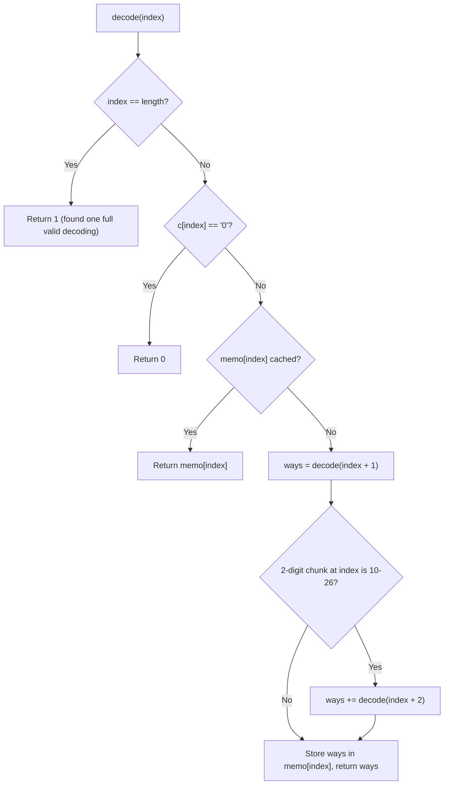

# Feature #4: Ways to Decode Message

## The problem

We're building a cryptanalysis tool for a simple substitution cipher: each letter of the alphabet maps to a specific numeric code — `1` for `A`, `2` for `B`, and so on through `26` for `Z`.

The trouble is that, without extra information, a ciphertext doesn't always decode to a unique plaintext. Given the digit string `"123"`, is it `ABC` (grouped as `1`, `2`, `3`), or `AW` (`1`, `23`), or `LC` (`12`, `3`)? To decode a message, we have to group its digits into valid 1-or-2-digit chunks and map each chunk back to a letter — and there may be more than one way to do that grouping.

Given a ciphertext `c` (a string of digits only, possibly with leading zeros), we need to return **how many** distinct plaintexts it could decode to — not the plaintexts themselves.

For example, `"12"` can decode to `"AB"` (`1`, `2`) or `"L"` (`12`) — **2** ways. `"226"` can decode to `"BZ"` (`2`, `26`), `"BBF"` (`2`, `2`, `6`), or `"VF"` (`22`, `6`) — **3** ways. But `"0"` and `"08"` both decode **0** ways, since `"0"` and `"08"` don't correspond to any letter (`0` alone isn't a valid single-digit code, and a leading zero can never start a valid two-digit code either).

## Solution

At any position in the ciphertext, we face a choice: consume the current digit as a 1-digit code, or consume the current and next digit together as a 2-digit code (as long as that two-digit chunk is `10`–`26`). Each valid choice branches into a new sub-problem — "how many ways to decode the rest of the string, starting from the new position" — and we recurse until we fall off the end of the string, at which point we've found one complete, valid decoding.

If a position's digit is `'0'`, no valid 1-digit code starts there, and it can never be validly grouped except as the *second* digit of a 2-digit code — so that path immediately contributes `0`. If the two-digit chunk at a position is above `26` (or is a single `0`), the 2-digit branch is simply unavailable, and only the 1-digit branch is explored.

The key efficiency observation is that many of these recursive calls are asked the exact same question — "how many ways to decode from index `i` onward?" — regardless of how we got there. That's a classic **overlapping sub-problems** signature, so we memoize on the starting index: the first time we solve "decode from index `i`," we cache the answer, and every subsequent call for that same index is an `O(1)` lookup instead of a re-exploration.



## Code

```java
import java.util.*;

class WaysToDecodeMessage {
    // Returns how many distinct plaintexts the ciphertext `c` could decode to.
    public static int waysToDecodeMessage(String c) {
        if (c == null || c.isEmpty()) return 0;
        int[] memo = new int[c.length() + 1];
        Arrays.fill(memo, -1);
        return decode(c, 0, memo);
    }

    private static int decode(String c, int index, int[] memo) {
        if (index == c.length()) {
            return 1; // Reached the end: one valid decoding found along this path.
        }
        if (c.charAt(index) == '0') {
            return 0; // No valid code starts with '0'.
        }
        if (memo[index] != -1) {
            return memo[index];
        }

        int ways = decode(c, index + 1, memo); // 1-digit code.

        if (index + 1 < c.length()) {
            int twoDigit = Integer.parseInt(c.substring(index, index + 2));
            if (twoDigit <= 26) {
                ways += decode(c, index + 2, memo); // 2-digit code.
            }
        }

        memo[index] = ways;
        return ways;
    }

    public static void main(String[] args) {
        System.out.println(waysToDecodeMessage("12"));
        // 2
        System.out.println(waysToDecodeMessage("0"));
        // 0
        System.out.println(waysToDecodeMessage("226"));
        // 3
        System.out.println(waysToDecodeMessage("08"));
        // 0
    }
}
```

## Complexity measures

Let **n** be the length of the ciphertext.

### Time Complexity

`O(n)` — memoization ensures we compute the answer for each starting index exactly once, and each computation does `O(1)` work beyond its (memoized) recursive calls.

### Space Complexity

`O(n)` — the memo array holds one entry per index, and the recursion stack can go as deep as `n` in the worst case (a string of all `1`s or `2`s, for instance).
