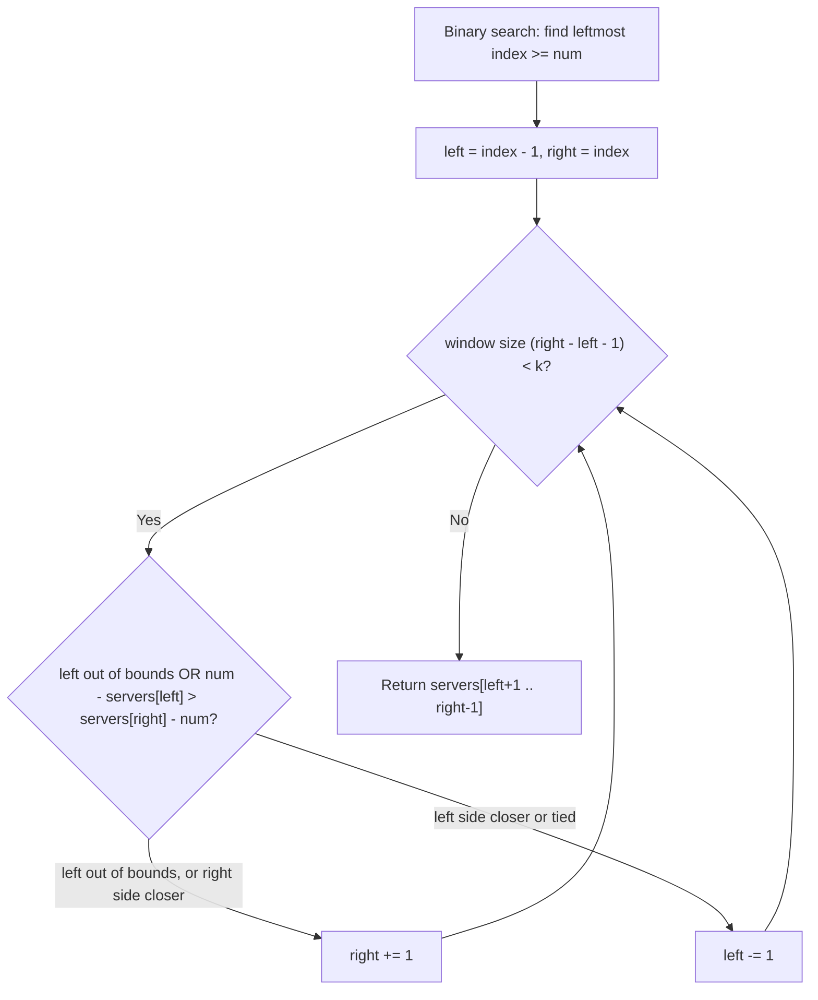

# Feature #5: Eligible Candidates

## The problem

We have `n` machines in a cluster and need to elect a leader. Running an election across all `n` machines at once generates a lot of network traffic and takes a lot of time — so we want to shrink the field before the election even starts.

Here's the scheme: each machine has a unique ID, and all the IDs are kept in a **sorted** array. A random number is drawn, and the `k` machines whose IDs are closest to that number become the eligible candidates — only they participate in the actual leader election.

Given the sorted array `servers`, a randomly drawn number `num`, and an integer `k`, we need to return the `k` machine IDs closest to `num`, themselves sorted in ascending order. An ID `a` counts as closer than `b` if `|a - num| < |b - num|`; if the distances tie, the smaller ID wins.

For example, with `servers = [-29, -11, -3, 0, 5, 10, 50, 63, 198]`, `num = 8`, `k = 6`: the distances to `8` are `37, 19, 11, 8, 3, 2, 42, 55, 190`. The six smallest distances belong to `10, 5, 0, -3, -11, -29` — sorted ascending, that's **`[-29, -11, -3, 0, 5, 10]`**.

## Solution

Since `servers` is already sorted, we don't need to compute every distance and sort them — we can be much more targeted. The `k` closest elements to `num` always form a single **contiguous window** somewhere in the sorted array (never a scattered set), so the problem reduces to finding where that window starts and ends.

We find a good starting point with binary search: locate the leftmost index whose value is `>= num` — this splits the array into "candidates approaching from below" (to its left) and "candidates approaching from above" (at and to its right). From there, we grow a window outward one element at a time using two pointers, `left` (just below the split) and `right` (at the split), until the window holds exactly `k` elements. At each step, we compare the next candidate on the left (`servers[left]`) against the next candidate on the right (`servers[right]`) and pull in whichever is closer to `num` — moving that pointer one step further outward. Ties favor the smaller ID, which is automatically the left candidate, so on a tie we pull from the left.

Once the window reaches size `k`, the elements strictly between `left` and `right` are exactly our answer, already in ascending order because the source array was sorted.



## Code

```java
import java.util.*;

class EligibleCandidates {
    // Returns the k server IDs closest to `num`, sorted ascending.
    public static List<Integer> eligibleCandidates(int[] servers, int num, int k) {
        int n = servers.length;
        if (k == n) {
            List<Integer> all = new ArrayList<>();
            for (int s : servers) all.add(s);
            return all;
        }

        // Binary search for the leftmost index whose value is >= num.
        int lo = 0, hi = n - 1;
        while (lo < hi) {
            int mid = lo + (hi - lo) / 2;
            if (servers[mid] < num) {
                lo = mid + 1;
            } else {
                hi = mid;
            }
        }

        int left = lo - 1;
        int right = lo;

        while (right - left - 1 < k) {
            if (left < 0) {
                right++;
            } else if (right >= n) {
                left--;
            } else if (num - servers[left] <= servers[right] - num) {
                left--; // Left candidate is closer (or tied, and thus smaller).
            } else {
                right++;
            }
        }

        List<Integer> result = new ArrayList<>();
        for (int i = left + 1; i < right; i++) {
            result.add(servers[i]);
        }
        return result;
    }

    public static void main(String[] args) {
        int[] servers = {-29, -11, -3, 0, 5, 10, 50, 63, 198};
        System.out.println(eligibleCandidates(servers, 8, 6));
        // [-29, -11, -3, 0, 5, 10]
    }
}
```

## Complexity measures

Let **n** be the size of `servers` and `k` be the number of candidates requested.

### Time Complexity

`O(log n + k)` — the binary search for the starting split costs `O(log n)`, and growing the window from size 0 to size `k` costs `O(k)`.

### Space Complexity

`O(1)` — beyond the output list (not counted toward space complexity), only a constant number of index variables are used.
