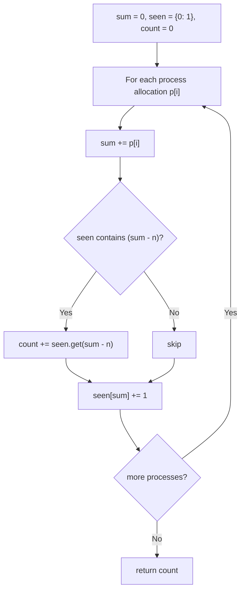

# Feature #1: Allocate Space

## The problem

We're building the memory manager. `p` processes are currently running, numbered `1` through `p`, and they're allocated memory **contiguously** — process `1` occupies `p_1` MB, process `2` immediately after occupies `p_2` MB, and so on. We're given these allocations as an array of integers.

An incoming process needs a contiguous chunk of `n` MB somewhere in memory. To free that space, we can preempt (evict) one process, or a run of several processes that sit next to each other in memory — as long as the memory they collectively free up adds up to exactly `n` MB.

Our task: count the total number of ways to pick such a contiguous run of currently running processes whose allocations sum to exactly `n`.

For example, given allocations `[1, 2, 3, 3]` (in MB) and a new process needing `n = 3` MB, there are **3** valid contiguous groups we could evict: processes at indices `0-1` (`1 + 2 = 3`), the process at index `2` (`3`), and the process at index `3` (`3`).

## Solution

This is the classic **subarray sum equals k** pattern. The key trick is prefix sums: if `sum[j]` is the cumulative memory allocated up through index `j`, then the memory used by the contiguous run of processes from index `i+1` to `j` is `sum[j] - sum[i]`. So a contiguous run summing to `n` exists between two prefix-sum points whenever `sum[j] - sum[i] == n`.

We don't need to store every prefix sum explicitly and compare pairs — we can do it in one pass. As we walk the array left to right, keeping a running `sum`, we ask "how many earlier prefix sums equal `sum - n`?" Every one of those is the start of a valid contiguous run ending here. A hashmap of `(prefix sum -> how many times we've seen it)` answers that in constant time, and we seed it with `(0, 1)` so a run starting right at index `0` is counted correctly.



## Code

```java
import java.util.*;

class Solution {
    // Counts contiguous runs of processes whose allocations sum to exactly n.
    public static int allocateSpace(int[] processes, int n) {
        int count = 0;
        int sum = 0;
        Map<Integer, Integer> seen = new HashMap<>();
        seen.put(0, 1); // an empty prefix sums to 0.

        for (int i = 0; i < processes.length; i++) {
            sum += processes[i];
            if (seen.containsKey(sum - n)) {
                count += seen.get(sum - n);
            }
            seen.put(sum, seen.getOrDefault(sum, 0) + 1);
        }
        return count;
    }

    public static void main(String[] args) {
        int[] processes = {1, 2, 3, 3};
        System.out.println(allocateSpace(processes, 3));
        // 3
    }
}
```

## Complexity measures

Let **n** be the number of currently running processes (array length).

### Time Complexity

`O(n)` — a single left-to-right pass over the array, with constant-time hashmap lookups and updates at each step.

### Space Complexity

`O(n)` — the hashmap can hold up to one entry per distinct prefix sum, which in the worst case is one per array element.
