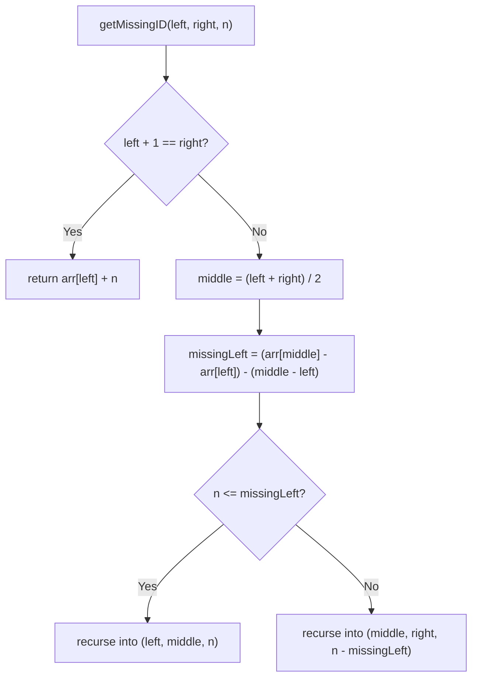

# Feature #2: Resume Process

## The problem

Processes get allocated contiguous memory blocks in ascending order of process ID — lower IDs sit near address `0`, higher IDs sit at higher addresses. Some processes have been preempted (interrupted) and currently hold no memory; the OS resumes preempted processes round-robin, starting from the lowest missing process ID.

We're in the `n`th round of resumption. Given the sorted array of process IDs that are *currently* in memory, find the `n`th process ID that's missing from that array (counting from the beginning).

For example, with process IDs `[5, 7, 9, 10, 13]` currently in memory, the missing IDs in order are `6, 8, 11, 12, ...` — so the 3rd process to resume is `11`.

## Solution

Since the array is sorted, binary search is the tool here — but instead of searching for a value, we're searching for a **count** of missing numbers, so each recursive step needs to know how many numbers are missing in a sub-range.

For any two indices `left` and `right` (with `arr[left] < arr[right]`), the range `arr[left] .. arr[right]` should contain `arr[right] - arr[left] + 1` numbers if none were missing. Since it actually holds `right - left + 1` array elements, the number of *missing* values strictly between them is:

```
missing(left, right) = (arr[right] - arr[left]) - (right - left)
```

We recursively split the range in half (the two halves share the middle element, so we don't lose the boundary). If the required count `n` is less than or equal to the number missing in the left half, the answer is in there — recurse into it unchanged. Otherwise, subtract the left half's missing count from `n` and recurse into the right half. Once the range narrows down to two adjacent array elements (`left + 1 == right`), we've localized the gap: the answer is `arr[left] + n`.

Walking through `[5, 7, 9, 10, 13]` looking for the 3rd missing number: splitting into `[5,7,9]` and `[9,10,13]` shows only 2 missing values in the left half (`6, 8`), so we move to the right half needing the 1st missing number there. Splitting `[9,10,13]` into `[9,10]` (0 missing) and `[10,13]` (2 missing) — since we still need only the 1st missing number, it must be in `[10,13]`, and that pair is now adjacent, so the answer is `arr[left] + n = 10 + 1 = 11`.



## Code

```java
class Solution {
    // Finds the nth missing process ID from the sorted array of IDs currently in memory.
    public static int resumeProcess(int[] arr, int n) {
        return getMissingID(arr, 0, arr.length - 1, n);
    }

    private static int getMissingID(int[] arr, int left, int right, int n) {
        if (left + 1 == right) {
            return arr[left] + n;
        }
        int middle = (left + right) / 2;
        int missingInLeftHalf = (arr[middle] - arr[left]) - (middle - left);
        if (n <= missingInLeftHalf) {
            return getMissingID(arr, left, middle, n);
        } else {
            return getMissingID(arr, middle, right, n - missingInLeftHalf);
        }
    }

    public static void main(String[] args) {
        int[] arr = {5, 7, 9, 10, 13};
        System.out.println(resumeProcess(arr, 3));
        // 11
    }
}
```

## Complexity measures

Let **n** be the number of elements in the array.

### Time Complexity

`O(log n)` — each recursive call halves the search range.

### Space Complexity

`O(log n)` — the recursion depth grows logarithmically with the array size (no extra data structures are allocated).
