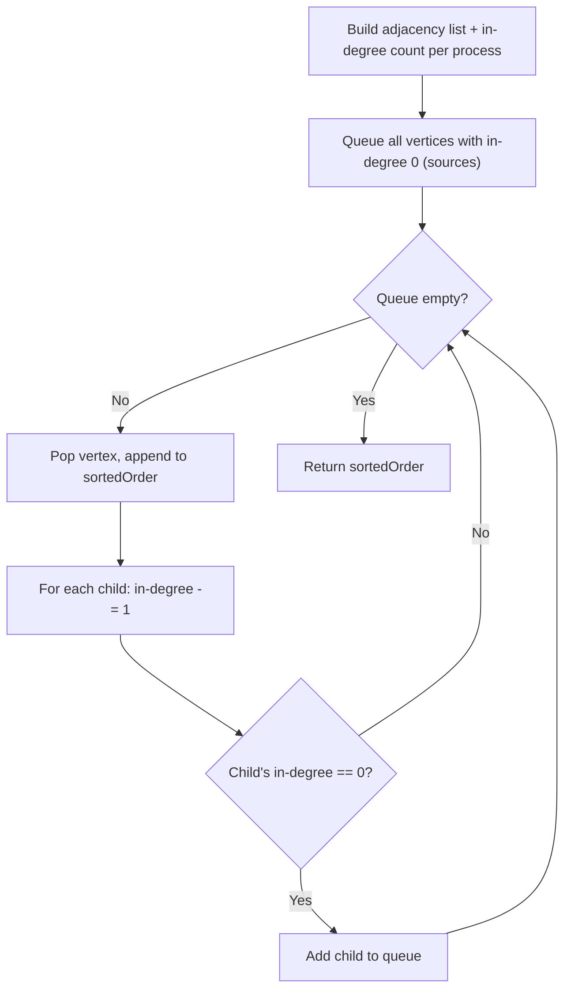

# Feature #3: Schedule Processes

## The problem

When the system boots, the OS needs to run a number of processes in some order. Some processes have dependencies, given as ordered pairs `(a, b)` meaning process `b` must run before process `a`. Some processes have no dependencies at all, and there are never circular dependencies like `(a, b)` and `(b, a)` together.

Given the total number of processes `n` and an array of dependency pairs, find a valid order to run all the processes so that every process's dependencies are satisfied before it runs.

For example, with 6 processes where process `3` depends on both `2` and `5`, process `2` depends on `4`, process `5` depends on `4` and is also needed by `1`, and process `4` depends on `6` — one valid run order is `6, 4, 2, 5, 3, 1` (another equally valid order is `6, 4, 5, 2, 1, 3`).

## Solution

Model each process as a vertex and each dependency as a directed edge. This is exactly a **topological sort** of a directed acyclic graph (DAG): an ordering of vertices such that for every edge `U -> V`, `U` comes before `V`.

Two building blocks make this concrete:
- A **source** is any vertex with no incoming edges — it has no unmet dependencies, so it can always run.
- Every ordering must start with a source and, as we peel sources away, new sources appear once their dependencies are satisfied.

We find the order using a BFS-style approach known as **Kahn's algorithm**:

1. Build the graph as an adjacency list (`HashMap` from parent vertex to its list of children/dependents) and an in-degree count per vertex (how many dependencies still point at it).
2. Any vertex whose in-degree is `0` is a source — put all of them in a queue.
3. Repeatedly pop a source, append it to the sorted result, then for each of its children, decrement their in-degree. Any child whose in-degree drops to `0` becomes a new source and joins the queue.
4. Once the queue is empty, the sorted list is the answer (if it doesn't contain all vertices, the graph had a cycle).



## Code

```java
import java.util.*;

class Solution {
    // Returns a valid run order for the processes so every dependency runs first.
    public static List<Integer> scheduleProcess(int vertices, int[][] edges) {
        List<Integer> sortedOrder = new ArrayList<>();
        if (vertices <= 0) return sortedOrder;

        Map<Integer, Integer> inDegree = new HashMap<>();
        Map<Integer, List<Integer>> graph = new HashMap<>();
        for (int i = 1; i <= vertices; i++) {
            inDegree.put(i, 0);
            graph.put(i, new ArrayList<>());
        }

        // edge[0] depends on edge[1], so edge[1] is the parent, edge[0] the child.
        for (int[] edge : edges) {
            int parent = edge[1], child = edge[0];
            graph.get(parent).add(child);
            inDegree.put(child, inDegree.get(child) + 1);
        }

        Queue<Integer> sources = new LinkedList<>();
        for (Map.Entry<Integer, Integer> entry : inDegree.entrySet()) {
            if (entry.getValue() == 0) sources.add(entry.getKey());
        }

        while (!sources.isEmpty()) {
            int vertex = sources.poll();
            sortedOrder.add(vertex);
            for (int child : graph.get(vertex)) {
                inDegree.put(child, inDegree.get(child) - 1);
                if (inDegree.get(child) == 0) sources.add(child);
            }
        }

        // If not all vertices made it in, the graph had a cycle - no valid order.
        if (sortedOrder.size() != vertices) return new ArrayList<>();
        return sortedOrder;
    }

    public static void main(String[] args) {
        // Process 3 depends on 2 and 5; 2 and 5 depend on 4; 1 depends on 5; 4 depends on 6.
        int[][] edges = {{3, 2}, {3, 5}, {2, 4}, {5, 4}, {4, 6}, {1, 5}};
        System.out.println(scheduleProcess(6, edges));
        // [6, 4, 2, 5, 3, 1]
    }
}
```

## Complexity measures

Let **V** be the number of processes and **E** be the number of dependency pairs.

### Time Complexity

`O(V + E)` — every vertex becomes a source exactly once, and every edge is traversed and decremented exactly once.

### Space Complexity

`O(V + E)` — the adjacency list stores every edge once, plus one in-degree entry per vertex.
