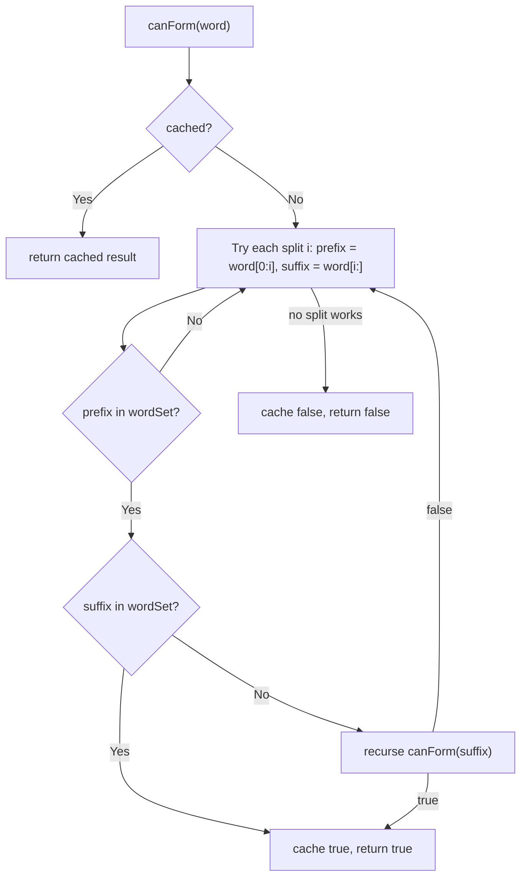

# Feature #4: Compress File

## The problem

We need a compression strategy for text files. Whenever a word in a file is a concatenation of two or more other, smaller words that also appear in the same file, we replace it with the smaller words' IDs instead of storing it as-is — saving space.

For example, given the words `n`, `cat`, `cats`, `dog`, and `catsndog` in a file: `catsndog` is a concatenation of `cats` and `n` and `dog` (`cats + n + dog`), so it can be replaced with those words' IDs.

Given an array of all the words in a file, identify and return every word that's a concatenation of other words from the same array.

## Solution

For each word, we try every way of splitting it into a `prefix` and a `suffix`. For `catsndog`, that's `(c, atsndog)`, `(ca, tsndog)`, `(cat, sndog)`, `(cats, ndog)`, and so on. A split only matters if the `prefix` is itself a word in our list — checking that first lets us skip straight past hopeless splits without touching the `suffix` at all.

If the `prefix` is a valid word, we then check the `suffix`. Either:
- The `suffix` is *itself* a word in the list — done, this split proves the whole word is a concatenation.
- The `suffix` is itself a concatenation of further words — we don't know that yet, so we recursively run the exact same check on the `suffix` (this is where `ndog` gets broken down into `n` + `dog`).
- Neither holds, so this particular split doesn't work — move on to the next split point.

This recursive breakdown, tried across every split point of every word, forms a tree of overlapping sub-checks: checking `catsndog`'s split `(c, atsndog)` and `(ca, tsndog)` can both end up recursing into the same suffix. To avoid re-deriving the same answer many times, we memoize: once we know whether a given (sub)word can be formed from smaller words, we cache the result and reuse it.

Implementation shape:
1. Put all words into a `HashSet` for `O(1)` membership checks, and keep a `HashMap<String, Boolean>` cache for memoized results.
2. For every word, run the recursive check.
3. In the check: if the word is already cached, return that. Otherwise, try every split point; for a prefix found in the set, either confirm the suffix is a whole word, or recurse on the suffix. Cache and return whichever result we land on.



## Code

```java
import java.util.*;

class Solution {
    // Returns every word that is a concatenation of two or more smaller words from the same list.
    public static List<String> identifyConcatenations(String[] words) {
        List<String> result = new ArrayList<>();
        Set<String> wordSet = new HashSet<>(Arrays.asList(words));
        Map<String, Boolean> cache = new HashMap<>();

        for (String word : words) {
            if (!word.isEmpty() && canForm(word, wordSet, cache)) {
                result.add(word);
            }
        }
        return result;
    }

    private static boolean canForm(String word, Set<String> wordSet, Map<String, Boolean> cache) {
        if (cache.containsKey(word)) {
            return cache.get(word);
        }

        for (int i = 1; i < word.length(); i++) {
            String prefix = word.substring(0, i);
            String suffix = word.substring(i);
            if (wordSet.contains(prefix) && (wordSet.contains(suffix) || canForm(suffix, wordSet, cache))) {
                cache.put(word, true);
                return true;
            }
        }
        cache.put(word, false);
        return false;
    }

    public static void main(String[] args) {
        String[] words = {"n", "cat", "cats", "dog", "catsndog"};
        System.out.println(identifyConcatenations(words));
        // [catsndog]
    }
}
```

## Complexity measures

Let **n** be the number of words and **m** be the average word length.

### Time Complexity

`O(n × m²)` — each word has `O(m)` split points, and forming/comparing the `prefix`/`suffix` substrings at each split costs `O(m)`, giving `O(m²)` per word across `n` words.

### Space Complexity

`O(n × m²)` — the word set and cache each hold `O(n × m)` characters, and in the worst case the substrings generated across all splits of all words add up to `O(n × m²)`.
