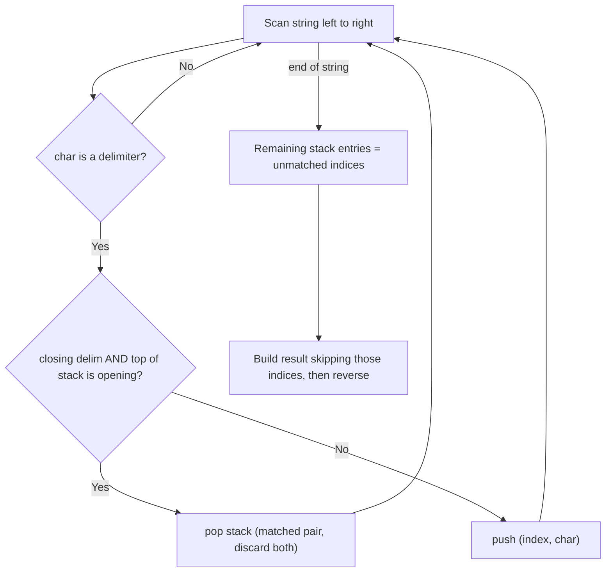

# Feature #5: Recover Files

## The problem

A file contains a byte stream with optional sections marked by start and end delimiters — think `(` and `)`. While downloading, some delimiters get corrupted: a start delimiter might silently become an end delimiter or vice versa, and we can't tell which one was corrupted. Delimiters can also be nested.

Our job: recover the file by removing the *minimum* number of unmatched delimiters, leaving every remaining delimiter properly paired.

For example, `"a)b(c)d"` has an unmatched `)` right after `a` — removing just that one character gives the valid `"ab(c)d"`. And `"(a(b(c)d)"` has one unmatched opening `(` at the very start — removing it gives `"a(b(c)d)"`.

## Solution

This is a stack problem: we scan the string once, and every time we see a delimiter, we ask "does it close something currently open?"

We push `(index, character)` pairs onto a stack whenever we see a delimiter. If the current character is a closing delimiter `)` **and** the top of the stack is an opening delimiter `(`, they match — pop the stack and move on, without pushing the closing delimiter at all. Otherwise, push the current delimiter (either because it's an opening delimiter, or because it's a closing delimiter with nothing open to match).

After the scan, whatever delimiters remain on the stack are exactly the unmatched ones — some closing delimiters that never found an opener before them, and some opening delimiters that never found a closer after them. We collect their indices into a removal set.

To build the result, we walk the original string from the end to the beginning, skipping any index in the removal set and appending everything else to a `StringBuilder`. Walking from the end matters because unmatched *opening* delimiters sit deep in the stack (pushed early) while unmatched *closing* delimiters sit near the top (pushed late) — but since we only care about the *set* of bad indices, not their order, we build backward and reverse once at the end to restore the original left-to-right order.



## Code

```java
import java.util.*;

class Pair {
    int index;
    char delimiter;
    public Pair(int index, char delimiter) {
        this.index = index;
        this.delimiter = delimiter;
    }
}

class Solution {
    // Removes the minimum number of unmatched '(' / ')' delimiters to recover a valid file.
    public static String recoverFile(String s) {
        Deque<Pair> stack = new ArrayDeque<>();
        for (int i = 0; i < s.length(); i++) {
            char c = s.charAt(i);
            if (c != '(' && c != ')') continue;
            if (c == ')' && !stack.isEmpty() && stack.peek().delimiter == '(') {
                stack.pop(); // Matched pair - drop both.
            } else {
                stack.push(new Pair(i, c));
            }
        }

        Set<Integer> unmatchedIndices = new HashSet<>();
        for (Pair p : stack) {
            unmatchedIndices.add(p.index);
        }

        StringBuilder builder = new StringBuilder();
        for (int i = s.length() - 1; i >= 0; i--) {
            if (!unmatchedIndices.contains(i)) {
                builder.append(s.charAt(i));
            }
        }
        return builder.reverse().toString();
    }

    public static void main(String[] args) {
        System.out.println(recoverFile("a)b(c)d"));
        // ab(c)d
        System.out.println(recoverFile("(a(b(c)d)"));
        // a(b(c)d)
    }
}
```

## Complexity measures

Let **n** be the length of the string.

### Time Complexity

`O(n)` — one pass to find unmatched delimiters, one pass to build the result string.

### Space Complexity

`O(n)` — in the worst case (e.g. `")))((("`) every character is an unmatched delimiter, so the stack and the removal set can both grow to size `n`.
