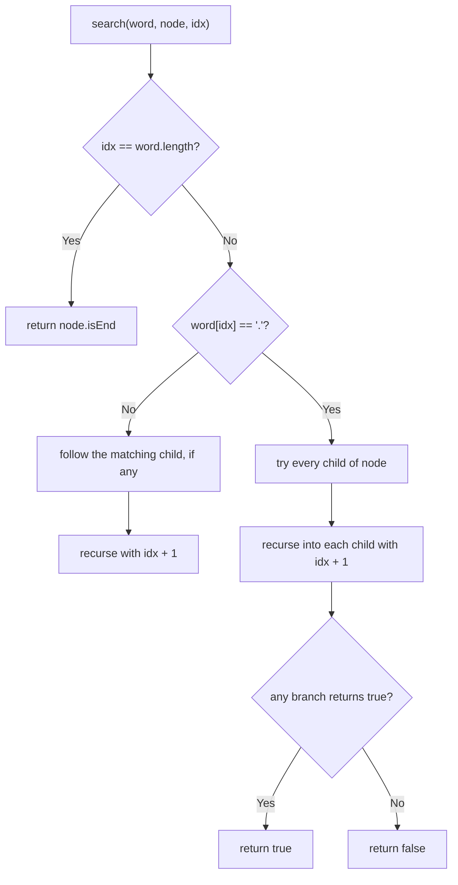

# Feature #6: File Management System

## The problem

We're building a file management system that maintains a file system index and supports:

- **Adding** a file or directory name — each name can only be added once, and names are case-sensitive (`"Data"` and `"data"` are different entries).
- **Searching** with an optional wildcard `.`, which matches any single character. For example, searching `.ata` should match `data`, `Aata`, `bata`, and so on — but only if that exact-length name was actually added. If the searched word only matches *part* of an added name (or nothing at all), the search must return `false`.
- **Listing** every file and directory name currently in the system.

For example: after adding `data`, searching `.ata` returns `true` (it matches `data`), searching `data` returns `true`, and searching `dat` returns `false` (no 3-letter name was ever added).

## Solution

This is a job for a **trie** (prefix tree). Each `TrieNode` holds a map from character to child node, plus a flag marking whether a complete name ends there. Since names are case-sensitive, we key each node's children by `Character` in a `HashMap` rather than assuming a fixed 26-letter lowercase alphabet — that handles any mix of upper/lowercase (or digits/symbols) without extra bookkeeping.

**Adding** a name walks the trie one character at a time, creating child nodes as needed, then marks the final node as a complete entry.

**Searching** without any `.` is just as simple — walk character by character, following the matching child, and fail as soon as a character has no matching child. The wildcard is what needs extra care: whenever we hit a `.`, we don't know which child to follow, so we try *all* of the current node's children and recurse into each one. If any of those recursive branches finds a complete match for the rest of the word, the whole search succeeds.

**Listing everything** is a straightforward DFS over the trie: walk every path from the root, and whenever we pass through a node marked as a complete name, record the path built up so far.



## Code

```java
import java.util.*;

class TrieNode {
    Map<Character, TrieNode> children = new HashMap<>();
    boolean isEnd = false;
}

class FileSystem {
    private final TrieNode root = new TrieNode();

    // Adds a name. Returns false if it already exists.
    public boolean add(String name) {
        TrieNode node = root;
        for (char c : name.toCharArray()) {
            node = node.children.computeIfAbsent(c, k -> new TrieNode());
        }
        if (node.isEnd) return false;
        node.isEnd = true;
        return true;
    }

    // Searches with an optional '.' wildcard matching any single character.
    public boolean search(String word) {
        return searchHelper(root, word, 0);
    }

    private boolean searchHelper(TrieNode node, String word, int idx) {
        if (idx == word.length()) return node.isEnd;
        char c = word.charAt(idx);
        if (c == '.') {
            for (TrieNode child : node.children.values()) {
                if (searchHelper(child, word, idx + 1)) return true;
            }
            return false;
        }
        TrieNode child = node.children.get(c);
        return child != null && searchHelper(child, word, idx + 1);
    }

    // Returns every complete name currently stored in the trie.
    public List<String> getAll() {
        List<String> result = new ArrayList<>();
        getAllHelper(root, new StringBuilder(), result);
        return result;
    }

    private void getAllHelper(TrieNode node, StringBuilder path, List<String> result) {
        if (node.isEnd) result.add(path.toString());
        for (Map.Entry<Character, TrieNode> entry : node.children.entrySet()) {
            path.append(entry.getKey());
            getAllHelper(entry.getValue(), path, result);
            path.deleteCharAt(path.length() - 1);
        }
    }

    public static void main(String[] args) {
        FileSystem fs = new FileSystem();
        System.out.println(fs.add("data"));
        // true
        System.out.println(fs.add("data"));
        // false (already exists)
        System.out.println(fs.search(".ata"));
        // true
        System.out.println(fs.search("dat"));
        // false
        System.out.println(fs.getAll());
        // [data]
    }
}
```

## Complexity measures

Let **m** be the length of a file/directory name and **n** be the total number of stored names.

### Time Complexity

- **add:** `O(m)` — one hashmap lookup/creation per character.
- **search:** `O(26^m)` worst case — a name made entirely of wildcards can branch into every child at every level.
- **getAll:** `O(n × m)` — a full DFS over every stored name's path.

### Space Complexity

- **add:** `O(m)` new nodes per call in the worst case (no shared prefix with existing names).
- **search:** `O(m)` for the recursion stack.
- **getAll:** `O(n × m)` to hold the recursion stack and the collected result strings.
