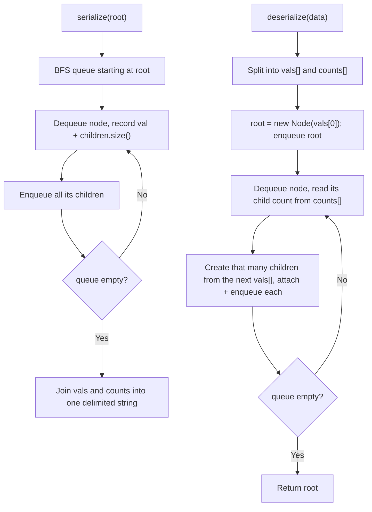

# Feature #7: Serialize and Deserialize File System

## The problem

We need a remote sync utility that copies part of the filesystem — rooted at a specific directory — to a remote machine. The whole filesystem lives in memory as an N-ary tree (each directory/file node can have any number of children). To move it across the wire, we need to **serialize** the tree into a string, and later **deserialize** that string back into the exact same tree structure.

There's no fixed format we must follow — any scheme works, as long as serializing then deserializing reproduces the original tree.

For example, a root directory `1` with a subdirectory `3` (itself containing files `5` and `6`) plus siblings `2` and `4`, should serialize to some string, and deserializing that string must reconstruct the same tree, with `3` still having children `5` and `6`.

## Solution

The natural fit here is a **level-order (BFS) traversal** that records two pieces of information for every node: its value, and how many children it has. Knowing "how many children" for each node in visiting order is exactly enough information to know where to reattach the next batch of nodes during deserialization — no explicit parent pointers or brackets needed.

**Serializing:** push the root into a queue. Repeatedly dequeue a node, record its value in a `vals` list and its children count in a `counts` list, then enqueue all of its children. Once the queue is empty, join both lists into strings (comma-separated) and combine them into a single string, separated by a delimiter that can't appear inside a value (e.g. `|`).

**Deserializing:** split the string back into the `vals` and `counts` arrays. The very first value is the root. Then replay the same BFS bookkeeping in reverse: dequeue a node, look up how many children it should have (next entry in `counts`), and pull that many values off the front of the remaining `vals` array to create and attach that many children — enqueueing each new child so its own children get attached in turn.



## Code

```java
import java.util.*;

class Node {
    int val;
    List<Node> children;
    Node(int val) {
        this.val = val;
        children = new ArrayList<>();
    }
}

class Codec {
    // Encodes an N-ary tree to a single string using level-order traversal.
    public String serialize(Node root) {
        if (root == null) return "";
        List<String> vals = new ArrayList<>();
        List<String> counts = new ArrayList<>();
        Queue<Node> queue = new LinkedList<>();
        queue.add(root);

        while (!queue.isEmpty()) {
            Node cur = queue.poll();
            vals.add(String.valueOf(cur.val));
            counts.add(String.valueOf(cur.children.size()));
            queue.addAll(cur.children);
        }
        return String.join(",", vals) + "|" + String.join(",", counts);
    }

    // Decodes the string produced by serialize back into the original tree.
    public Node deserialize(String data) {
        if (data.isEmpty()) return null;
        String[] parts = data.split("\\|", -1);
        String[] vals = parts[0].split(",");
        String[] counts = parts[1].split(",");

        Node root = new Node(Integer.parseInt(vals[0]));
        Queue<Node> queue = new LinkedList<>();
        queue.add(root);
        int valIdx = 1;
        int countIdx = 0;

        while (!queue.isEmpty()) {
            Node cur = queue.poll();
            int childCount = Integer.parseInt(counts[countIdx++]);
            for (int i = 0; i < childCount; i++) {
                Node child = new Node(Integer.parseInt(vals[valIdx++]));
                cur.children.add(child);
                queue.add(child);
            }
        }
        return root;
    }

    public static void main(String[] args) {
        // Root 1 with children 3 (which itself has children 5, 6), 2, and 4.
        Node n5 = new Node(5);
        Node n6 = new Node(6);
        Node n3 = new Node(3);
        n3.children.addAll(Arrays.asList(n5, n6));
        Node root = new Node(1);
        root.children.addAll(Arrays.asList(n3, new Node(2), new Node(4)));

        Codec codec = new Codec();
        String data = codec.serialize(root);
        System.out.println(data);
        // 1,3,2,4,5,6|3,2,0,0,0,0

        Node restored = codec.deserialize(data);
        System.out.println(codec.serialize(restored));
        // 1,3,2,4,5,6|3,2,0,0,0,0 (round trip matches)
    }
}
```

## Complexity measures

Let **n** be the total number of nodes in the tree.

### Time Complexity

`O(n)` for both directions — serialization visits every node exactly once via BFS; deserialization processes every value and count exactly once while rebuilding the tree.

### Space Complexity

`O(n)` for both directions — the BFS queue holds up to `O(n)` nodes at once, and the serialized string itself is proportional to `2n` (one value plus one count per node).
