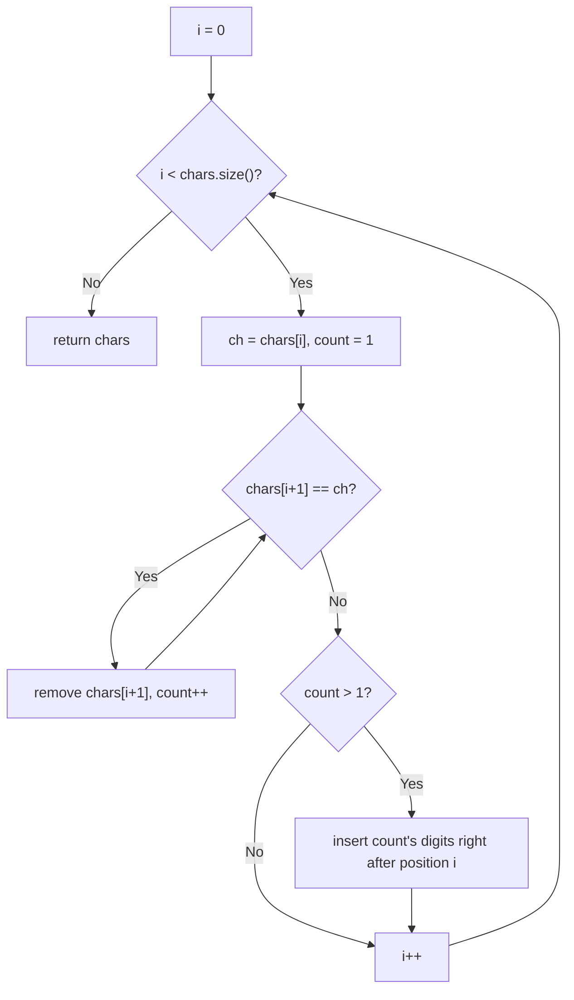

# Feature #8: Compress File II

## The problem

We want basic file compression, similar to WinZip: replace consecutive runs of the same character with that character followed by its run length. A character with no repeats is written as-is.

For example, `"abbbbccc"` compresses to `['a', 'b', '4', 'c', '3']`. If a character repeats `15` times, its count is written digit by digit — so 15 `a`s compress to `['a', '1', '5']`.

We're given the file's contents as a `List<Character>`, and we must compress it **in place**, using only constant extra space.

## Solution

Since we need constant extra space, we mutate the input list directly instead of building a new one.

We scan the list with an index `i`. At each position, we note the character `ch` there, then keep looking one position ahead: as long as the next character equals `ch`, we `remove` it from the list (collapsing the run down to a single copy of `ch`) and bump a `count`. Once the run ends, if `count` was more than `1`, we convert it to a string and insert its digits, one at a time, right after `ch`'s position. Then we jump `i` past whatever we just inserted and move to the next distinct character.

Because `remove` and the digit `insert`s both happen at the current scan position, the list shrinks and grows in place as we go — no second list is ever allocated.



## Code

```java
import java.util.*;

class Solution {
    // Compresses runs of repeated characters in place; returns the same list.
    public static List<Character> compress(List<Character> chars) {
        int i = 0;
        while (i < chars.size()) {
            char ch = chars.get(i);
            int count = 1;

            while (i + 1 < chars.size() && chars.get(i + 1) == ch) {
                chars.remove(i + 1);
                count++;
            }

            if (count > 1) {
                String countStr = String.valueOf(count);
                for (int k = 0; k < countStr.length(); k++) {
                    chars.add(i + 1 + k, countStr.charAt(k));
                }
                i += countStr.length();
            }
            i++;
        }
        return chars;
    }

    public static void main(String[] args) {
        List<Character> chars = new ArrayList<>(Arrays.asList('a', 'b', 'b', 'b', 'b', 'c', 'c', 'c'));
        System.out.println(compress(chars));
        // [a, b, 4, c, 3]
    }
}
```

## Complexity measures

Let **n** be the length of the character list.

### Time Complexity

`O(n²)` — every `remove`/`insert` on an `ArrayList` at an arbitrary position shifts the remaining elements, so the total work across all removals and insertions can be quadratic in the worst case (e.g. one giant run of `n` identical characters).

### Space Complexity

`O(1)` — the list is compressed in place; the only extra memory is the digit string for the current count, which is bounded by the input size limit and therefore constant.
