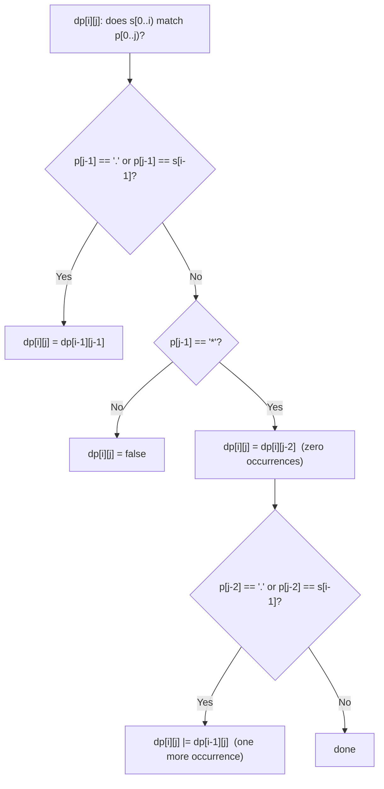

# Feature #9: File Search

## The problem

We're adding regular-expression search to the file system. Given a list of file names and a pattern, return every file name that the pattern matches **entirely** (not just a partial match). The pattern supports:

- `.` — matches any single character.
- `*` — matches zero or more occurrences of the character immediately before it in the pattern.

For example, with files `["data", "dataaa", "data2"]`, searching with the pattern `"data*"` (literal `d`, `a`, `t`, then zero-or-more of the preceding `a`) matches `"dat"`, `"data"`, `"dataa"`, `"dataaa"`, ... — so it returns `["data", "dataaa"]`. `"data2"` doesn't match because there's no `2` in the pattern.

## Solution

This is the classic **regular expression matching** problem, solved bottom-up with a 2D DP table. Let `dp[i][j]` mean "does `s[0..i)` match `p[0..j)`?" The table is `(|s|+1) x (|p|+1)` so that row/column `0` can represent the empty string and empty pattern.

**Base cases:**
- `dp[0][0] = true` — an empty string matches an empty pattern.
- `dp[0][j]` (empty string against a non-empty pattern) can only be `true` if the pattern is made entirely of `x*` pairs that each match zero occurrences — so `dp[0][j] = dp[0][j-2]` whenever `p[j-1] == '*'`.
- `dp[i][0]` (non-empty string against an empty pattern) is always `false`.

**Transition**, filling the rest of the table:
- If `p[j-1]` is `.` or matches `s[i-1]` exactly, this position behaves like a normal one-to-one character match: `dp[i][j] = dp[i-1][j-1]`.
- If `p[j-1]` is `*`, it refers back to `p[j-2]`, the character it repeats. Two ways this can still match:
  - **Zero occurrences** of that character: skip both `p[j-2]` and `p[j-1]` entirely — `dp[i][j] = dp[i][j-2]`.
  - **One more occurrence**, only possible if `p[j-2]` equals `s[i-1]` or is `.`: `dp[i][j] = dp[i][j] || dp[i-1][j]` (peel one character off `s`, keep the `*` available for another repetition).

The answer is `dp[m][n]`, whether the entire string matches the entire pattern.



## Code

```java
import java.util.*;

class Solution {
    public static List<String> files = new ArrayList<String>() {{
        add("data");
        add("dataaa");
        add("data2");
    }};

    // Full-string regex match supporting '.' and '*'.
    public static boolean isMatch(String s, String p) {
        int m = s.length(), n = p.length();
        boolean[][] dp = new boolean[m + 1][n + 1];
        dp[0][0] = true;

        for (int j = 1; j <= n; j++) {
            if (p.charAt(j - 1) == '*' && j >= 2) {
                dp[0][j] = dp[0][j - 2];
            }
        }

        for (int i = 1; i <= m; i++) {
            for (int j = 1; j <= n; j++) {
                char sc = s.charAt(i - 1);
                char pc = p.charAt(j - 1);
                if (pc == sc || pc == '.') {
                    dp[i][j] = dp[i - 1][j - 1];
                } else if (pc == '*') {
                    char prev = p.charAt(j - 2);
                    dp[i][j] = dp[i][j - 2]; // zero occurrences.
                    if (prev == sc || prev == '.') {
                        dp[i][j] = dp[i][j] || dp[i - 1][j]; // one more occurrence.
                    }
                }
            }
        }
        return dp[m][n];
    }

    public static List<String> findFiles(String pattern) {
        List<String> result = new ArrayList<>();
        for (String file : files) {
            if (isMatch(file, pattern)) {
                result.add(file);
            }
        }
        return result;
    }

    public static void main(String[] args) {
        System.out.println(findFiles("data*"));
        // [data, dataaa]
    }
}
```

## Complexity measures

Let **m** be the length of a file name and **n** be the length of the pattern.

### Time Complexity

`O(m × n)` per file — every DP cell is filled in constant time. Across the whole file list, it's `O(k × m × n)` for `k` files.

### Space Complexity

`O(m × n)` — the DP table.
