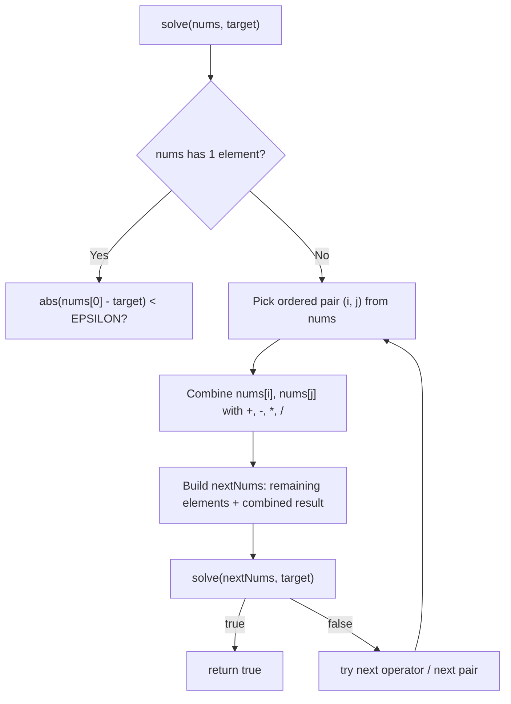

# Feature #10: Decode a Message

## The problem

We need to reverse-engineer a message digest function. It takes four integers, each in the range `[1, 9]`, applies some combination of `+`, `-`, `*`, `/`, and parenthesization to them, and produces a single integer digest.

Given the four integers and a target digest, determine whether *any* combination of operations and groupings can produce that digest. Rules:

- `/` is real (floating-point) division, not integer division.
- `-` is never unary — every operation combines exactly two numbers.
- Numbers can't be concatenated (e.g. with `message = [1, 2, 1, 2]`, treating two digits as `"12"` is not allowed).
- Division by `0` is never allowed.

For example, `[4, 1, 8, 7]` can reach `24` — `(8 - 4) * (7 - 1) = 24` — so the answer is `true`. But `[1, 2, 1, 2]` can never reach `24` with any combination, so the answer is `false`.

## Solution

This is the classic **24 Game** pattern, generalized to an arbitrary target instead of the fixed number `24`.

The core idea: repeatedly pick any two numbers from the current list, combine them with every possible operator, and replace those two numbers with the result — shrinking the list by one each time. If we can shrink the list all the way down to a single number that equals the target, some sequence of choices worked.

We convert the integers to `double` up front, since `/` needs real (non-integer) division. The recursion:

- **Base case:** if only one number remains, check whether it's within a small floating-point tolerance (`EPSILON`) of the target.
- **Recursive case:** try every ordered pair `(i, j)` of positions in the current list (ordered, so both `a - b` and `b - a` get tried without a separate subtraction-in-both-directions case). For each pair, compute every valid combination (`a+b`, `a-b`, `a*b`, and `a/b` when `b != 0`), build a smaller list with those two numbers removed and the combined result appended, and recurse. If any recursive call succeeds, we're done — no need to explore further.
- If every pair and every operator combination fails to reach the target, backtrack: remove the appended result and try the next combination.

We use floating-point tolerance rather than exact equality because `double` division can introduce tiny rounding errors (e.g. `1.0 / 3.0 * 3.0` isn't bit-for-bit `1.0`).



## Code

```java
import java.util.*;

class Solution {
    private static final double EPSILON = 1e-6;

    // Returns whether any combination of +, -, *, / over `nums` can reach `target`.
    public static boolean decodeMessage(int[] nums, int target) {
        if (nums.length == 0) return false;
        List<Double> numsAsDoubles = new ArrayList<>();
        for (int n : nums) numsAsDoubles.add(n * 1.0);
        return solve(numsAsDoubles, target);
    }

    private static boolean solve(List<Double> nums, double target) {
        if (nums.size() == 1) {
            return Math.abs(nums.get(0) - target) < EPSILON;
        }

        int n = nums.size();
        for (int i = 0; i < n; i++) {
            for (int j = 0; j < n; j++) {
                if (i == j) continue;
                List<Double> nextNums = new ArrayList<>();
                for (int k = 0; k < n; k++) {
                    if (k != i && k != j) nextNums.add(nums.get(k));
                }
                for (double combined : combine(nums.get(i), nums.get(j))) {
                    nextNums.add(combined);
                    if (solve(nextNums, target)) return true;
                    nextNums.remove(nextNums.size() - 1);
                }
            }
        }
        return false;
    }

    private static List<Double> combine(double a, double b) {
        List<Double> results = new ArrayList<>();
        results.add(a + b);
        results.add(a - b);
        results.add(a * b);
        if (Math.abs(b) > EPSILON) results.add(a / b);
        return results;
    }

    public static void main(String[] args) {
        System.out.println(decodeMessage(new int[]{4, 1, 8, 7}, 24));
        // true - (8 - 4) * (7 - 1) = 24
        System.out.println(decodeMessage(new int[]{1, 2, 1, 2}, 24));
        // false - no combination reaches 24
    }
}
```

## Complexity measures

The input is always exactly 4 numbers, so every measure below is technically constant — but it's worth seeing why.

### Time Complexity

`O(1)` — with a fixed-size input of 4 numbers, the number of ways to pick pairs and operators at each recursion level is bounded by a constant, so the whole search tree has constant size.

### Space Complexity

`O(1)` — the recursion depth is bounded by the fixed input size (3 combine steps to go from 4 numbers down to 1), so the call stack never grows with any external variable.
