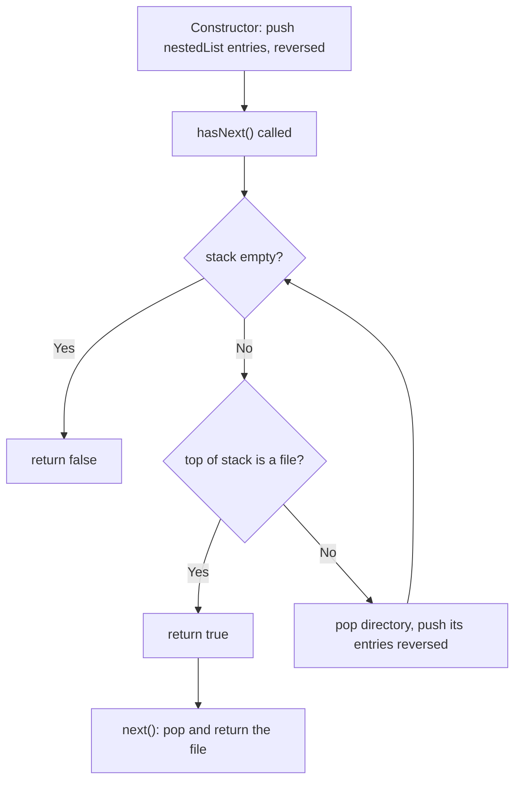

# Feature #11: Directory Iterator

## The problem

A directory can contain files and other directories, which can themselves contain files and further directories, arbitrarily deep. We're given such a structure as a list where each element is either a file (a plain string) or a subdirectory (a nested list of the same kind of elements).

We need to implement `NestedIterator` with:
- `NestedIterator(List<NestedDirectories> nestedList)` — initializes the iterator over the given nested structure.
- `boolean hasNext()` — `true` if there's at least one more file to visit.
- `String next()` — returns the next file.

For example, given `["a.txt", ["b.txt", "c.txt"], "d.txt"]`, iterating should yield `a.txt`, `b.txt`, `c.txt`, `d.txt` in that order — flattening the nested directory into a single file sequence.

## Solution

The trick is to **flatten lazily** — we don't want to walk the entire tree upfront if the caller only ends up asking for the first file. A stack does this naturally.

In the constructor, we push every top-level entry onto a stack, in **reverse order**, so the first entry ends up on top (ready to be popped first).

`hasNext()` does the real work of unwrapping nested directories on demand: it looks at the top of the stack.
- If it's a file, we're done — return `true` immediately.
- If it's a directory (a nested list), pop it off and push all of *its* entries onto the stack, again in reverse order so their own first entry lands on top. Then loop and check the new top again.

This repeats until either a file surfaces at the top (return `true`) or the stack empties out (return `false`) — meaning every subdirectory got unwrapped and there was nothing left.

`next()` simply calls `hasNext()` first (to guarantee any pending directories are unwrapped down to a file), then pops and returns that file.



## Code

```java
import java.util.*;

interface NestedDirectories {
    boolean isFile();
    String getFile();
    List<NestedDirectories> getDirectory();
}

class DirectoryEntry implements NestedDirectories {
    private final String file;
    private final List<NestedDirectories> directory;

    public DirectoryEntry(String file) {
        this.file = file;
        this.directory = null;
    }

    public DirectoryEntry(List<NestedDirectories> directory) {
        this.file = null;
        this.directory = directory;
    }

    public boolean isFile() { return file != null; }
    public String getFile() { return file; }
    public List<NestedDirectories> getDirectory() { return directory; }
}

class NestedIterator {
    private final Deque<NestedDirectories> stack;

    public NestedIterator(List<NestedDirectories> nestedList) {
        stack = new ArrayDeque<>();
        for (int i = nestedList.size() - 1; i >= 0; i--) {
            stack.push(nestedList.get(i));
        }
    }

    public String next() {
        hasNext(); // Ensures the top of the stack is unwrapped down to a file.
        return stack.pop().getFile();
    }

    public boolean hasNext() {
        while (!stack.isEmpty()) {
            NestedDirectories top = stack.peek();
            if (top.isFile()) return true;
            stack.pop();
            List<NestedDirectories> nested = top.getDirectory();
            for (int i = nested.size() - 1; i >= 0; i--) {
                stack.push(nested.get(i));
            }
        }
        return false;
    }

    public static void main(String[] args) {
        List<NestedDirectories> inner = Arrays.asList(
            new DirectoryEntry("b.txt"),
            new DirectoryEntry("c.txt")
        );
        List<NestedDirectories> nestedList = Arrays.asList(
            new DirectoryEntry("a.txt"),
            new DirectoryEntry(inner),
            new DirectoryEntry("d.txt")
        );

        NestedIterator it = new NestedIterator(nestedList);
        List<String> result = new ArrayList<>();
        while (it.hasNext()) {
            result.add(it.next());
        }
        System.out.println(result);
        // [a.txt, b.txt, c.txt, d.txt]
    }
}
```

## Complexity measures

Let **n** be the number of files and **l** be the number of directories in the nested structure.

### Time Complexity

`O(n + l)` total across the lifetime of the iterator — the constructor pushes every top-level entry once, and `hasNext()` unwraps every directory exactly once over all its calls combined. Individual calls are cheap, but analyzed together the whole traversal costs `O(n + l)`.

### Space Complexity

`O(n + l)` — the stack can hold as many entries as the widest, most deeply-unwrapped point of the structure, bounded by the total number of files and directories.
