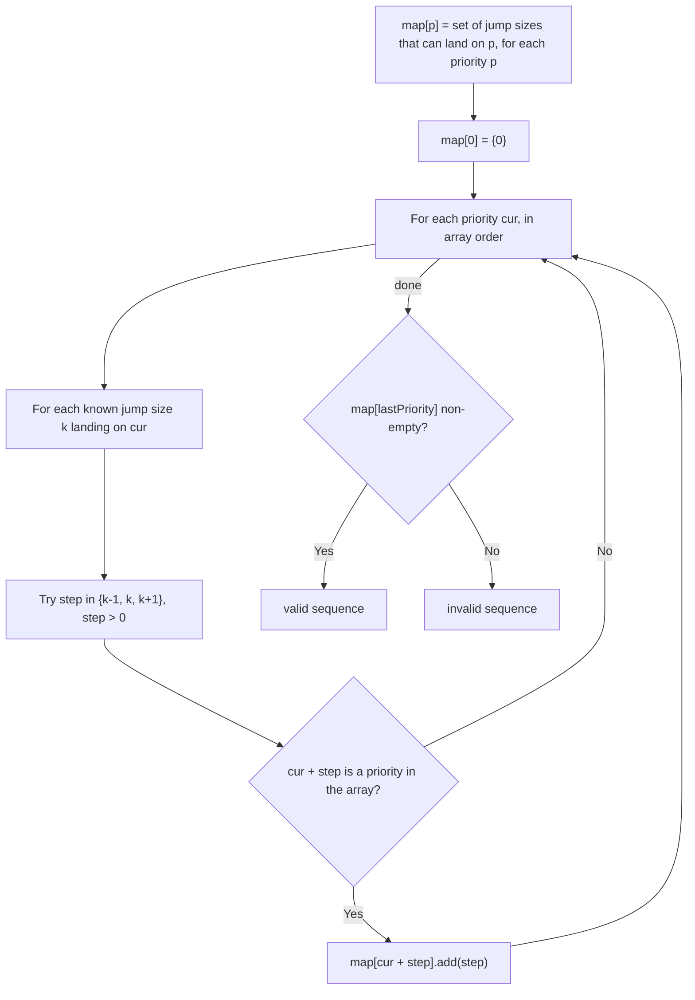

# Feature #12: Priority Validation

## The problem

Every process starts with priority `0` (lowest priority). The OS may raise a process's priority over time to prevent **starvation** — where high-priority processes keep running while low-priority ones stay blocked indefinitely.

The rules for raising priority: the very first increment must be exactly `1`. After that, each subsequent increment must be `k-1`, `k`, or `k+1`, where `k` is the size of the *previous* increment.

Given an array of priority levels a process passed through (in order), determine whether it's a valid sequence of priority updates reachable from `0` by following these rules.

For example, `[0, 1, 3, 5, 6, 8, 12, 17]` is valid: jump sizes `1, 2, 2, 1, 2, 4, 5` — each one is within `±1` of the previous jump. But `[0, 1, 2, 3, 4, 8, 9, 11]` is not, because after jump sizes `1, 1, 1, 1, 4`, jumping from `8` to `9` (size `1`) isn't `3`, `4`, or `5`.

## Solution

This is the classic **Frog Jump** pattern: the priorities are stepping stones, and the "last jump size" is the state we carry forward. We can't just greedily check consecutive differences — the same priority value might be reachable via different jump sizes, and we need to know if *any* of those reachable jump sizes lets us continue validly to the end.

We use a `HashMap<Integer, Set<Integer>>` where each key is a priority value from the array, and its value set holds every jump size that could have *landed* on that priority validly. We seed `map.get(0)` with `{0}` (arriving at the start "with" a zero-size jump, so the first real jump of `1` is allowed).

We then process priorities in order: for each priority `cur` and each jump size `k` that's known to reach it, we try the three next possible jump sizes `k-1`, `k`, `k+1` (skipping any `<= 0`, since jumps must move forward). If `cur + step` is one of our array's priority values, we record `step` as a way to reach it.

By the time we finish processing every priority in order, `map.get(lastPriority)` tells us every jump size that could validly land on the final priority. If that set is non-empty, the sequence is valid.



## Code

```java
import java.util.*;

class Solution {
    // Checks whether `priorities` is a reachable sequence of priority increments starting from 0.
    public static boolean validSequence(int[] priorities) {
        if (priorities.length == 0) return false;
        if (priorities.length == 1) return true;
        if (priorities[1] != 1) return false; // first increment must always be 1.

        Map<Integer, Set<Integer>> reachedBy = new HashMap<>();
        for (int p : priorities) reachedBy.put(p, new HashSet<>());
        reachedBy.get(0).add(0);

        for (int i = 0; i < priorities.length; i++) {
            int cur = priorities[i];
            for (int k : reachedBy.get(cur)) {
                for (int step = k - 1; step <= k + 1; step++) {
                    if (step > 0 && reachedBy.containsKey(cur + step)) {
                        reachedBy.get(cur + step).add(step);
                    }
                }
            }
        }
        return !reachedBy.get(priorities[priorities.length - 1]).isEmpty();
    }

    public static void main(String[] args) {
        System.out.println(validSequence(new int[]{0, 1, 3, 5, 6, 8, 12, 17}));
        // true
        System.out.println(validSequence(new int[]{0, 1, 2, 3, 4, 8, 9, 11}));
        // false
    }
}
```

## Complexity measures

Let **n** be the number of priority levels in the array.

### Time Complexity

`O(n²)` — for each of the `n` priorities, we may examine up to `O(n)` distinct jump sizes that reached it (in the worst case, one per earlier priority), each spawning 3 constant-time checks.

### Space Complexity

`O(n²)` — in the worst case, each priority's set of reaching jump sizes can grow to `O(n)`, across `n` priorities.
