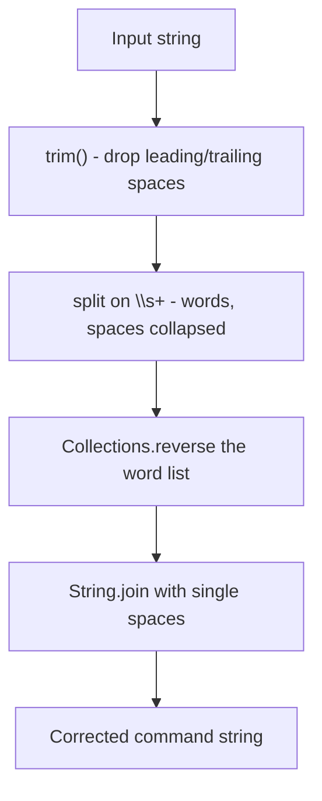

# Feature #13: Reverse Commands

## The problem

A command history logger has a bug: instead of appending each new command word to the end of the log, it prepends them, and it also introduces extra spaces along the way. So a command that should read `"tar czvf pages.tar.gz *.html"` ends up stored as `"*.html pages.tar.gz czvf tar"` — completely reversed, word by word.

We need to undo the damage: given the corrupted log line, trim leading/trailing spaces, collapse any run of multiple spaces between words down to one, and reverse the word order back to normal.

For example, `"  *.html   pages.tar.gz czvf   tar  "` should become `"tar czvf pages.tar.gz *.html"`.

## Solution

Standard library functions handle every step here, in order:

1. `trim()` removes leading and trailing whitespace.
2. `split("\\s+")` splits on any run of one-or-more whitespace characters, which both separates the words *and* collapses multiple spaces in one step.
3. `Collections.reverse(...)` flips the word order back to normal.
4. `String.join(" ", ...)` glues the words back together with single spaces.



## Code

```java
import java.util.*;

class Solution {
    // Trims, collapses extra spaces, and reverses word order in a corrupted log line.
    public static String reverseWords(String s) {
        s = s.trim();
        List<String> wordList = new ArrayList<>(Arrays.asList(s.split("\\s+")));
        Collections.reverse(wordList);
        return String.join(" ", wordList);
    }

    public static void main(String[] args) {
        System.out.println(reverseWords("*.html pages.tar.gz czvf tar"));
        // tar czvf pages.tar.gz *.html
    }
}
```

## Complexity measures

Let **n** be the length of the string.

### Time Complexity

`O(n)` — `trim`, `split`, `reverse`, and `join` each take `O(n)` time, and they run one after another.

### Space Complexity

`O(n)` — the word list produced by `split` holds all of the string's characters (minus the removed extra whitespace).
