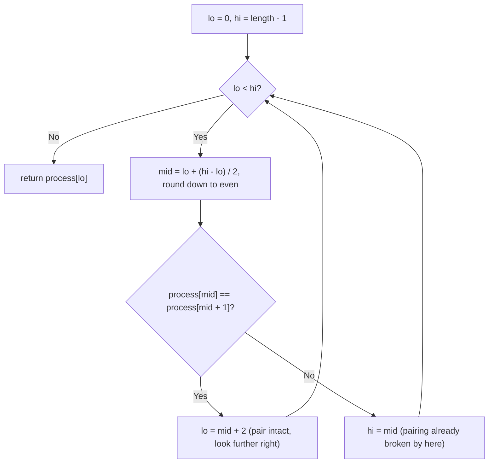

# Feature #14: Releasing Process Lock

## The problem

Processes acquire and release locks on a shared resource. The OS logs a process's number every time it acquires the lock, and again when it releases it — so a well-behaved log looks like pairs of the same number appearing back-to-back (`acquire, release, acquire, release, ...`). Processes are numbered by the order they first acquired the lock (`1`, `2`, `3`, ...).

Suppose every process released its lock except exactly one — its log entry appears only once, breaking the "pairs" pattern. Given the log as an array of process numbers, find the one process number that appears alone.

For example, in `[1, 1, 2, 3, 3, 4, 4, 5, 5]`, every number appears twice except `2` — so `2` is the process that never released its lock.

## Solution

This is the **single element in a sorted array of pairs** pattern. Because well-formed pairs sit at consecutive `(even, odd)` index positions before the unreleased entry throws things off, we can binary search over just the **even indices**.

Start with `lo = 0`, `hi = length - 1`. At each step, compute `mid` normally, then force it to be even (decrement by `1` if it's odd) — this keeps our probe aligned with where a valid pair's first element should sit.

Compare `process[mid]` with `process[mid + 1]`:
- If they're equal, this pair is intact — every process up through `mid + 1` released correctly, so the unreleased process must be further along. Move `lo` to `mid + 2` (staying on an even index).
- If they're *not* equal, the pairing has already broken down by this point — the unreleased process is at `mid` or somewhere before it. Move `hi` to `mid`.

The loop ends when `lo == hi`, narrowing down to a single index — the position of the process that never released its lock.



## Code

```java
class Solution {
    // Finds the process number that appears once instead of paired (acquire, release).
    public static int findUnreleasedLock(int[] process) {
        int lo = 0, hi = process.length - 1;
        while (lo < hi) {
            int mid = lo + (hi - lo) / 2;
            if (mid % 2 == 1) mid--; // Keep mid on an even index.

            if (process[mid] == process[mid + 1]) {
                lo = mid + 2; // This pair is intact - look further right.
            } else {
                hi = mid; // Pairing already broken by here.
            }
        }
        return process[lo];
    }

    public static void main(String[] args) {
        int[] process = {1, 1, 2, 3, 3, 4, 4, 5, 5};
        System.out.println(findUnreleasedLock(process));
        // 2
    }
}
```

## Complexity measures

Let **n** be the length of the array.

### Time Complexity

`O(log n)` — each iteration halves the search range, restricted to even indices.

### Space Complexity

`O(1)` — only a few integer variables track the search boundaries.
