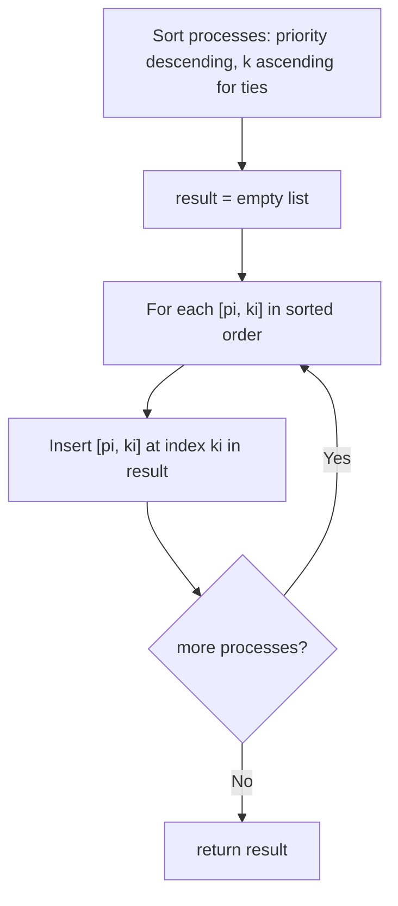

# Feature #15: Queue Reconstruction by Priority

## The problem

The OS crashed, and the process queue got scattered — we only have an unordered array of processes, each described by `[pi, ki]`: a priority `pi`, and a count `ki` of how many other processes with priority *at least* `pi` were standing ahead of it in the original queue.

Our job: reconstruct the original queue order from this scrambled information.

For example, given `[[7,0],[4,4],[7,1],[5,0],[6,1],[5,2]]`, the reconstructed queue is `[[5,0],[7,0],[5,2],[6,1],[4,4],[7,1]]`.

## Solution

The key insight: a process with a **lower** priority can never affect where a **higher**-priority process needs to sit, because `ki` only counts processes of priority `>= pi`. So if we place all the higher-priority processes first, their positions become fixed and immune to anything we insert afterward.

That suggests a greedy build order:

1. **Sort** the array by priority descending. For ties (same priority), sort by `k` ascending.
2. **Insert one at a time**, in that sorted order, into a growing output list. For an entry `[pi, ki]`, insert it directly at index `ki` in the output list (shifting later elements right).

Why does inserting at index `ki` work? By the time we get to `[pi, ki]`, every process already placed in the output has priority `>= pi` (we processed higher priorities first, and same-priority ties in ascending `k` order, so ties are placed in their own correct relative order too). So the count of `>= pi` processes standing before this one is exactly the count of *already-placed* processes before it — meaning inserting it at position `ki` among them is *always* correct, and no future (lower-priority) insertion can disturb it.



## Code

```java
import java.util.*;

class Solution {
    // Reconstructs the process queue from [priority, count-of-higher-or-equal-ahead] pairs.
    public static int[][] reconstructQueue(int[][] process) {
        Arrays.sort(process, (a, b) -> a[0] == b[0] ? a[1] - b[1] : b[0] - a[0]);

        List<int[]> result = new ArrayList<>();
        for (int[] p : process) {
            result.add(p[1], p);
        }
        return result.toArray(new int[result.size()][]);
    }

    public static void main(String[] args) {
        int[][] process = {{7, 0}, {4, 4}, {7, 1}, {5, 0}, {6, 1}, {5, 2}};
        for (int[] p : reconstructQueue(process)) {
            System.out.print(Arrays.toString(p) + " ");
        }
        // [5, 0] [7, 0] [5, 2] [6, 1] [4, 4] [7, 1]
    }
}
```

## Complexity measures

Let **n** be the number of processes.

### Time Complexity

`O(n²)` — sorting takes `O(n log n)`, but inserting into an `ArrayList` at an arbitrary index shifts the remaining elements, so `n` insertions can cost `O(n²)` in the worst case.

### Space Complexity

`O(n)` — the sorted array and the output list each hold `n` entries.
