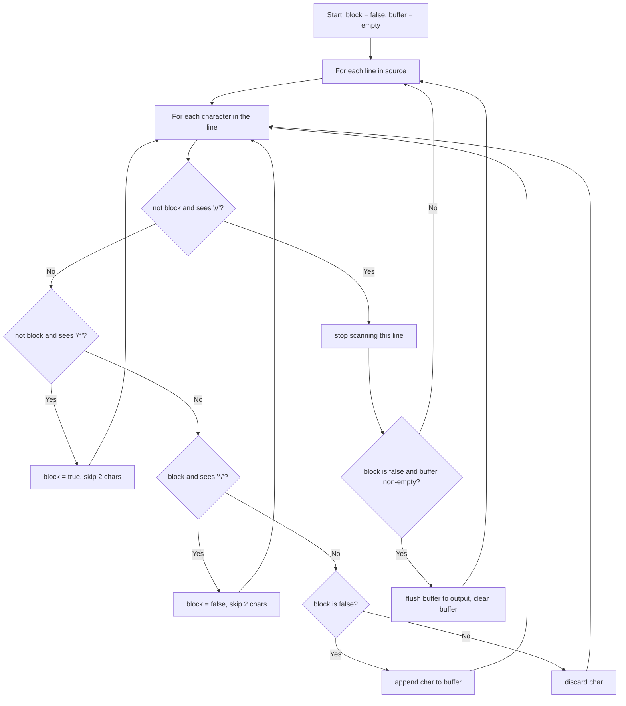

# Feature #1: Remove Comments

## The problem

Before the compiler can start processing a C++ source file, it needs to strip out anything meant only for human readers — the comments. C++ has two kinds:

- **Inline comment:** `//` — everything to the right of it, on the same line, is ignored.
- **Block comment:** `/* ... */` — everything between a `/*` and the next `*/` is ignored, even across multiple lines.

There's a subtlety with nesting: whichever comment marker is seen *first*, wins. If a `//` appears while we're already inside a block comment, it's just ordinary (ignored) comment text, not the start of a new inline comment. Likewise, a `/*` appearing inside a line comment doesn't start a block comment — the whole rest of that line is already being ignored.

If removing comments leaves a line completely empty, that line should be dropped entirely from the output (a line of only tabs/spaces is *not* considered empty — only a truly empty string is dropped). We can assume `//` and `/*` never appear inside string literals or statements — only in genuine comments.

For example, given this source (each string is one line of code):

```
{"/* Example code for feature */",
 "int main() {",
 "  /*",
 "  This is a",
 "  block comment",
 "  */",
 "  int value = 10;  // This is an inline comment",
 "  int sum = value + /* this is // also a block */ value;",
 "  return 0;",
 "}"}
```

the comment-free output should be:

```
{"int main() {",
 "  ",
 "  int value = 10;  ",
 "  int sum = value +  value;",
 "  return 0;",
 "}"}
```

## Solution

We scan the source character by character, keeping one piece of state: a boolean `block` flag that's `true` whenever we're currently inside a block comment. A `buffer` accumulates the characters of the line we're currently keeping; whenever we finish a line and we're *not* inside an unclosed block comment, we flush that buffer to the output (only if it's non-empty).

Walking through each character:
- If we see `//` and we're not inside a block comment, the rest of the line is a comment — stop processing this line immediately.
- If we see `/*` and we're not inside a block comment, switch `block` to `true` and skip both characters.
- If we see `*/` while `block` is `true`, switch `block` back to `false` and skip both characters.
- Otherwise, if we're not inside a block comment, keep the character (append it to `buffer`); if we are inside one, discard it.

Because `block` persists across the outer loop iterations (lines), a block comment that spans multiple lines is handled naturally — we just keep discarding until we see the closing `*/`, however many lines later that is.



## Code

```java
import java.util.*;

class Solution {
    // Strips both // and /* ... */ comments from a piece of source code,
    // given as one line per array element.
    public static List<String> removeComments(String[] source) {
        List<String> output = new ArrayList<>();
        StringBuilder buffer = new StringBuilder();
        boolean block = false;

        for (String line : source) {
            int i = 0;
            int n = line.length();
            while (i < n) {
                if (!block && i + 1 < n && line.charAt(i) == '/' && line.charAt(i + 1) == '/') {
                    break; // rest of the line is an inline comment.
                } else if (!block && i + 1 < n && line.charAt(i) == '/' && line.charAt(i + 1) == '*') {
                    block = true;
                    i += 2;
                } else if (block && i + 1 < n && line.charAt(i) == '*' && line.charAt(i + 1) == '/') {
                    block = false;
                    i += 2;
                } else if (!block) {
                    buffer.append(line.charAt(i));
                    i++;
                } else {
                    i++; // inside a block comment, discard the character.
                }
            }
            if (!block && buffer.length() > 0) {
                output.add(buffer.toString());
                buffer = new StringBuilder();
            }
        }
        return output;
    }

    public static void main(String[] args) {
        String[] source = {
            "/* Example code for feature */",
            "int main() {",
            "  /*",
            "  This is a",
            "  block comment",
            "  */",
            "  int value = 10;  // This is an inline comment",
            "  int sum = value + /* this is // also a block */ value;",
            "  return 0;",
            "}"
        };
        System.out.println(removeComments(source));
        // [int main() {,   ,   int value = 10;  ,   int sum = value +  value;,   return 0;, }]
    }
}
```

## Complexity measures

Let **n** be the total length of the source code (summed across all lines).

### Time Complexity

`O(n)` — every character is visited a constant number of times as we scan through it.

### Space Complexity

`O(n)` — the output list holds the surviving (comment-free) source code, which in the worst case is close to the original size.
