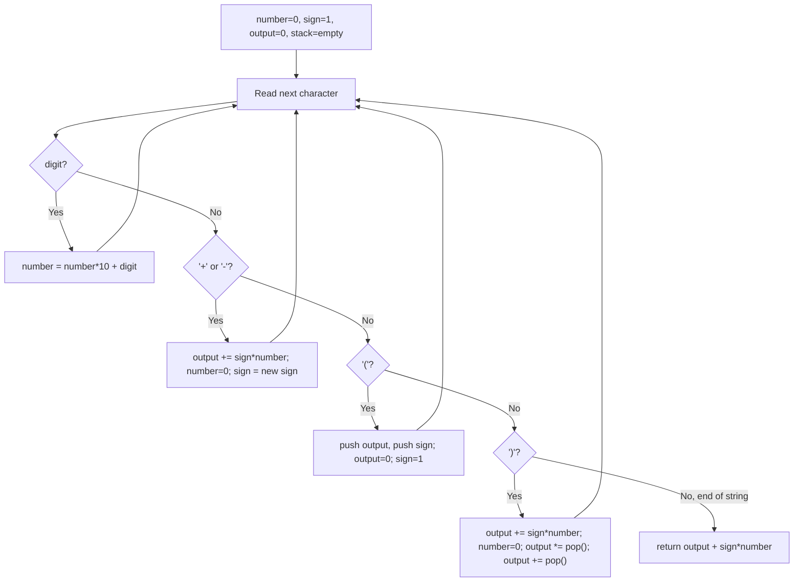

# Feature #2: Evaluate the Arithmetic Expression

## The problem

Once comments are stripped, the compiler still needs to evaluate arithmetic expressions extracted from the source code — for example, expressions used in constant-folding optimizations. We're handed one such expression as a string and need to compute its integer value.

To keep things manageable, the expressions we handle here are constrained:

- Numbers are integers.
- The only operators are `+` and `-`.
- Parentheses `(` and `)` can appear, and can nest.
- The expression is already guaranteed to be valid.

For example, given `"5-(3+4)"`, the parenthesized sub-expression `3+4` evaluates first, giving `7`, and then `5-7` gives `-2`.

## Solution

This is a natural fit for a stack. The tricky part is handling `+`/`-` alongside nested parentheses without accidentally evaluating things in the wrong order.

The key trick: treat `-` as *negating the operand to its right* rather than as a binary subtraction. Since `A - B - C` is the same as `A + (-B) + (-C)`, and addition is associative, once we've flipped every subtracted value's sign we only have additions left — and additions can be summed in any order, left-to-right or otherwise.

We track:
- `number` — the operand currently being built up digit by digit.
- `sign` — `+1` or `-1`, the sign to apply to `number` once we know it's complete.
- `output` — the running total for the current parenthesis level.
- `stack` — used to remember the running total and sign *outside* the current parentheses, so we can resume once the parenthesis closes.

Walking through the string character by character:
- A digit extends `number` (`number = number * 10 + digit`).
- Hitting `+` or `-` means the number we just finished building is complete: fold it into `output` using the *previous* sign, then remember the new sign for the next operand.
- Hitting `(` means we're about to start a fresh sub-expression: push the current `output` and `sign` onto the stack (so we can restore them later), then reset `output` to `0` and `sign` to `+1` for the inner expression.
- Hitting `)` means the sub-expression just ended: fold the last operand into `output`, then pop the sign that was in effect *before* this parenthesis (multiplying `output` by it — this is what applies a leading `-` to an entire parenthesized group) and pop the outer running total, adding it back in.
- At the very end of the string, fold in whatever operand is still pending.



## Code

```java
import java.util.*;

class Solution {
    // Evaluates a +/- arithmetic expression that may contain nested parentheses.
    public static int evaluateExpression(String expression) {
        int number = 0;
        int sign = 1;
        int output = 0;
        Deque<Integer> stack = new ArrayDeque<>();

        for (int i = 0; i < expression.length(); i++) {
            char c = expression.charAt(i);
            if (Character.isDigit(c)) {
                number = number * 10 + (c - '0');
            } else if (c == '+' || c == '-') {
                output += sign * number;
                number = 0;
                sign = (c == '+') ? 1 : -1;
            } else if (c == '(') {
                stack.push(output);
                stack.push(sign);
                output = 0;
                sign = 1;
            } else if (c == ')') {
                output += sign * number;
                number = 0;
                output *= stack.pop(); // the sign in front of this parenthesis.
                output += stack.pop(); // the running total before this parenthesis.
            }
            // spaces (if any) are simply skipped: none of the branches above match them.
        }
        return output + sign * number;
    }

    public static void main(String[] args) {
        System.out.println(evaluateExpression("5-(3+4)"));
        // -2
        System.out.println(evaluateExpression("(1+(4+5+2)-3)+(6+8)"));
        // 23
    }
}
```

## Complexity measures

Let **n** be the length of the expression string.

### Time Complexity

`O(n)` — a single left-to-right pass over the string, with constant-time work per character.

### Space Complexity

`O(n)` — the stack holds at most two entries per nesting level of parentheses, so in the worst case (all opening parens) it grows linearly with the input.
