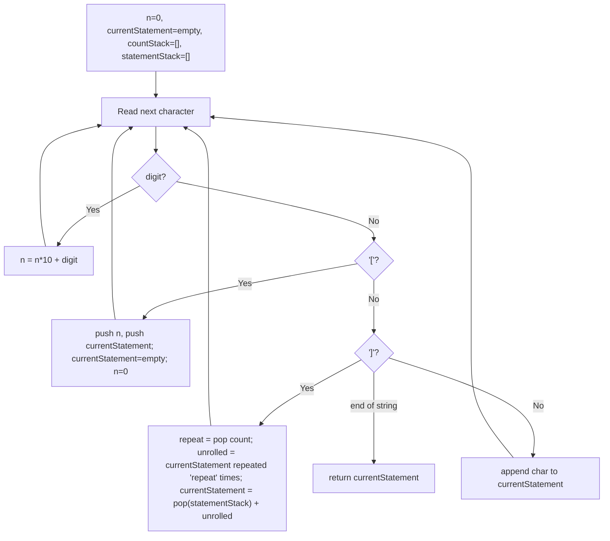

# Feature #3: Loop Unrolling

## The problem

Loop unrolling is a compiler optimization that trades code size for speed: instead of looping, the compiler replicates the loop body inline as many times as the loop would have executed, removing the overhead of the branch and loop-maintenance instructions.

Suppose a module upstream of us has already figured out how many times each loop runs, and has encoded that into the intermediate representation using the format `n[statements]` — meaning "repeat `statements`, `n` times." For example, this loop:

```
for (int i=0; i<3; i++)
    printf("output");
```

gets encoded as:

```
3[printf("output"); ]
```

These blocks can also nest, representing nested loops. For example:

```
2[sum = sum + i; 2[i++; ]]
```

Our job: take one of these encoded blocks as a string, and expand it into the fully repeated (unrolled) instructions.

## Solution

The structure is: a number `n`, then `[`, then some statement text, which is either followed directly by the closing `]`, or contains another nested `n[statement]` block before the `]`. Since the *innermost* block has to be resolved before the block that contains it, this is a classic Last-In-First-Out problem — a job for a stack. In fact, we use two parallel stacks: one for the pending repetition counts (`countStack`), and one for the statement text accumulated so far at each nesting level (`statementStack`).

Walking through the string character by character, tracking a `currentStatement` buffer and a pending count `n`:

- A digit extends `n` (building up the repetition count).
- A non-bracket character is just appended to `currentStatement`.
- On `[`: we're about to descend one level deeper. Push `n` onto `countStack` and the *current* `currentStatement` onto `statementStack` (so we can resume building the outer statement once this inner block is unrolled), then reset `currentStatement` to empty and `n` to `0`.
- On `]`: the block we're inside just closed. Pop the repetition count and repeat `currentStatement` that many times to get the unrolled text. Then pop the *outer* statement text that was waiting, and append the unrolled text onto it — that becomes the new `currentStatement`, ready to keep accumulating (or to be unrolled again, if it's itself inside another block).

At the end, whatever's left in `currentStatement` is the fully unrolled result.



## Code

```java
import java.util.*;

class Solution {
    // Expands an n[statement] encoded (possibly nested) loop block into repeated instructions.
    public static String loopUnrolling(String codeBlock) {
        Deque<Integer> countStack = new ArrayDeque<>();
        Deque<StringBuilder> statementStack = new ArrayDeque<>();
        StringBuilder currentStatement = new StringBuilder();
        int n = 0;

        for (int i = 0; i < codeBlock.length(); i++) {
            char ch = codeBlock.charAt(i);
            if (Character.isDigit(ch)) {
                n = n * 10 + (ch - '0');
            } else if (ch == '[') {
                countStack.push(n);
                statementStack.push(currentStatement);
                currentStatement = new StringBuilder();
                n = 0;
            } else if (ch == ']') {
                int repeat = countStack.pop();
                StringBuilder unrolled = new StringBuilder();
                for (int r = 0; r < repeat; r++) {
                    unrolled.append(currentStatement);
                }
                StringBuilder outer = statementStack.pop();
                currentStatement = outer.append(unrolled);
            } else {
                currentStatement.append(ch);
            }
        }
        return currentStatement.toString();
    }

    public static void main(String[] args) {
        System.out.println(loopUnrolling("3[printf(\"output\"); ]"));
        // printf("output"); printf("output"); printf("output");

        System.out.println(loopUnrolling("2[sum = sum + i; 2[i++; ]]"));
        // sum = sum + i; i++; i++; sum = sum + i; i++; i++;
    }
}
```

## Complexity measures

Let **n** be the largest repetition factor in the block, and **m** be the length of the statement text being repeated.

### Time Complexity

`O(n × m)` — unrolling a block copies its statement text `n` times, and this can happen at each nesting level.

### Space Complexity

`O(m + k)` — `m` for the length of the accumulated code, and `k` for the number of nesting levels currently sitting on the two stacks.
