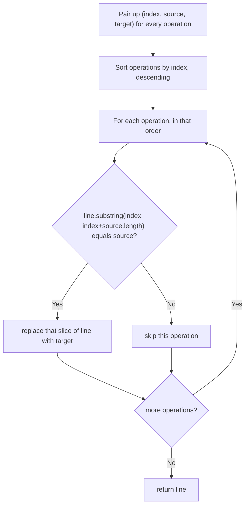

# Feature #4: Optimization by Replacement

## The problem

Another compiler optimization: swapping out slow function calls (or other tokens) for faster equivalents. We're given a line of code, plus a list of candidate replacement operations. Each operation is described by three parallel arrays:

- `indices[i]` — where in the line the token to replace starts.
- `sources[i]` — the token expected to be found there.
- `targets[i]` — what to replace it with.

A replacement at position `i` is only applied if `sources[i]` actually appears starting at `indices[i]` in the line. Note `sources[i]` and `targets[i]` don't have to be the same length, so applying a replacement can shift everything after it.

For example, given the line `foo(input, i);`, replacement indices `[0, 11]`, sources `["foo", "i"]`, and targets `["foobar", "j+1"]`: both replacements are valid (the source tokens really are at those positions), and applying them turns the line into `foobar(input, j+1);`.

## Solution

The naive approach — replacing left to right — runs into trouble because each replacement can change the string's length, which shifts the positions of every later `indices[i]` out from under us.

The fix: process replacements from **right to left** (highest index first). Since we always work on the part of the string to the *right* of the current index, and later replacements only affect the string at indices to the *right* of the ones we haven't processed yet, replacing from right to left means earlier (lower-index) replacement targets never move before we get to them.

The algorithm:
1. Sort the replacement operations by `indices[i]` in descending order.
2. For each one, check whether `sources[i]` actually matches the line starting at `indices[i]`.
3. If it matches, replace that slice of the line with `targets[i]`.
4. Return the modified line once every operation has been considered.



## Code

```java
import java.util.*;

class Solution {
    // Applies valid source->target replacements to a line, processing right-to-left
    // so earlier indices are never shifted before we reach them.
    public static String optimizeLine(String line, int[] indices, String[] sources, String[] targets) {
        List<int[]> order = new ArrayList<>();
        for (int i = 0; i < indices.length; i++) {
            order.add(new int[]{indices[i], i});
        }
        order.sort((a, b) -> b[0] - a[0]); // descending by index.

        StringBuilder sb = new StringBuilder(line);
        for (int[] pair : order) {
            int idx = pair[0];
            int j = pair[1];
            String src = sources[j];
            String tgt = targets[j];
            if (idx + src.length() <= sb.length() && sb.substring(idx, idx + src.length()).equals(src)) {
                sb.replace(idx, idx + src.length(), tgt);
            }
        }
        return sb.toString();
    }

    public static void main(String[] args) {
        System.out.println(optimizeLine(
            "foo(input, i);",
            new int[]{0, 11},
            new String[]{"foo", "i"},
            new String[]{"foobar", "j+1"}
        ));
        // foobar(input, j+1);
    }
}
```

## Complexity measures

Let **l** be the length of the input line and **n** be the number of replacement operations.

### Time Complexity

`O(l × n)` — sorting the operations takes `O(n log n)`, and each of the `n` substring checks/replacements can touch up to `O(l)` characters.

### Space Complexity

`O(l)` — dominated by the mutable copy of the line (assuming target substrings are bounded in length).
