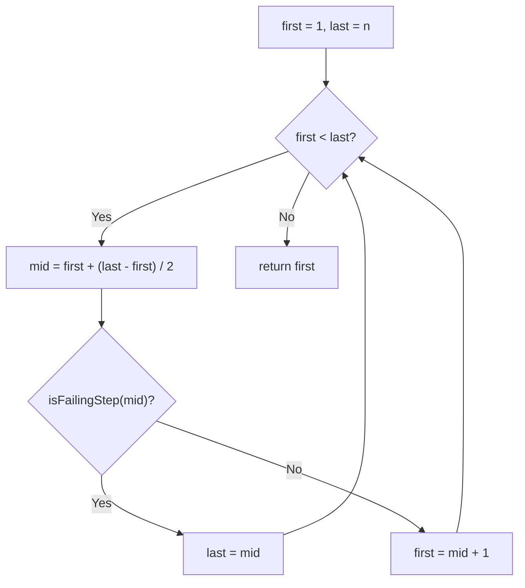

# Feature #5: Compilation Step Failure

## The problem

A large piece of software compiles through a sequence of build steps — one per source file or library — performed in order `1` through `n`, since later steps depend on earlier ones succeeding. If a build fails partway through, we don't want to blindly recompile every step from scratch; we only want to redo the steps from the first failure onward.

The catch: when a build fails, we get a generic error, not the specific step number. What we *do* have is an API, `isFailingStep(i)`, which tells us whether step `i` failed. Because later steps depend on earlier ones, once a step fails, every step after it is considered failed too — so `isFailingStep` returns `true` for that step and everything after it, and `false` before it.

For example, with `n = 40` steps where steps 28 through 40 all report as failed: `isFailingStep(i)` returns `true` for every `i >= 28`, and `false` otherwise. We want to find that boundary — step `28` — using as few API calls as possible.

## Solution

Since the failure states form a sorted boolean sequence (`false, false, ..., false, true, true, ..., true`), this is exactly the "first true in a sorted boolean array" pattern — solved with binary search in `O(log n)` calls instead of checking every step one by one.

We keep two pointers, `first` and `last`, bounding the range of steps that could possibly be the first failure. At each step:
- Compute `mid` (avoiding overflow by using `first + (last - first) / 2`).
- Call `isFailingStep(mid)`.
- If it failed, the first failure is `mid` or something earlier — narrow the range to `[first, mid]`.
- If it didn't fail, the first failure must be later — narrow the range to `[mid + 1, last]`.

We stop once `first == last` — that's our answer.



## Code

```java
class Solution {
    // Stand-in for the given API: returns true once step >= 28 in this demo.
    interface ErrorReport {
        boolean isFailingStep(int step);
    }

    // Finds the first build step that fails, using binary search over the API calls.
    public static int firstFailingStep(int n, ErrorReport api) {
        int first = 1;
        int last = n;
        while (first < last) {
            int mid = first + (last - first) / 2;
            if (api.isFailingStep(mid)) {
                last = mid;
            } else {
                first = mid + 1;
            }
        }
        return first;
    }

    public static void main(String[] args) {
        ErrorReport demo = step -> step >= 28; // steps 28..40 fail.
        System.out.println(firstFailingStep(40, demo));
        // 28
    }
}
```

## Complexity measures

Let **n** be the total number of build steps.

### Time Complexity

`O(log n)` — the search space is halved on each API call.

### Space Complexity

`O(1)` — only a fixed number of integer pointers are used.
