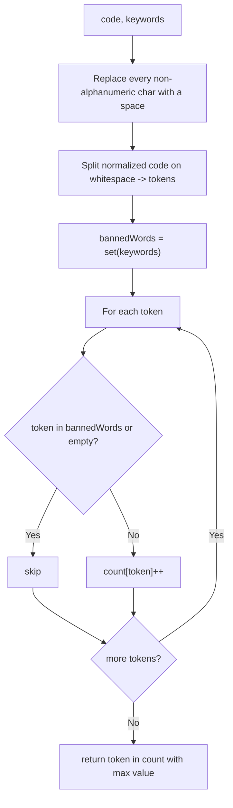

# Feature #6: Most Common Token

## The problem

We want the compiler to identify the variable or function name that's referenced most often in a program, so we know where to focus future optimizations. The program is handed to us as a single string, along with a list of language keywords to ignore (since a keyword like `int` or `return` would otherwise dominate the count without telling us anything useful).

For example, given this program:

```c
int main() {
  int value = getValue();
  int sum = value + getRandom();
  int subs = value - getRandom();
  return 0;
}
```

with keywords `["int", "main", "return"]`, the most common token is `"value"` — it appears three times, more than `getRandom` (twice) or anything else. Syntax like parentheses, semicolons, and operators should be ignored entirely — they're not tokens we're counting.

## Solution

The trick is to normalize the code into a clean sequence of tokens first, then just count.

1. Replace every non-alphanumeric character (parentheses, operators, semicolons, whitespace variations, etc.) with a plain space. What's left is a string of alphanumeric tokens separated by spaces.
2. Split that normalized string on whitespace to get the individual tokens.
3. Build a set of the given keywords, so we can skip them in constant time.
4. Walk the tokens, incrementing a `HashMap<String, Integer>` count for every token that isn't a keyword.
5. Scan the map for the token with the highest count.



## Code

```java
import java.util.*;

class Solution {
    // Finds the most frequently used non-keyword token in a piece of code.
    public static String mostCommonToken(String code, String[] keywords) {
        String normalizedCode = code.replaceAll("[^a-zA-Z0-9]", " ");
        String[] tokens = normalizedCode.trim().split("\\s+");

        Set<String> bannedWords = new HashSet<>(Arrays.asList(keywords));
        Map<String, Integer> count = new HashMap<>();
        for (String token : tokens) {
            if (token.isEmpty() || bannedWords.contains(token)) {
                continue;
            }
            count.put(token, count.getOrDefault(token, 0) + 1);
        }

        String best = null;
        int bestCount = -1;
        for (Map.Entry<String, Integer> entry : count.entrySet()) {
            if (entry.getValue() > bestCount) {
                bestCount = entry.getValue();
                best = entry.getKey();
            }
        }
        return best;
    }

    public static void main(String[] args) {
        String code = "int main() {\n"
            + "  int value = getValue();\n"
            + "  int sum = value + getRandom();\n"
            + "  int subs = value - getRandom();\n"
            + "  return 0;\n"
            + "}";
        System.out.println(mostCommonToken(code, new String[]{"int", "main", "return"}));
        // value
    }
}
```

## Complexity measures

Let **n** be the length of the code string and **m** be the number of keywords.

### Time Complexity

`O(n + m)` — `O(n)` to normalize and tokenize the code, and `O(m)` to build the keyword set.

### Space Complexity

`O(n + m)` — `O(n)` for the frequency map (at most one entry per distinct token) and `O(m)` for the keyword set.
