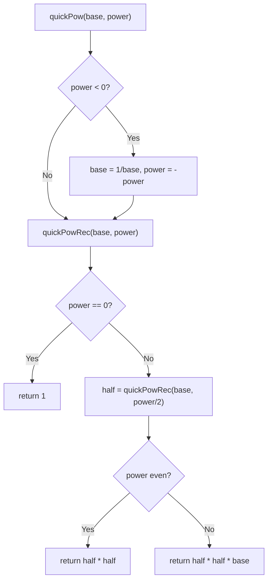

# Feature #7: Exponentiation for Mobile Devices

## The problem

Many mobile device processors don't natively support certain arithmetic operations — exponentiation (raising a number to a power) is one of them. When our compiler sees an expression that involves exponentiation on such a device, it needs to replace it with a call to a software routine that computes the same result.

We need to implement that routine: given a `base` and an integer `power`, compute `base ^ power`.

For example, `base = 2`, `power = 4` should give `16`.

## Solution

The naive approach — multiplying `base` by itself `power` times — takes `O(power)` multiplications. We can do much better with **fast exponentiation** (also called exponentiation by squaring), which halves the exponent at every step:

- `base^n = (base^(n/2))^2` when `n` is even.
- `base^n = (base^(n/2))^2 × base` when `n` is odd (integer division rounds down, so we need one extra factor of `base`).
- `base^0 = 1` (base case).

This recursive halving takes only `O(log n)` multiplications instead of `O(n)`.

Negative powers are handled up front: `base^(-n) = (1/base)^n`, so we flip `base` to `1/base` and the power to positive, then run the same recursive routine.

Algorithm:
1. `quickPow(base, power)`: if `power < 0`, replace `base` with `1/base` and `power` with `-power`. Then call `quickPowRec(base, power)`.
2. `quickPowRec(base, power)`: if `power == 0`, return `1`. Otherwise, recursively compute `half = quickPowRec(base, power / 2)`. If `power` is even, return `half * half`; if odd, return `half * half * base`.



## Code

```java
class Solution {
    // Fast exponentiation by squaring: base^power in O(log power) multiplications.
    private static double quickPowRec(double base, int power) {
        if (power == 0) {
            return 1.0;
        }
        double half = quickPowRec(base, power / 2);
        if (power % 2 == 0) {
            return half * half;
        } else {
            return half * half * base;
        }
    }

    public static double quickPow(double base, int power) {
        if (power < 0) {
            base = 1 / base;
            power = -power;
        }
        return quickPowRec(base, power);
    }

    public static void main(String[] args) {
        System.out.println(quickPow(2, 4));
        // 16.0
        System.out.println(quickPow(2, -2));
        // 0.25
    }
}
```

## Complexity measures

Let **n** be the magnitude of the power.

### Time Complexity

`O(log n)` — the exponent is halved at every recursive call.

### Space Complexity

`O(log n)` — the recursion stack has one frame per halving of the power.
