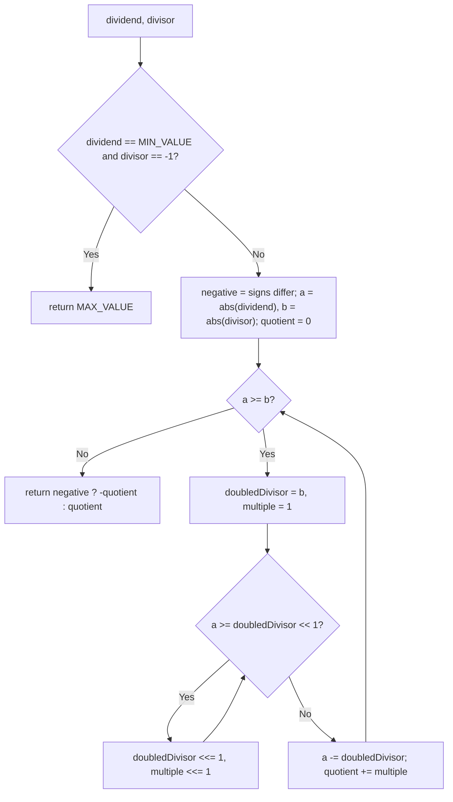

# Feature #8: Divide in Power Save Mode

## The problem

When a mobile device drops into power-save mode, it disables power-hungry operations to conserve battery — integer division being one of them. Our compiler needs to generate adaptive code: when the device is in this mode, division has to be computed without ever using the `/` operator.

We need a `divide(dividend, divisor)` function that computes integer division (truncating toward zero) using only addition, subtraction, and bit shifts. We can assume the divisor is never `0`.

For example, `dividend = 8`, `divisor = 2` should give `4`.

## Solution

The core idea: instead of subtracting `divisor` from `dividend` one copy at a time (which would be `O(dividend / divisor)` — too slow), we subtract the *largest possible power-of-two multiple* of `divisor` at each step. That collapses the number of subtractions down to `O(log n)`.

Steps:
1. **Handle overflow up front.** The one case that can overflow a 32-bit int is `Integer.MIN_VALUE / -1` (whose true result, `2^31`, doesn't fit in an `int`) — special-case it to return `Integer.MAX_VALUE`.
2. **Work with positive magnitudes.** Record whether the result should be negative (dividend and divisor have different signs), then work with `Math.abs` of both — as `long`s, so negating `Integer.MIN_VALUE` doesn't overflow.
3. **Repeatedly find the largest doubling of the divisor that still fits.** Starting from the divisor itself, keep doubling it (`doubledDivisor <<= 1`) — and doubling a `multiple` counter alongside it — as long as it's still `<= a` (the remaining dividend). This finds the biggest power-of-two multiple of the divisor we can subtract in one shot.
4. **Subtract that chunk, add its multiple to the quotient, and repeat** on what's left of `a`, until `a < divisor`.
5. **Apply the sign** we recorded in step 2.



## Code

```java
class Solution {
    // Integer division without using '/', via repeated doubling (bit-shift subtraction).
    public static int divide(int dividend, int divisor) {
        if (dividend == Integer.MIN_VALUE && divisor == -1) {
            return Integer.MAX_VALUE;
        }

        boolean negative = (dividend < 0) != (divisor < 0);
        long a = Math.abs((long) dividend);
        long b = Math.abs((long) divisor);
        int quotient = 0;

        while (a >= b) {
            long doubledDivisor = b;
            int multiple = 1;
            while (a >= (doubledDivisor << 1)) {
                doubledDivisor <<= 1;
                multiple <<= 1;
            }
            a -= doubledDivisor;
            quotient += multiple;
        }

        return negative ? -quotient : quotient;
    }

    public static void main(String[] args) {
        System.out.println(divide(8, 2));
        // 4
        System.out.println(divide(-7, 2));
        // -3
    }
}
```

## Complexity measures

Let **n** be the dividend's magnitude.

### Time Complexity

`O(log n)` — the inner doubling loop finds the largest divisor multiple in `O(log n)`, and the outer loop runs at most `O(log n)` times since each iteration removes at least half of what's left of `a`.

### Space Complexity

`O(1)` — a fixed number of integer/long variables, no recursion or extra data structures.
