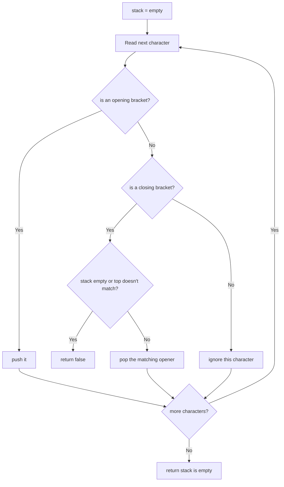

# Feature #9: Validate Program Brackets

## The problem

Compilers verify a lot of things about a program's structure. As languages grow more expressive — anonymous functions, functions nested inside functions, asynchronous callbacks — bracket nesting gets complicated fast. Consider this immediately-invoked anonymous function:

```js
alert((function(n) {
  return !(n > 1)
    ? 1
    : arguments.callee(n - 1) * n;
})(15));
```

After the compiler strips line breaks, it's left with one long string that may contain nested `(`, `[`, and `{` brackets. Our job: verify that every bracket is properly opened and closed, in the right order.

## Solution

This is the classic bracket-matching problem, solved with a stack:

- Walk the string character by character.
- Whenever we see an **opening** bracket (`(`, `[`, `{`), push it onto the stack.
- Whenever we see a **closing** bracket (`)`, `]`, `}`), pop the stack and check that the popped bracket is the matching opener — if the stack is empty, or the popped bracket doesn't match, the brackets are invalid.
- Any other character is simply ignored (not part of bracket-checking).
- At the end, the brackets are valid only if the stack is completely empty (every opener found a matching closer).



## Code

```java
import java.util.*;

class Solution {
    // Verifies that (), [], and {} are all properly nested and matched in the string.
    public static boolean valid(String s) {
        Map<Character, Character> matches = new HashMap<>();
        matches.put(')', '(');
        matches.put(']', '[');
        matches.put('}', '{');

        Deque<Character> stack = new ArrayDeque<>();
        for (char c : s.toCharArray()) {
            if (c == '(' || c == '[' || c == '{') {
                stack.push(c);
            } else if (matches.containsKey(c)) {
                if (stack.isEmpty() || stack.pop() != matches.get(c)) {
                    return false;
                }
            }
            // any other character is ignored.
        }
        return stack.isEmpty();
    }

    public static void main(String[] args) {
        String code = "alert((function(n) { return !(n > 1) ? 1 : arguments.callee(n - 1) * n; })(15));";
        System.out.println(valid(code));
        // true
        System.out.println(valid("(()"));
        // false
    }
}
```

## Complexity measures

Let **n** be the length of the code string.

### Time Complexity

`O(n)` — a single left-to-right pass over the string.

### Space Complexity

`O(n)` — the worst case (a string of nothing but opening brackets) pushes every character onto the stack.
