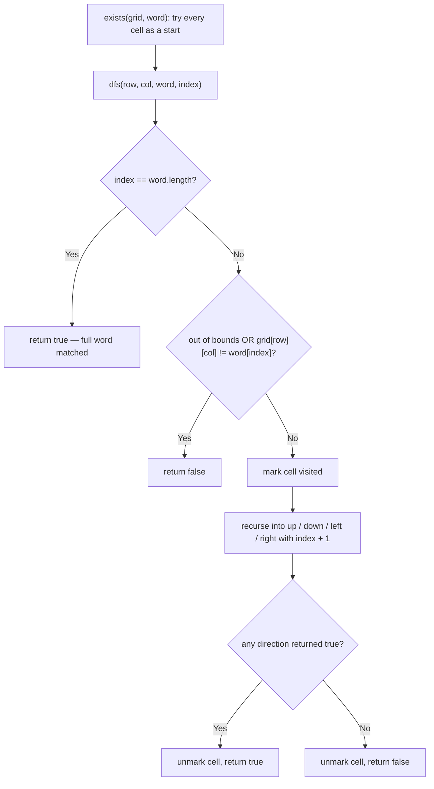

# Feature #1: Search for a Single Word in the Boggle Grid

## The problem

For the game's easy mode, we're given a grid of letters — the Boggle board — and a word to search for inside it. The input is a 5x5 grid of letters. The rules for this variation of the game are:

- A word is built from letters in sequentially adjacent cells.
- Adjacent means horizontal or vertical neighbors only — diagonally touching cells don't count.
- A cell can only be used once per word (you can't reuse the same die twice while spelling one word).

For example, take this grid:

```
C S L I M
O I L M O
O L I E O
R T A S N
S I T A C
```

Words like `CAT`, `MOON`, `SAILOR`, and `COIL` can all be traced through adjacent cells here. If we search for `COIL`, the answer is `true` — trace `C`(0,0) → `O`(1,0) → `I`(1,1) → `L`(0,2) or similar adjacent paths. If we search for `COCOON`, the answer is `false` — no path of adjacent cells spells it out.

## Solution

This is a classic backtracking problem solved with Depth-First Search (DFS). For every cell on the grid, we try starting the word there. From each cell, there are up to four directions to explore next (up, down, left, right). If a direction turns out wrong, we backtrack and try a different one, until the word is fully matched or every possibility is exhausted.

The algorithm:

1. Call `dfs` starting from every cell of the grid — the word could start anywhere.
2. In `dfs`, the base case is: if we've matched every character of the word already, we're done — return `true`.
3. Otherwise check the current cell is valid (in bounds) and its letter matches the next character we need.
4. If it matches, mark the cell as visited (so this word can't loop back through it), then recurse into all four neighboring directions with the next character to match.
5. When the recursive calls return, unmark the cell — it's free again for a *different* candidate word or a different path.

Marking and unmarking is what enforces "a cell can only be part of one word" — actually, part of one word *per attempt*: within a single DFS path, a cell is locked while it's "in use," and released the moment that path is abandoned, so a later path can reuse it.



## Code

```java
class Solution {
    // Returns true if `word` can be traced through sequentially adjacent
    // (horizontal/vertical only) cells of the grid, each cell used at most
    // once per attempt.
    public static boolean exists(char[][] grid, String word) {
        int rows = grid.length, cols = grid[0].length;
        for (int row = 0; row < rows; row++) {
            for (int col = 0; col < cols; col++) {
                if (dfs(grid, row, col, word, 0)) {
                    return true;
                }
            }
        }
        return false;
    }

    private static boolean dfs(char[][] grid, int row, int col, String word, int index) {
        if (index == word.length()) {
            return true; // matched every character already.
        }
        int rows = grid.length, cols = grid[0].length;
        if (row < 0 || row >= rows || col < 0 || col >= cols) {
            return false;
        }
        if (grid[row][col] != word.charAt(index)) {
            return false;
        }

        char original = grid[row][col];
        grid[row][col] = '#'; // mark visited for this attempt.

        boolean found = dfs(grid, row + 1, col, word, index + 1)
                || dfs(grid, row - 1, col, word, index + 1)
                || dfs(grid, row, col + 1, word, index + 1)
                || dfs(grid, row, col - 1, word, index + 1);

        grid[row][col] = original; // unmark — free for other attempts.
        return found;
    }

    public static void main(String[] args) {
        char[][] grid = {
            {'C', 'S', 'L', 'I', 'M'},
            {'O', 'I', 'L', 'M', 'O'},
            {'O', 'L', 'I', 'E', 'O'},
            {'R', 'T', 'A', 'S', 'N'},
            {'S', 'I', 'T', 'A', 'C'}
        };
        System.out.println(exists(grid, "COIL"));
        // true
        System.out.println(exists(grid, "COCOON"));
        // false
    }
}
```

## Complexity measures

Let **n** be the number of cells in the grid and **l** be the length of the word we're searching for.

### Time Complexity

`O(n × 3ˡ)` — DFS is attempted from every cell, and from each cell in a path there are up to four directions, but one of them is always the direction we just came from, so effectively only three fresh choices remain at each step, repeated `l` times.

### Space Complexity

`O(l)` — the recursion (call) stack goes at most as deep as the word is long.
