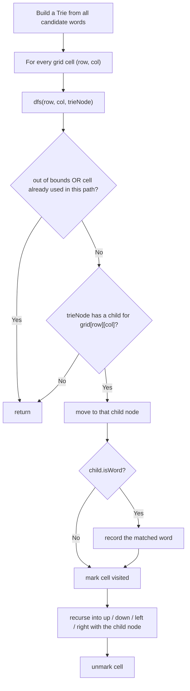

# Feature #2: Search for Maximum Number of Words in the Boggle Grid

## The problem

This feature powers the game's difficult mode. Instead of searching for one word, we're given a *list* of candidate words, and we need to find the maximum number of them that actually exist in the Boggle grid. The adjacency rules from the previous lesson still apply:

- A word is built from letters in sequentially adjacent cells.
- Adjacent means horizontal or vertical neighbors only — no diagonals.
- A cell can only be part of one word (per attempt at tracing that word).

The module takes two inputs: the grid, and a list of candidate words. It returns the subset of those words that were actually found in the grid.

For example, given this grid:

```
B S L I M
R I L M O
O L I E O
R Y I L N
B U N E C
```

and the candidate words `{"BUY", "SLICK", "SLIME", "ONLINE", "NOW"}`, the feature should return `{"SLIME", "ONLINE", "BUY"}` — `SLICK` and `NOW` can't be traced through adjacent cells on this grid.

## Solution

We could run Feature #1's single-word search once per candidate word, but that repeats work whenever several words share a prefix — e.g. if `SLICE` and `SLIME` both fail to extend past `SLI`, we'd still explore the `SLI...` prefix on the grid twice.

A **Trie** (prefix tree) fixes this. We insert every candidate word into a Trie first. Then we do a *single* DFS sweep over the grid — starting from every cell — and at each step we follow the Trie alongside the grid, one letter at a time. If the Trie has no child for the current letter, that whole branch of candidate words is dead and we stop immediately, without exploring it further. Whenever we land on a Trie node marked as a complete word, we've found a match.

The algorithm:

1. Insert every candidate word into a Trie.
2. Loop over every cell in the grid, and start a DFS from each one whose letter matches a child of the Trie's root.
3. In the DFS, walk the Trie and the grid together: from the current grid cell and current Trie node, try all four neighboring directions, following the corresponding child of the Trie node.
4. Whenever the Trie node we land on is marked `isWord`, record that word as found.
5. Mark/unmark grid cells as visited exactly like Feature #1, so one path can't reuse a cell.



## Code

```java
import java.util.*;

class Solution {
    static final int ALPHABET_SIZE = 26;

    static class TrieNode {
        TrieNode[] children = new TrieNode[ALPHABET_SIZE];
        boolean isWord = false;
        String word = null; // the full word, stored at the node where it ends.
    }

    private static void insert(TrieNode root, String word) {
        TrieNode node = root;
        for (char c : word.toCharArray()) {
            int i = c - 'A';
            if (node.children[i] == null) {
                node.children[i] = new TrieNode();
            }
            node = node.children[i];
        }
        node.isWord = true;
        node.word = word;
    }

    // Returns every word from `words` that can be traced through sequentially
    // adjacent cells of the grid.
    public static List<String> findMaxWords(char[][] grid, String[] words) {
        TrieNode root = new TrieNode();
        for (String word : words) {
            insert(root, word);
        }

        List<String> found = new ArrayList<>();
        int rows = grid.length, cols = grid[0].length;
        for (int row = 0; row < rows; row++) {
            for (int col = 0; col < cols; col++) {
                dfs(grid, row, col, root, found);
            }
        }
        return found;
    }

    private static void dfs(char[][] grid, int row, int col, TrieNode node, List<String> found) {
        int rows = grid.length, cols = grid[0].length;
        if (row < 0 || row >= rows || col < 0 || col >= cols) {
            return;
        }
        char letter = grid[row][col];
        if (letter == '#') {
            return; // already used in this path.
        }
        TrieNode next = node.children[letter - 'A'];
        if (next == null) {
            return; // no candidate word continues with this letter — stop.
        }

        if (next.isWord && next.word != null) {
            found.add(next.word);
            next.word = null; // avoid adding the same word twice.
        }

        grid[row][col] = '#'; // mark visited for this path.
        dfs(grid, row + 1, col, next, found);
        dfs(grid, row - 1, col, next, found);
        dfs(grid, row, col + 1, next, found);
        dfs(grid, row, col - 1, next, found);
        grid[row][col] = letter; // unmark.
    }

    public static void main(String[] args) {
        char[][] grid = {
            {'B', 'S', 'L', 'I', 'M'},
            {'R', 'I', 'L', 'M', 'O'},
            {'O', 'L', 'I', 'E', 'O'},
            {'R', 'Y', 'I', 'L', 'N'},
            {'B', 'U', 'N', 'E', 'C'}
        };
        String[] words = {"BUY", "SLICK", "SLIME", "ONLINE", "NOW"};
        System.out.println(findMaxWords(grid, words));
        // [SLIME, ONLINE, BUY]
    }
}
```

## Complexity measures

Let **n** be the number of cells in the grid, **l** be the length of the longest candidate word, and **m** be the total number of characters across all candidate words.

### Time Complexity

`O(n × 3ˡ)` — same shape as Feature #1: DFS starts from every cell, and each step has at most three fresh directions to explore (excluding where we came from), up to `l` levels deep. In the worst case none of the candidate words share a prefix, so the Trie can't prune anything and we still explore every candidate's full path.

### Space Complexity

`O(m)` — the Trie stores at most one node per character across all candidate words, which is `m` in the worst case (no shared prefixes).
