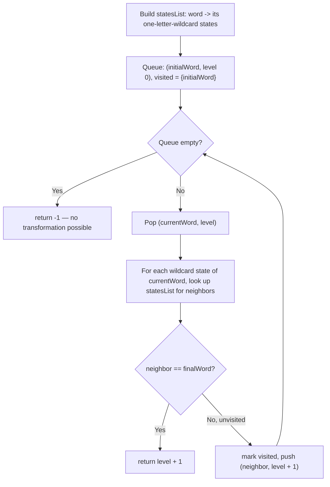

# Feature #1: Minimum Moves

## The problem

The first functionality we need to build finds the minimum number of conversions needed to transform the *initial* word into the *final* word. Both words are the same length.

We're given an *initial* word, a *final* word, and a word group (an array of words). Our code needs to find the shortest sequence of same-length words from that word group, starting at the *initial* word and ending at the *final* word, where each consecutive word in the sequence differs from the previous one by exactly one letter.

For example, take this word group:

```
{"hot", "dot", "dog", "lot", "log", "cog"}
```

If the *initial* word is `hit` and the *final* word is `cog`, one shortest transformation is:

```
hit -> hot -> dot -> dog -> cog
```

That's **4** moves (character conversions) to get from `hit` to `cog`.

## Solution

We can treat each word in the word group as a vertex (node) in a graph, with an edge between two vertices whenever the corresponding words differ by exactly one letter. Finding the minimum number of moves is then the same as finding the shortest path between the vertices representing the *initial* and *final* words.

BFS (Breadth-First Search) is the standard tool for finding the shortest path in an unweighted graph — it explores the graph level by level, so the first time it reaches the *final* word, that's guaranteed to be via the fewest possible edges. Before we can run BFS, though, we need a fast way to find a word's neighbors, since we don't have an explicit adjacency list.

The trick: for a word like `let`, replace one letter at a time with a wildcard to get its **intermediate states** — `*et`, `l*t`, `le*`. Any other word sharing one of these same wildcard states differs from `let` by exactly one letter, and is therefore its neighbor. For example, `lot` and `lit` both share the state `l*t`, so both are neighbors of `let`.

Here's the implementation plan:

1. Preprocess every word in the word group to find its intermediate states, and build a map `statesList` from each state to the list of words that produce it.
2. Push the tuple `(initialWord, 0)` into a queue — the *initial* word is the BFS root, sitting at level `0`. The level at which we eventually find the *final* word is the answer.
3. Keep a `visited` set to avoid revisiting words (and to prevent cycles).
4. Pop the next `(currentWord, level)` from the queue. For each of `currentWord`'s intermediate states, look up `statesList` to get all words sharing that state — these are `currentWord`'s neighbors.
5. Any unvisited neighbor gets marked visited and pushed as `(neighbor, level + 1)`.
6. The moment a neighbor equals the *final* word, `level + 1` is the answer — the minimum number of moves.



## Code

```java
import java.util.*;

class Solution {
    // Returns the minimum number of one-letter conversions needed to turn
    // `initial` into `finalWord`, moving only through words in `wordGroup`.
    // Returns -1 if no such transformation exists.
    public static int minimumMoves(String initial, String finalWord, String[] wordGroup) {
        if (initial.equals(finalWord)) {
            return 0;
        }

        // Map each one-letter-wildcard state to every word that produces it.
        Map<String, List<String>> statesList = new HashMap<>();
        for (String word : wordGroup) {
            for (int i = 0; i < word.length(); i++) {
                String state = word.substring(0, i) + "*" + word.substring(i + 1);
                statesList.computeIfAbsent(state, k -> new ArrayList<>()).add(word);
            }
        }

        Queue<Map.Entry<String, Integer>> queue = new LinkedList<>();
        queue.offer(new AbstractMap.SimpleEntry<>(initial, 0));
        Set<String> visited = new HashSet<>();
        visited.add(initial);

        while (!queue.isEmpty()) {
            Map.Entry<String, Integer> entry = queue.poll();
            String currentWord = entry.getKey();
            int level = entry.getValue();

            for (int i = 0; i < currentWord.length(); i++) {
                String state = currentWord.substring(0, i) + "*" + currentWord.substring(i + 1);
                for (String neighbor : statesList.getOrDefault(state, Collections.emptyList())) {
                    if (neighbor.equals(finalWord)) {
                        return level + 1;
                    }
                    if (!visited.contains(neighbor)) {
                        visited.add(neighbor);
                        queue.offer(new AbstractMap.SimpleEntry<>(neighbor, level + 1));
                    }
                }
            }
        }
        return -1; // finalWord is unreachable from initial.
    }

    public static void main(String[] args) {
        String[] wordGroup = {"hot", "dot", "dog", "lot", "log", "cog"};
        System.out.println(minimumMoves("hit", "cog", wordGroup));
        // 4
    }
}
```

## Complexity measures

Let **m** be the length of each word and **n** be the total number of words in `wordGroup`.

### Time Complexity

`O(m² × n)` — building `statesList` visits all **n** words, and for each word of length **m** we build **m** substrings (each an `O(m)` operation), giving `O(m² × n)`. The BFS traversal does the same substring work again per word visited, so it also costs `O(m² × n)`.

### Space Complexity

`O(m² × n)` — `statesList` stores, for each of the **n** words, **m** wildcard-state keys each of length **m**; `visited` and the `queue` add only `O(m × n)` on top.
