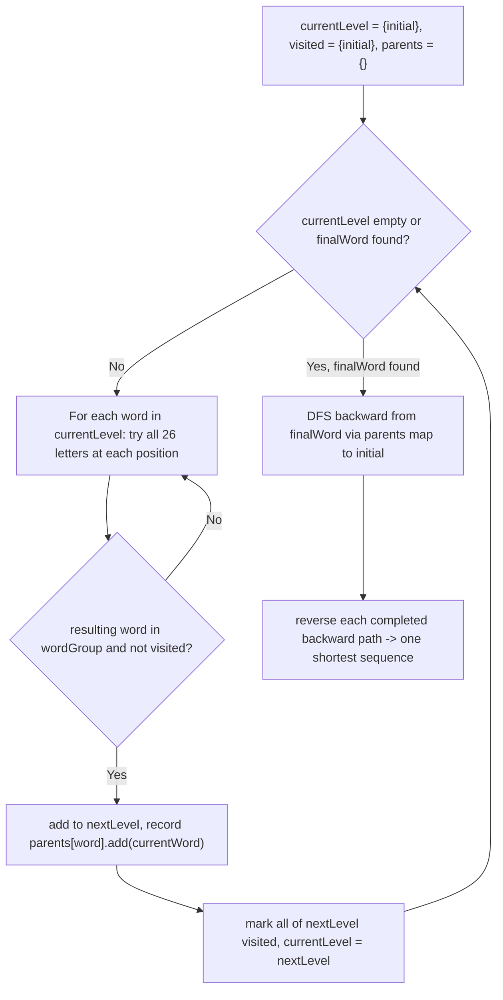

# Feature #2: Possible Results

## The problem

In the previous lesson, we built a feature that calculates the minimum number of conversions from the *initial* word to the *final* word. Now we need to actually fetch and display every shortest transformation sequence — every word-by-word path from the *initial* word to the *final* word that achieves that minimum number of moves — so the player can pick which one to follow.

For example, take the same word group as before:

```
{"hot", "dot", "dog", "lot", "log", "cog"}
```

With *initial* word `hit` and *final* word `cog`, there are **two** different shortest (4-move) transformation sequences:

```
hit -> hot -> dot -> dog -> cog
hit -> hot -> lot -> log -> cog
```

Both take exactly 4 moves to reach `cog` from `hit`, so both should be returned.

## Solution

Feature #1 only needed the *length* of the shortest path, so plain BFS was enough — it doesn't naturally remember the path taken to get there. Here we need every shortest *path*, which is a different (and trickier) ask.

Pure DFS could enumerate paths, but the word group is a graph, not a tree — DFS alone would wander down long, ultimately-irrelevant branches and cycles, wasting huge amounts of time on paths that are nowhere near shortest.

The fix is to combine both algorithms — use BFS to discover the shortest distance *layer by layer*, and use DFS only afterward, to backtrack through the layers we already know are correct:

1. Run BFS from the *initial* word one full layer at a time (all words reachable in 1 move, then all reachable in 2 moves, and so on) — not word by word, so that we can freely record *multiple* parents for a single word if more than one word in the previous layer reaches it.
2. At each layer, for every word currently in the frontier, try changing each letter position to each of the 26 alternatives and check whether the resulting word exists in our word group.
3. Any new word found this way becomes part of the *next* layer, and we record an edge in a **parent map**: `word -> the word(s) in the current layer that led to it`.
4. Words already visited in an earlier layer are skipped — visiting them again could never be part of a *shortest* path (it would only lengthen it).
5. We stop expanding layers the moment the *final* word is found in the freshly built layer — since that layer, by BFS's level-order guarantee, is the shortest possible distance.
6. Finally, we DFS **backward** from the *final* word, following the parent map back toward the *initial* word. Every complete backward walk that reaches the *initial* word, reversed, is one shortest transformation sequence.



## Code

```java
import java.util.*;

class Solution {
    // Returns every shortest one-letter-at-a-time transformation sequence
    // from `initial` to `finalWord`, moving only through words in `wordGroup`.
    public static List<List<String>> possibleResults(String initial, String finalWord, String[] wordGroup) {
        List<List<String>> results = new ArrayList<>();
        Set<String> wordSet = new HashSet<>(Arrays.asList(wordGroup));
        if (!wordSet.contains(finalWord)) {
            return results; // finalWord isn't even a valid word in the group.
        }

        Map<String, List<String>> parents = new HashMap<>();
        Set<String> currentLevel = new HashSet<>();
        currentLevel.add(initial);
        Set<String> visited = new HashSet<>();
        visited.add(initial);
        boolean found = false;

        while (!currentLevel.isEmpty() && !found) {
            Set<String> nextLevel = new HashSet<>();
            Set<String> visitedThisLevel = new HashSet<>();

            for (String word : currentLevel) {
                char[] chars = word.toCharArray();
                for (int i = 0; i < chars.length; i++) {
                    char original = chars[i];
                    for (char c = 'a'; c <= 'z'; c++) {
                        if (c == original) {
                            continue;
                        }
                        chars[i] = c;
                        String next = new String(chars);
                        if (wordSet.contains(next) && !visited.contains(next)) {
                            nextLevel.add(next);
                            visitedThisLevel.add(next);
                            parents.computeIfAbsent(next, k -> new ArrayList<>()).add(word);
                            if (next.equals(finalWord)) {
                                found = true;
                            }
                        }
                    }
                    chars[i] = original;
                }
            }

            visited.addAll(visitedThisLevel);
            currentLevel = nextLevel;
        }

        if (!found) {
            return results; // no transformation sequence exists.
        }

        List<String> path = new LinkedList<>();
        path.add(finalWord);
        backtrack(finalWord, initial, parents, path, results);
        results.sort((a, b) -> String.join(",", a).compareTo(String.join(",", b)));
        return results;
    }

    private static void backtrack(String word, String initial, Map<String, List<String>> parents,
                                   List<String> path, List<List<String>> results) {
        if (word.equals(initial)) {
            results.add(new ArrayList<>(path));
            return;
        }
        for (String parent : parents.getOrDefault(word, Collections.emptyList())) {
            path.add(0, parent);
            backtrack(parent, initial, parents, path, results);
            path.remove(0);
        }
    }

    public static void main(String[] args) {
        String[] wordGroup = {"hot", "dot", "dog", "lot", "log", "cog"};
        List<List<String>> results = possibleResults("hit", "cog", wordGroup);
        for (List<String> path : results) {
            System.out.println(path);
        }
        // [hit, hot, dot, dog, cog]
        // [hit, hot, lot, log, cog]
    }
}
```

`possibleResults` builds the BFS layers and parent map together, stopping as soon as `finalWord` shows up in a layer; `backtrack` then walks the parent map from `finalWord` back to `initial`, prepending each parent to `path` and recording a complete path whenever it reaches `initial`.

## Complexity measures

Let **m** be the length of each word and **n** be the total number of words in `wordGroup`.

### Time Complexity

`O((m × 26) × n)` for the BFS layering — every word considered (at most **n** of them) tries all **m** positions against 26 letters. The backward DFS over the parent map touches each recorded edge once, adding `O(m × n)`, so `O((m × 26) × n)` dominates overall.

### Space Complexity

`O(m² × n)` — the `parents` map, `visited` set, and per-level sets together hold up to `O(m × n)` word references, and building each candidate word costs `O(m)` space, giving `O(m² × n)` overall.
