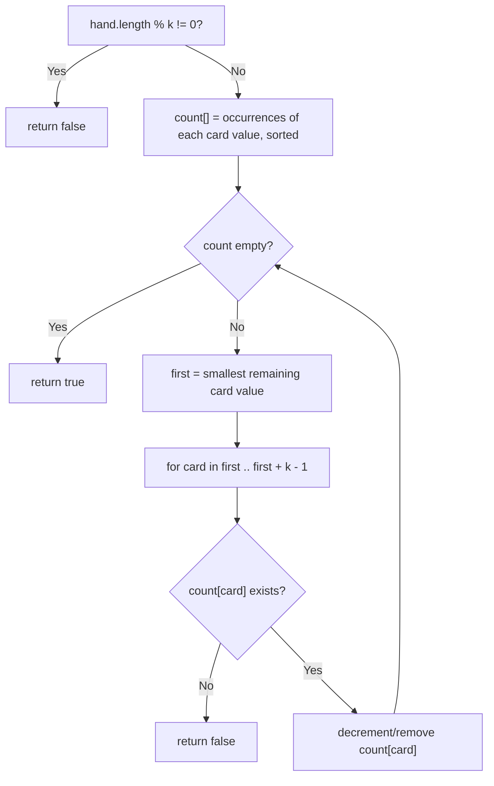

# Feature #1: Hand of Straights

## The problem

For this feature, we're working on a variation of poker. In traditional poker, a "straight" is five cards of sequential rank, like 9♣, 8♠, 7♠, 6♥, 5♥. In our variation, the computer player rolls a dice to determine a number `k` (re-rolling on a 1, so `k` is always between 2 and 6), and a hand of straights is only possible if every card in the hand can be arranged into groups of `k` cards each, where each group is a run of `k` sequential ranks.

We'll receive the hand as an array of integers, where jack, queen, and king are represented as `11`, `12`, and `13`. For example, take the hand:

```
{11, 3, 6, 2, 13, 12, 5, 4, 7}
```

with `k = 3`. Sorted, that hand is `2, 3, 4, 5, 6, 7, 11, 12, 13` — which splits cleanly into three runs of three: `{2,3,4}`, `{5,6,7}`, and `{11,12,13}` (jack, queen, king). So this hand *is* a hand of straights, and our feature should return `true`.

(Note: if you swap that `11` for a `10`, the sorted hand becomes `2,3,4,5,6,7,10,12,13` — and there's no way to form a third run of three consecutive ranks out of `10, 12, 13`, since `11` is missing. That version of the hand is *not* a hand of straights. It's a good reminder that a hand "looking" sequential-ish isn't enough — every run has to be genuinely consecutive.)

## Solution

The key intuition: always try to build a group starting from the *lowest* remaining card. If `k` is 3 and the lowest remaining card is `2`, the only group that card could possibly belong to is `{2, 3, 4}` — there's no smaller card to pair it with, so if `3` and `4` aren't both available, the hand simply can't be split into straights.

That gives us a clean greedy algorithm:

1. If the hand size isn't divisible by `k`, we can't form equal-sized groups at all — return `false` immediately.
2. Count the occurrences of each card value, regardless of suit, in a map that's sorted by key (so we can always ask "what's the smallest remaining card?").
3. While cards remain:
   - Look at the smallest remaining card value.
   - Try to consume one instance each of that value and the next `k - 1` values above it. If any of those values is missing from the map, the hand can't form straights — return `false`.
   - Decrement (or remove) each consumed value from the map.
4. If we empty the map without ever failing, every card was successfully placed into a straight — return `true`.



## Code

```java
import java.util.*;

class Solution {
    // Returns true if `hand` can be split entirely into groups of k
    // sequential-rank cards.
    public static boolean isHandOfStraights(int[] hand, int k) {
        if (hand.length % k != 0) {
            return false;
        }

        TreeMap<Integer, Integer> count = new TreeMap<>();
        for (int card : hand) {
            count.merge(card, 1, Integer::sum);
        }

        while (!count.isEmpty()) {
            int first = count.firstKey();
            for (int card = first; card < first + k; card++) {
                Integer occurrences = count.get(card);
                if (occurrences == null) {
                    return false; // Missing card breaks this run.
                }
                if (occurrences == 1) {
                    count.remove(card);
                } else {
                    count.put(card, occurrences - 1);
                }
            }
        }
        return true;
    }

    public static void main(String[] args) {
        int[] hand = {11, 3, 6, 2, 13, 12, 5, 4, 7};
        System.out.println(isHandOfStraights(hand, 3));
        // true
    }
}
```

## Complexity measures

Let **n** be the number of cards in the hand.

### Time Complexity

`O(n log n + n × k)` — building the sorted `TreeMap` costs `O(n log n)`, and in the worst case the outer `while` loop runs `n / k` times with an inner loop of `k` steps, each doing an `O(log n)` map lookup — that's `O(n log n)` again, dominated overall by `O(n log n + n × k)`.

### Space Complexity

`O(n)` — the `count` map holds at most one entry per distinct card value, bounded by `n`.
