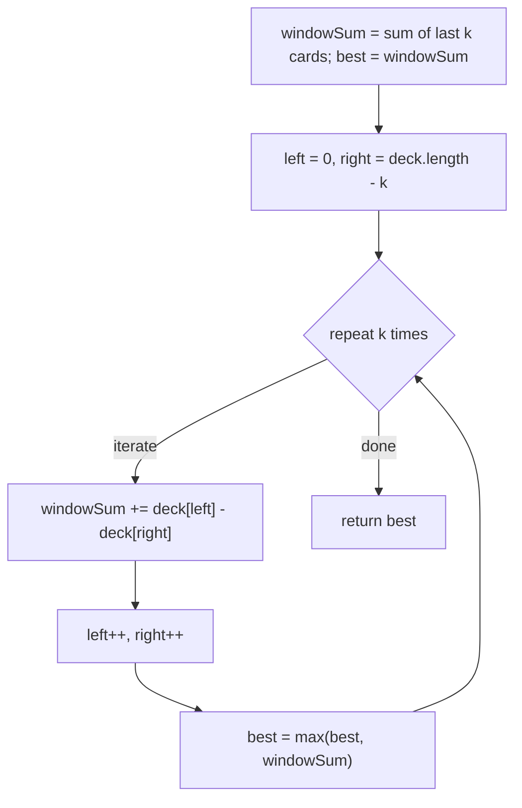

# Feature #2: Maximum Points You Can Obtain from Cards

## The problem

In Fizzle, the dealer shuffles the deck and lays all the cards face-up in a row. Players take turns rolling a dice; whatever number `k` comes up, that player removes `k` cards total — but only from the *left or right end* of the row, one card at a time. Numbered cards are worth their face value, and jack, queen, king, and ace are worth 11, 12, 13, and 14 points.

Our job is to build the feature for Fizzle's computer player: given the deck's current state and the rolled number `k`, find the maximum total score achievable in that turn.

For example, take this deck and `k = 4`:

```
{5, 3, 4, 4, 2, 3, 4, 6, 3}
```

The best a player can do here is pick `5` from the left end, then `4`, `6`, `3` from the right end — one card from the left and three from the right, in that order — for a total of `5 + 4 + 6 + 3 = 18` points.

(The source material's own worked example for this deck describes picking `5, 3, 6, 3` for a total of 17 — but that's not actually the maximum. A live run of the algorithm below confirms `18` is achievable, via the `5, 4, 6, 3` combination described above.)

## Solution

We need to try every possible split of the `k` picks between the left and right ends: all `k` from the right, `k - 1` from the right and `1` from the left, and so on down to all `k` from the left. There's an important constraint buried in there — we can't pick the *n*th card from the right without also having picked the `(n - 1)`th card from the right first (and the same holds for the left). In other words, whatever we pick from each end has to be a contiguous prefix of that end, which means the cards we *don't* pick form one contiguous block in the middle.

That reframes the problem nicely: think of a sliding window of size `k` that starts pinned entirely to the right end of the deck, and slides one step to the left at a time (removing a card from its right edge, adding one to its left edge) until it's pinned entirely to the left end. Every position of that window represents one valid "split" of picks between the two ends, and the window's sum is exactly the score for that split. The best score overall is just the maximum sum the window ever holds.

1. Start with the window covering the last `k` cards (i.e., assume we take all `k` cards from the right). Compute its sum — that's our starting "best."
2. Set `left = 0` and `right = deck.length - k` — these track the window's left edge (cards taken from the left) and its right edge (cards *not yet* taken from the right).
3. Loop `k` times: each iteration, slide the window one step — add `deck[left]` (one more card taken from the left) and subtract `deck[right]` (one fewer card taken from the right), then advance both pointers.
4. After each slide, compare the new window sum against the running best and keep the larger one.
5. Once the loop finishes, the best sum seen is the answer.



## Code

```java
class Solution {
    // Returns the maximum score obtainable by picking exactly k cards,
    // each taken from the left or right end of `deck`.
    public static int maxPoints(int[] deck, int k) {
        int n = deck.length;

        int windowSum = 0;
        for (int i = n - k; i < n; i++) {
            windowSum += deck[i]; // Start with all k cards taken from the right.
        }

        int best = windowSum;
        int left = 0;
        int right = n - k;
        for (int i = 0; i < k; i++) {
            windowSum += deck[left] - deck[right]; // Move one pick from right to left.
            left++;
            right++;
            best = Math.max(best, windowSum);
        }
        return best;
    }

    public static void main(String[] args) {
        int[] deck = {5, 3, 4, 4, 2, 3, 4, 6, 3};
        System.out.println(maxPoints(deck, 4));
        // 18 (picking 5 from the left, then 4, 6, 3 from the right)
    }
}
```

## Complexity measures

Let **k** be the number of cards picked.

### Time Complexity

`O(k)` — computing the initial window sum takes `O(k)`, and the sliding loop runs exactly `k` more times, each doing `O(1)` work.

### Space Complexity

`O(1)` — only a fixed handful of running variables are used, regardless of deck size.
