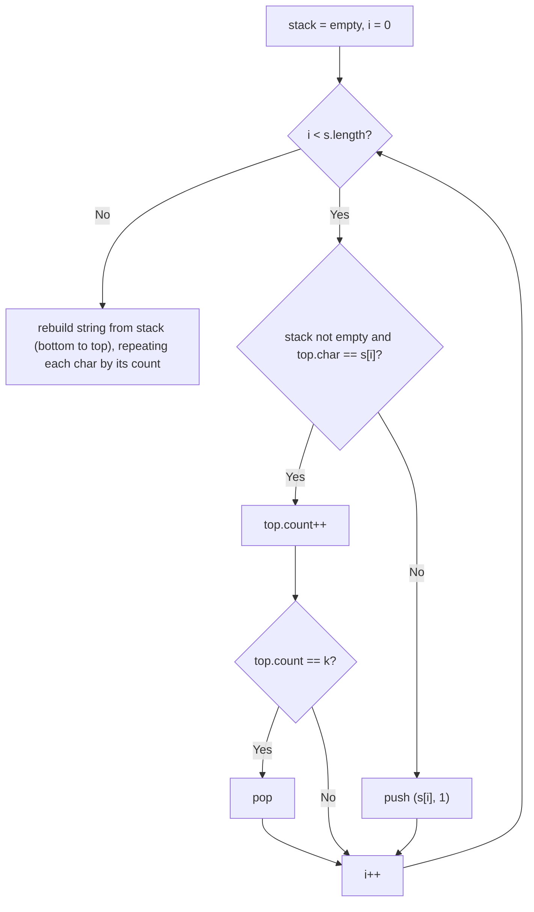

# Feature #3: Balloon Splash

## The problem

Balloon Splash is one of the arcade games in development. Picture a row of colored balloons. The player can only splash a run of `k` *consecutive* balloons that are all the same color — once splashed, that whole run disappears, and any balloons don't shift positions relative to each other, they simply become adjacent to whatever was on either side of the removed run (which may itself now form a new run of `k` and be splashed next). The player keeps splashing runs until no run of `k` consecutive same-colored balloons remains anywhere in the row.

We represent the row of balloons as a string, where each letter stands for a unique balloon color. For example, take the row:

```
deeedbbcccbdaa
```

with `k = 3`. Splashing proceeds like this:

1. `eee` (3 consecutive `e`s) is a splashable run → remove it: `d` + `bbcccbdaa` → `dbbcccbdaa`.
2. `ccc` (3 consecutive `c`s) is now exposed → remove it: `dbb` + `bdaa` → `dbbbdaa`.
3. `bbb` (3 consecutive `b`s, since the two `b`s that were on either side of the removed `ccc` are now adjacent) is exposed → remove it: `d` + `daa` → `ddaa`.
4. No run of 3 remains (`dd` is only 2, `aa` is only 2) — we're done.

Final result: `aa`.

## Solution

The trick is that removing one run can expose a *new* run right where the removal happened — as we saw with the `b`s above. We want a way to process the string left to right, exactly once, while still correctly "seeing" those newly-exposed runs the moment they form.

A stack of `(character, runLength)` pairs does exactly this:

1. Walk the balloon string one character at a time.
2. If the current character matches the character on top of the stack, increment that top entry's count.
3. Otherwise, push a brand-new entry `(character, 1)`.
4. Whenever an entry's count reaches `k`, pop it immediately — that run has just been splashed.
5. Because popping can expose the entry below (whose character might now be adjacent to the *next* incoming character), the stack naturally handles chain reactions without any extra bookkeeping.
6. After the whole string is consumed, whatever remains on the stack — read bottom to top, each entry repeated by its count — is the final, un-splashable row of balloons.



## Code

```java
import java.util.*;

class Solution {
    // Repeatedly removes runs of k consecutive identical characters from s
    // until no such run remains, returning what's left.
    public static String removeAdjacentBalloons(String s, int k) {
        Deque<int[]> stack = new ArrayDeque<>(); // Each entry: {character, runLength}.

        for (char c : s.toCharArray()) {
            if (!stack.isEmpty() && stack.peek()[0] == c) {
                stack.peek()[1]++;
                if (stack.peek()[1] == k) {
                    stack.pop(); // This run just got splashed.
                }
            } else {
                stack.push(new int[]{c, 1});
            }
        }

        StringBuilder result = new StringBuilder();
        Iterator<int[]> bottomToTop = stack.descendingIterator();
        while (bottomToTop.hasNext()) {
            int[] entry = bottomToTop.next();
            for (int i = 0; i < entry[1]; i++) {
                result.append((char) entry[0]);
            }
        }
        return result.toString();
    }

    public static void main(String[] args) {
        System.out.println(removeAdjacentBalloons("deeedbbcccbdaa", 3));
        // aa
    }
}
```

## Complexity measures

Let **n** be the length of the balloon string.

### Time Complexity

`O(n)` — each character is pushed onto the stack exactly once and popped at most once, so the whole scan does `O(1)` amortized work per character.

### Space Complexity

`O(n)` — in the worst case (no runs ever reach length `k`), the stack ends up holding an entry for every character in the string.
