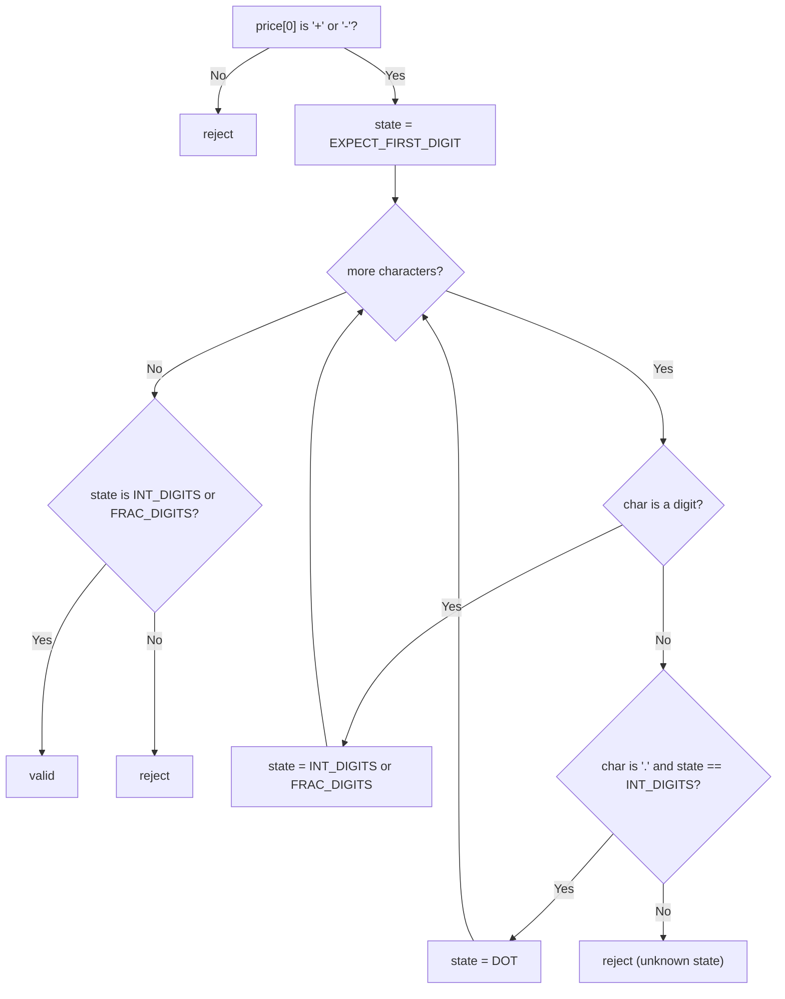

# Feature #1: Validate Price

## The problem

Stocks are being bought and sold every second on our trading platform, and new hires with little experience often fat-finger the prices they enter. The company has a fixed convention for what a valid entry looks like: a price prefixed with `+` means "buy stock worth this amount," a price prefixed with `-` means "sell stock worth this amount," and a price with no sign at all should be rejected outright. Since stocks trade in different currencies, prices can also be fractional.

We're given the price as a string and need to say whether it's valid. Some examples:

```
+40.325   -> valid
-1.1.1    -> NOT valid (two decimal points)
-222      -> valid
++22      -> NOT valid (two signs)
10.1      -> NOT valid (missing sign)
+22.22    -> valid
100.      -> NOT valid (ends right after the decimal point, no digits after it)
```

## Solution

The cleanest way to think about this is as a small state machine. The very first character must be `+` or `-` — if it's anything else, we reject immediately. Everything after that sign has to look like a plain (unsigned) number: one or more digits, then *optionally* a single decimal point followed by one or more digits.

We track three states as we scan past the sign:

- **`INT_DIGITS`** — we're reading the digits before any decimal point (or we've already seen at least one).
- **`DOT`** — we've just consumed the decimal point, but haven't seen a digit after it yet.
- **`FRAC_DIGITS`** — we're reading digits after the decimal point.

A digit keeps us in `INT_DIGITS` (if we're not past a dot yet) or moves/keeps us in `FRAC_DIGITS`. A `.` is only legal from `INT_DIGITS` (so `+.5` and `-1.1.1`'s second dot are both rejected). Anything else is an unknown character — reject immediately. And if the string ends while we're still sitting in `DOT` (nothing but digits then a bare trailing `.`), that's invalid too — `100.` fails for exactly this reason.



## Code

```java
class Solution {
    private enum State { EXPECT_FIRST_DIGIT, INT_DIGITS, DOT, FRAC_DIGITS }

    // Returns true if `price` follows the platform's convention: a mandatory
    // leading '+'/'-' sign, then digits with at most one decimal point, and
    // the string must not end right after that decimal point.
    public static boolean isValidPrice(String price) {
        if (price == null || price.isEmpty()) {
            return false;
        }
        char sign = price.charAt(0);
        if (sign != '+' && sign != '-') {
            return false; // A sign is mandatory.
        }

        State state = State.EXPECT_FIRST_DIGIT;
        for (int i = 1; i < price.length(); i++) {
            char c = price.charAt(i);
            if (Character.isDigit(c)) {
                state = (state == State.EXPECT_FIRST_DIGIT || state == State.INT_DIGITS)
                        ? State.INT_DIGITS : State.FRAC_DIGITS;
            } else if (c == '.' && state == State.INT_DIGITS) {
                state = State.DOT;
            } else {
                return false; // Unknown/illegal character in this position.
            }
        }
        return state == State.INT_DIGITS || state == State.FRAC_DIGITS;
    }

    public static void main(String[] args) {
        String[] prices = {"+40.325", "-1.1.1", "-222", "++22", "10.1", "+22.22", "100."};
        for (String price : prices) {
            System.out.println(price + " -> " + isValidPrice(price));
        }
        // +40.325 -> true
        // -1.1.1 -> false
        // -222 -> true
        // ++22 -> false
        // 10.1 -> false
        // +22.22 -> true
        // 100. -> false
    }
}
```

## Complexity measures

Let **n** be the length of the input string.

### Time Complexity

`O(n)` — the string is scanned exactly once, doing constant work per character.

### Space Complexity

`O(1)` — only a handful of fixed variables (the current state, loop index) are used, regardless of input size.
