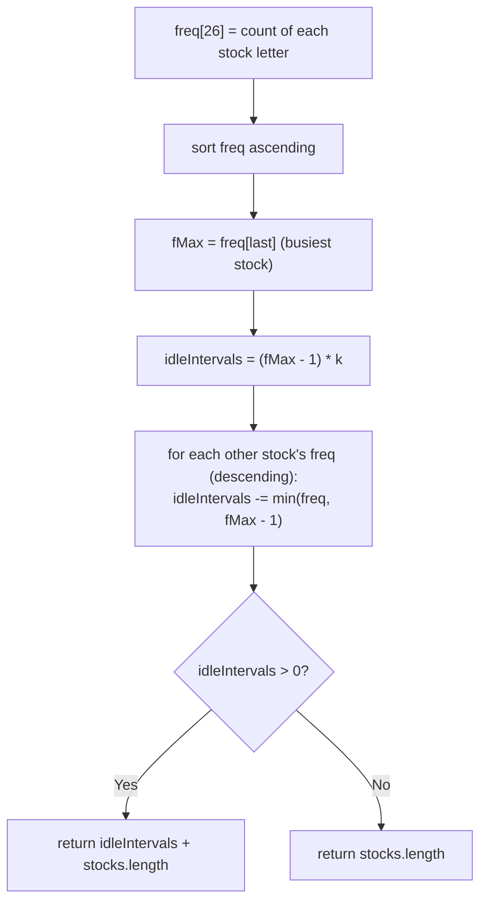

# Feature #2: Settling Period

## The problem

The settling period is the cooldown that must elapse before money changes hands after a stock trade completes. The platform must not let a broker trade the same company's stock again before that cooldown expires — a trade for stock `A` must be separated from the next trade for stock `A` by at least `k` intervening periods, whether those periods are filled by trades of other stocks or by sitting idle.

We're given a list of letters, one per requested trade, where each letter identifies a company's stock (letters repeat when multiple trades of the same stock are requested). For example, a request for four `APPLE` trades, two `TESLA` trades, and one `MICROSOFT` trade might arrive as:

```
['A', 'A', 'A', 'T', 'T', 'M', 'A']
```

Given this list and a settling period `k`, we need the minimum total number of time periods required to get every trade done, in order, respecting the cooldown.

## Solution

This is the classic "task scheduler" pattern, just wearing a stock-trading costume. The stock traded most often is the bottleneck: if `APPLE` needs to be traded `fMax` times, those trades alone force `fMax - 1` gaps of size `k` between them — call that `idleIntervals = (fMax - 1) * k`.

Every other stock's trades get to fill those gaps for free, *up to* `fMax - 1` uses each (any stock that's also nearly as frequent as the busiest one will overflow the gaps and need to trail afterward, but that's automatically handled since we can't fit more than `fMax - 1` of any single stock into the gaps between the busiest one's occurrences). So we subtract, for every other stock, `min(its frequency, fMax - 1)` from `idleIntervals`.

If that leaves `idleIntervals` positive, we still have unavoidable idle time, and the total time needed is `idleIntervals + stocks.length` (all the actual trades, plus the leftover idle slots). If it goes to zero or below, it means the other stocks' trades were plentiful enough to fill every gap and then some — in that case the answer is simply `stocks.length`, since there's no idle time left at all.



## Code

```java
import java.util.*;

class Solution {
    // Returns the minimum number of time periods needed to carry out every
    // trade in `stocks`, given that two trades of the same stock (same
    // letter) must be separated by at least `k` intervening periods.
    public static int minTimeToTradeAll(char[] stocks, int k) {
        int[] freq = new int[26];
        for (char c : stocks) {
            freq[c - 'A']++;
        }
        Arrays.sort(freq);

        int fMax = freq[25]; // Most frequently traded stock.
        int idleIntervals = (fMax - 1) * k;

        for (int i = 24; i >= 0 && freq[i] > 0; i--) {
            idleIntervals -= Math.min(fMax - 1, freq[i]);
        }

        return idleIntervals > 0 ? idleIntervals + stocks.length : stocks.length;
    }

    public static void main(String[] args) {
        char[] stocks = {'A', 'A', 'A', 'T', 'T', 'M', 'A'};
        System.out.println(minTimeToTradeAll(stocks, 2));
        // 10
    }
}
```

## Complexity measures

Let **n** be the number of requested trades.

### Time Complexity

`O(n)` — building the frequency array is `O(n)`; sorting it takes constant time since it always has exactly 26 entries.

### Space Complexity

`O(1)` — the `freq` array's size is fixed at 26 regardless of `n`.
