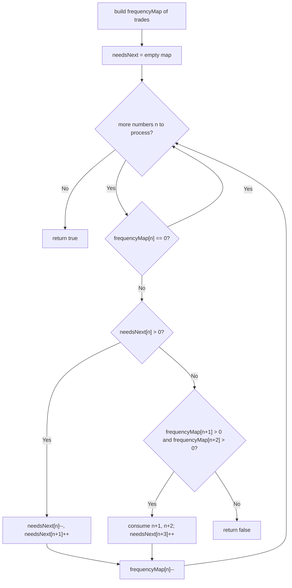

# Feature #3: Goals Fulfilled

## The problem

Our company hires interns throughout the year, and each intern's daily target is to close at least three trades. Every trade an intern closes gets an auto-incrementing sequence number scoped to that intern — the first intern to start that day logs trades `1, 2, 3, ...`, the next logs their own separate `1, 2, 3, ...`, and so on.

Here's the catch: the logging tool a previous developer built never recorded *which* intern made which trade, and it dumps all the interns' sequence numbers into one sorted list for the day. For example, if three interns logged `[1, 2, 3, 4]`, `[4, 5, 6]`, and `[10, 11, 12]` respectively, the day's log reads:

```
[1, 2, 3, 4, 4, 5, 6, 10, 11, 12]
```

Given a day's sorted log, we need to determine — as accurately as possible — whether it's *plausible* that every intern working that day logged at least three trades. We don't need to know how many interns there were, just whether the numbers *could* be partitioned into consecutive runs of length three or more. If there's no way to do that, we report `false`.

## Solution

Every number in the log either extends a subsequence we've already started, or has to kick off a brand-new one. We greedily prefer extending an existing subsequence over starting a new one — but only after we run out of subsequences that want this exact number next.

Two maps do the bookkeeping:

- **`frequencyMap`** — how many times each number still remains unassigned in the log.
- **`needsNext`** — for each value `v`, how many already-started subsequences are waiting for `v` to arrive next.

For each number `n` (in sorted order):

1. Skip it if `frequencyMap[n]` is already `0` (fully consumed).
2. If some open subsequence is waiting for exactly `n` (`needsNext[n] > 0`), extend that subsequence: decrement `needsNext[n]`, and now that subsequence wants `n + 1` next, so increment `needsNext[n + 1]`.
3. Otherwise, try to start a fresh subsequence `n, n+1, n+2`. This only works if both `n+1` and `n+2` are still available in `frequencyMap`. If so, consume one each of `n+1` and `n+2`, and mark that this new subsequence now wants `n + 3` next.
4. If neither option works, no valid partition exists — return `false` right away.
5. Either way, consume one occurrence of `n` from `frequencyMap`.

If we make it through the whole log without failing, every number successfully joined a run of at least three consecutive integers, so we return `true`.



## Code

```java
import java.util.*;

class Solution {
    // Returns true if the sorted `trades` log could plausibly have come
    // from interns who each logged at least 3 consecutive trade numbers.
    public static boolean isGoalFulfilled(int[] trades) {
        Map<Integer, Integer> frequencyMap = new HashMap<>();
        for (int n : trades) {
            frequencyMap.merge(n, 1, Integer::sum);
        }

        Map<Integer, Integer> needsNext = new HashMap<>();

        for (int n : trades) {
            if (frequencyMap.getOrDefault(n, 0) == 0) {
                continue; // Already claimed by an earlier subsequence.
            }
            if (needsNext.getOrDefault(n, 0) > 0) {
                needsNext.merge(n, -1, Integer::sum);
                needsNext.merge(n + 1, 1, Integer::sum);
            } else if (frequencyMap.getOrDefault(n + 1, 0) > 0
                    && frequencyMap.getOrDefault(n + 2, 0) > 0) {
                frequencyMap.merge(n + 1, -1, Integer::sum);
                frequencyMap.merge(n + 2, -1, Integer::sum);
                needsNext.merge(n + 3, 1, Integer::sum);
            } else {
                return false;
            }
            frequencyMap.merge(n, -1, Integer::sum);
        }
        return true;
    }

    public static void main(String[] args) {
        int[] trades = {1, 2, 3, 4, 4, 5, 6, 10, 11, 12};
        System.out.println(isGoalFulfilled(trades));
        // true
    }
}
```

## Complexity measures

Let **n** be the number of trades in the day's log.

### Time Complexity

`O(n)` — each trade is processed once, doing `O(1)` amortized hash-map work.

### Space Complexity

`O(n)` — `frequencyMap` and `needsNext` together hold at most one entry per distinct value in `trades`.
