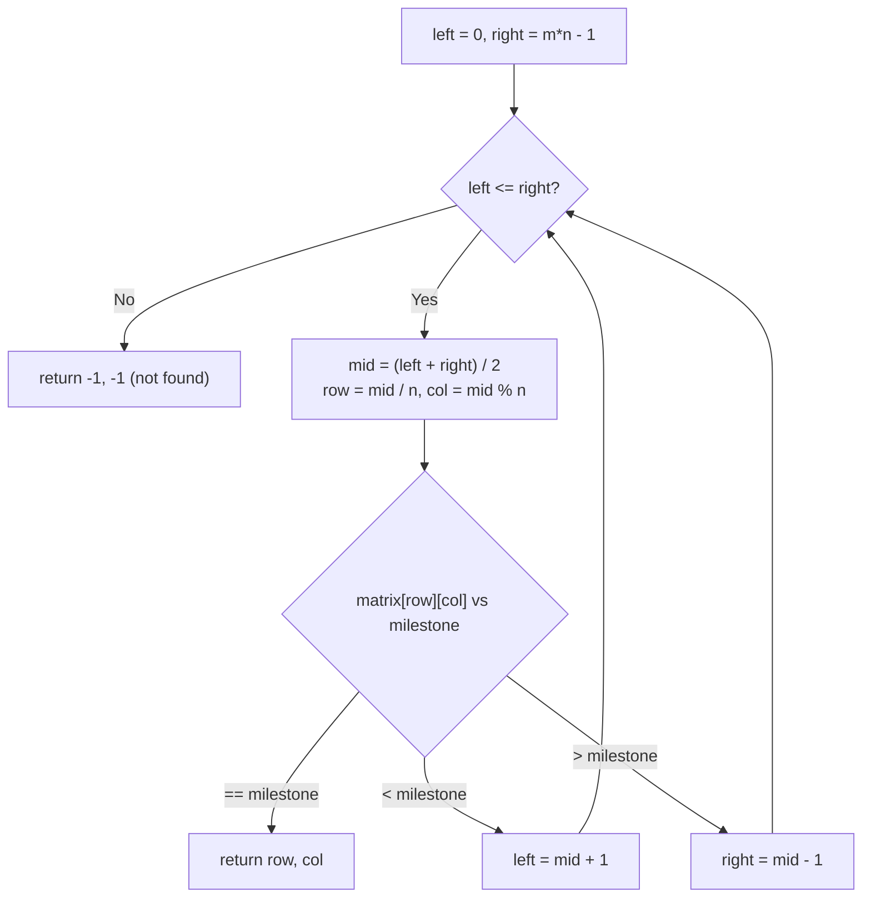

# Feature #4: Milestone Reached

## The problem

The company wants a hall of fame for its highest-achieving brokers, listing when each one first crossed a milestone of `k` career trades. Every broker's running trade tally has been logged since day one, in per-broker log files. Each log file is shaped like a matrix with 5 columns (one per weekday) and `r` rows (one per week worked so far) — and, crucially, each cell holds the *cumulative* trade count, so values increase as you read left-to-right across a row and top-to-bottom across the file.

Given one broker's `m x 5` matrix and a target milestone value, we need to find the `(row, col)` — i.e., the week and weekday — where that milestone was first reached.

## Solution

Because each row's values increase left to right, and every row's first value is larger than the previous row's last value, the whole `m x n` matrix behaves exactly like one giant sorted 1D array of `m * n` elements laid out row by row. That means we don't need to scan anything — we can binary search directly.

We never actually flatten the matrix into a real array (that would cost `O(m*n)` space for nothing). Instead, we binary search over *virtual* indices `0` to `m*n - 1`, and convert each candidate index back into a `(row, col)` pair on the fly:

```
row = index / n
col = index % n
```

where `n` is the number of columns. Standard binary search then does the rest: compare the milestone against the matrix value at the midpoint's `(row, col)`, and shrink the search window to the left or right half accordingly.



## Code

```java
class Solution {
    // Binary searches the row-major-sorted matrix for `milestone`, returning
    // its {row, col} position, or {-1, -1} if it was never reached.
    public static int[] findMilestone(int[][] log, int milestone) {
        int rows = log.length, cols = log[0].length;
        int left = 0, right = rows * cols - 1;

        while (left <= right) {
            int mid = (left + right) / 2;
            int row = mid / cols, col = mid % cols;
            int value = log[row][col];

            if (value == milestone) {
                return new int[]{row, col};
            } else if (value < milestone) {
                left = mid + 1;
            } else {
                right = mid - 1;
            }
        }
        return new int[]{-1, -1};
    }

    public static void main(String[] args) {
        int[][] log = {
            {1, 3, 5, 7, 9},
            {10, 11, 16, 20, 22},
            {23, 30, 34, 60, 61}
        };
        int[] result = findMilestone(log, 30);
        System.out.println("week " + result[0] + ", day " + result[1]);
        // week 2, day 1
    }
}
```

## Complexity measures

Let **m** be the number of weeks (rows) and **n** be the number of columns (5, in this case).

### Time Complexity

`O(log(m × n))` — a plain binary search over `m × n` virtual positions.

### Space Complexity

`O(1)` — only a constant number of index variables are used; the matrix is never copied or flattened.
