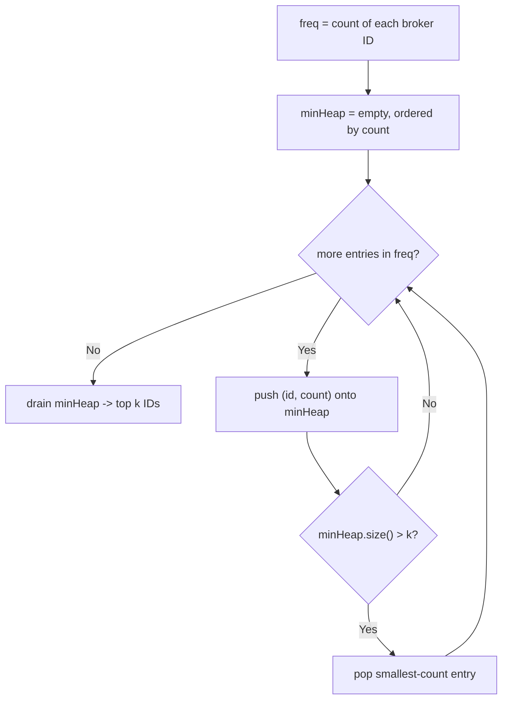

# Feature #5: Top Brokers

## The problem

At quarter-end review time, each broker's raise depends on how active they were. Every broker has a unique ID, and every time they complete a trade, their ID gets appended to a running array. The company wants the top **k** most active brokers — the ones whose ID appears most often in that array — surfaced automatically.

We're given an array of broker IDs (with repeats) and a number `k`. We need to return the `k` IDs with the highest trade counts.

## Solution

First, count how often each broker ID appears — a `HashMap` gives us that in one pass. The interesting part is finding the top `k` counts efficiently, and a **min-heap of size k** is the tool for that: we walk through the frequency map's entries, pushing each `(id, count)` pair onto the heap. Whenever the heap grows past size `k`, we pop the *smallest*-count entry off it.

Because the heap only ever pops the least-frequent entry once it's over capacity, whatever survives at the end is exactly the `k` broker IDs with the largest counts — the smallest-among-the-largest gets bumped out only by something even larger coming along, and anything smaller than the current floor never gets a chance to stick around.



## Code

```java
import java.util.*;

class Solution {
    // Returns the k broker IDs that traded most frequently in `brokerIds`.
    public static int[] topKBrokers(int[] brokerIds, int k) {
        Map<Integer, Integer> freq = new HashMap<>();
        for (int id : brokerIds) {
            freq.merge(id, 1, Integer::sum);
        }

        // Min-heap ordered by trade count, capped at size k.
        PriorityQueue<int[]> minHeap = new PriorityQueue<>((a, b) -> a[1] - b[1]);
        for (Map.Entry<Integer, Integer> entry : freq.entrySet()) {
            minHeap.offer(new int[]{entry.getKey(), entry.getValue()});
            if (minHeap.size() > k) {
                minHeap.poll();
            }
        }

        int[] result = new int[k];
        for (int i = k - 1; i >= 0; i--) {
            result[i] = minHeap.poll()[0];
        }
        return result;
    }

    public static void main(String[] args) {
        int[] brokerIds = {1, 3, 5, 14, 18, 14, 5};
        System.out.println(Arrays.toString(topKBrokers(brokerIds, 2)));
        // [5, 14]
    }
}
```

## Complexity measures

Let **n** be the number of trades recorded and **k** be the number of top brokers requested.

### Time Complexity

`O(n log k)` — building the frequency map is `O(n)`, and each of the (at most `n`) distinct-ID insertions into the size-`k` heap costs `O(log k)`.

### Space Complexity

`O(n)` — the frequency map holds up to `n` distinct broker IDs; the heap itself is bounded by `O(k)`.
