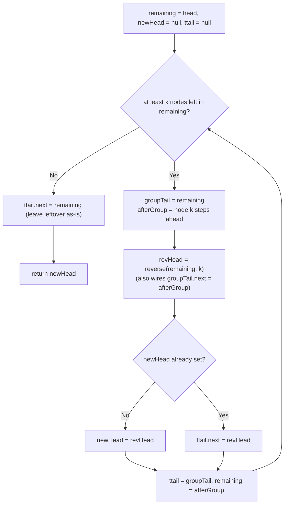

# Feature #6: Assign Transactions

## The problem

Stock transaction requests arrive and get inserted at the *head* of a singly linked list, so the list holds them in the reverse of arrival order. `N` transactions need to be split among `K` brokers: the first `⌊N/K⌋` transactions (in arrival order) go to the first broker, the next `⌊N/K⌋` go to the second, and so on. Whatever's left over (fewer than `⌊N/K⌋` transactions) stays untouched at the end. Each broker's own batch must still be carried out in original arrival order.

We don't want to split the linked list into separate lists — we just want to hand each broker a pointer to the start of their batch within one continuous list. But since the list order is the *reverse* of arrival order, and each broker needs to process their batch in arrival order, each group of `⌊N/K⌋` nodes needs to be physically reversed in place. We can't use extra data structures — the fix has to happen using `O(1)` additional space, changing node links only (never the values).

For example, with `head = [1, 2, 3, 4, 5]` and group size `2`, reversing every group of 2 (leaving a trailing group smaller than 2 untouched) gives:

```
[2, 1, 4, 3, 5]
```

## Solution

The building block is a plain linked-list reversal: walk the list with a pointer, and repeatedly insert the node it's pointing at onto the front of a separate "reversed so far" list. Do that for every node and the whole list comes out backward.

Now we just need to apply that reversal one group of `k` nodes at a time, instead of to the whole list, and stitch the groups back together:

- **`remaining`** walks through the original list, one group at a time.
- Before reversing a group, check that at least `k` nodes are still left — if not, that tail end is left exactly as-is.
- **`reverse(groupHead, k)`** reverses exactly `k` nodes starting at `groupHead`, and wires the *old* head (now the group's tail) to whatever node follows the group — this is what keeps everything as one continuous list instead of `k`-node islands.
- **`ttail`** remembers the tail of the *previous* group (which, after that group was reversed, is its now-last node) so we can point it at the next group's new head once that group is reversed too.
- **`newHead`** is simply the very first group's new head — the head of the whole returned list.



## Code

```java
class Solution {
    static class ListNode {
        int val;
        ListNode next;
        ListNode(int val) { this.val = val; }
    }

    // Reverses `head` k nodes at a time, leaving any trailing group of
    // fewer than k nodes untouched, using O(1) extra space.
    public static ListNode reverseKGroup(ListNode head, int k) {
        ListNode newHead = null;
        ListNode ttail = null; // Tail of the previously-reversed group.
        ListNode remaining = head;

        while (hasKNodes(remaining, k)) {
            ListNode groupTail = remaining; // Becomes this group's tail after reversal.
            ListNode afterGroup = advance(remaining, k);
            ListNode revHead = reverse(remaining, k);

            if (newHead == null) {
                newHead = revHead;
            }
            if (ttail != null) {
                ttail.next = revHead;
            }
            ttail = groupTail;
            remaining = afterGroup;
        }

        if (ttail != null) {
            ttail.next = remaining; // Leftover (< k) nodes stay in original order.
        }
        return newHead == null ? head : newHead;
    }

    private static boolean hasKNodes(ListNode head, int k) {
        int count = 0;
        while (head != null && count < k) {
            head = head.next;
            count++;
        }
        return count == k;
    }

    private static ListNode advance(ListNode node, int k) {
        for (int i = 0; i < k; i++) {
            node = node.next;
        }
        return node;
    }

    // Reverses exactly k nodes starting at head (caller guarantees k nodes
    // exist) and returns the new head of that reversed segment. `head`
    // itself becomes the tail, wired to whatever followed the group.
    private static ListNode reverse(ListNode head, int k) {
        ListNode revHead = null;
        ListNode curr = head;
        for (int i = 0; i < k; i++) {
            ListNode next = curr.next;
            curr.next = revHead;
            revHead = curr;
            curr = next;
        }
        head.next = curr;
        return revHead;
    }

    static ListNode fromArray(int[] arr) {
        ListNode dummy = new ListNode(0), tail = dummy;
        for (int v : arr) {
            tail.next = new ListNode(v);
            tail = tail.next;
        }
        return dummy.next;
    }

    static String toStr(ListNode head) {
        StringBuilder sb = new StringBuilder("[");
        while (head != null) {
            sb.append(head.val);
            if (head.next != null) sb.append(", ");
            head = head.next;
        }
        return sb.append("]").toString();
    }

    public static void main(String[] args) {
        ListNode head = fromArray(new int[]{1, 2, 3, 4, 5});
        System.out.println(toStr(reverseKGroup(head, 2)));
        // [2, 1, 4, 3, 5]
    }
}
```

## Complexity measures

Let **n** be the number of nodes in the linked list.

### Time Complexity

`O(n)` — every node is visited a constant number of times: once by `hasKNodes`/`advance` and once by `reverse`.

### Space Complexity

`O(1)` — reversal is done purely by rewiring `next` pointers with a fixed set of helper pointers; no stack, recursion, or auxiliary list is used.
