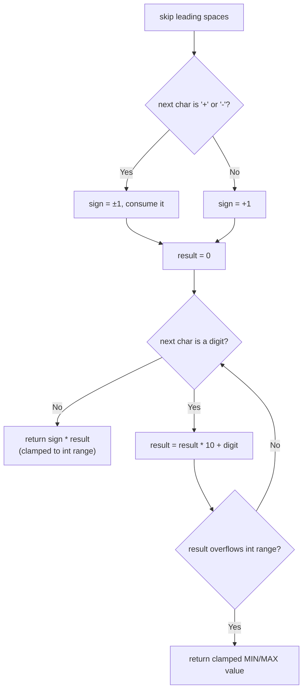

# Feature #7: Process Transactions

## The problem

Every transaction at the trading company gets recorded in a log file, one per line. Each line may start with leading whitespace, then an optional `+` or `-` sign representing profit or loss, then digits, then arbitrary trailing text. We need to process one line and return just the integer at its beginning — skipping leading whitespace, honoring an optional sign, and reading digits until the first non-digit character (ignoring everything after that). If the line doesn't start with a valid integer at all (after whitespace), we return `0`.

We can only store results within the 32-bit signed integer range `[-2^31, 2^31 - 1]`. If the parsed value would fall outside that range, we clamp it to whichever boundary it overshot.

Only the space character (`' '`) counts as whitespace — nothing else gets skipped.

## Solution

This is a straightforward left-to-right scan with a few edge cases to respect, in order:

1. Skip leading spaces.
2. If the next character is `+` or `-`, consume it and remember the sign (default positive if neither is present).
3. Read consecutive digits, converting them into a running integer as we go (e.g., `"42"` → `42`, `"00112"` → `112`).
4. Stop at the first non-digit character (or the end of the line) — the rest of the line is ignored.
5. Apply the sign, then clamp the result into `[Integer.MIN_VALUE, Integer.MAX_VALUE]` if it overflowed.

The overflow check has to happen *while* accumulating digits, not after, since a `long` can hold the intermediate value safely but the final `int` result cannot — computing everything in `int` first and checking afterward would already have overflowed and lost information.



## Code

```java
class Solution {
    // Parses the leading integer (skipping whitespace, honoring an optional
    // sign) at the start of `line`, clamping to the 32-bit int range.
    public static int processLine(String line) {
        int i = 0, n = line.length();
        while (i < n && line.charAt(i) == ' ') {
            i++;
        }
        if (i == n) {
            return 0;
        }

        int sign = 1;
        if (line.charAt(i) == '+' || line.charAt(i) == '-') {
            sign = line.charAt(i) == '-' ? -1 : 1;
            i++;
        }

        long result = 0;
        while (i < n && Character.isDigit(line.charAt(i))) {
            int digit = line.charAt(i) - '0';
            result = result * 10 + digit;
            if (sign == 1 && result > Integer.MAX_VALUE) {
                return Integer.MAX_VALUE;
            }
            if (sign == -1 && -result < Integer.MIN_VALUE) {
                return Integer.MIN_VALUE;
            }
            i++;
        }
        return (int) (sign * result);
    }

    public static void main(String[] args) {
        System.out.println(processLine("   -125 profit on TSLA"));
        // -125
    }
}
```

## Complexity measures

Let **n** be the length of the log line.

### Time Complexity

`O(n)` — the line is scanned left to right exactly once.

### Space Complexity

`O(1)` — a constant number of index and accumulator variables are used, regardless of line length.
